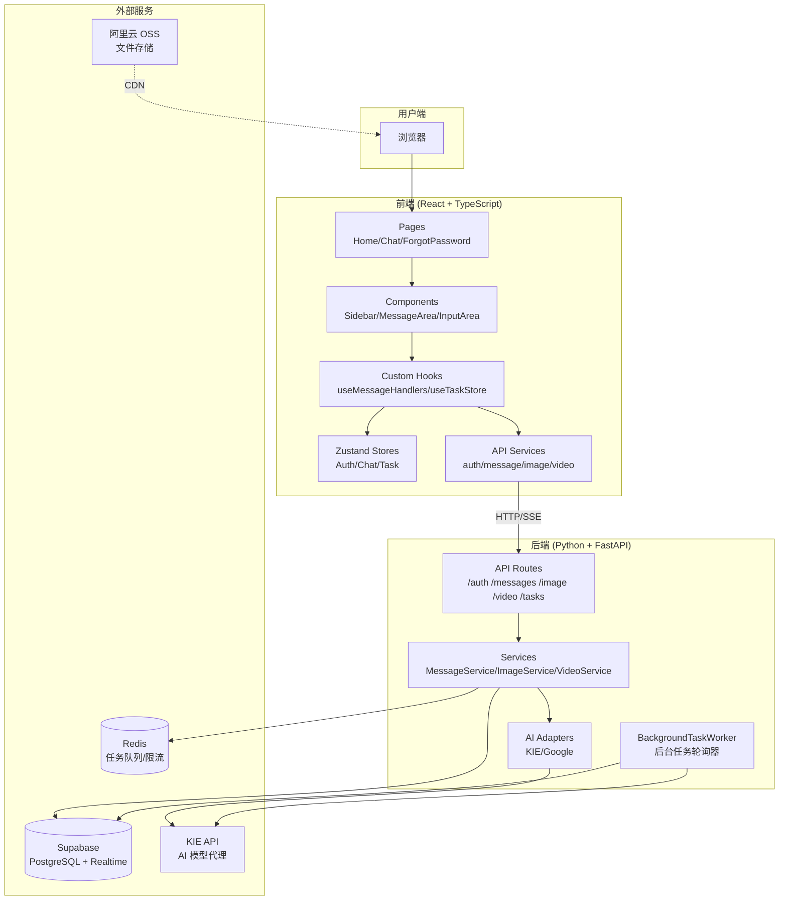
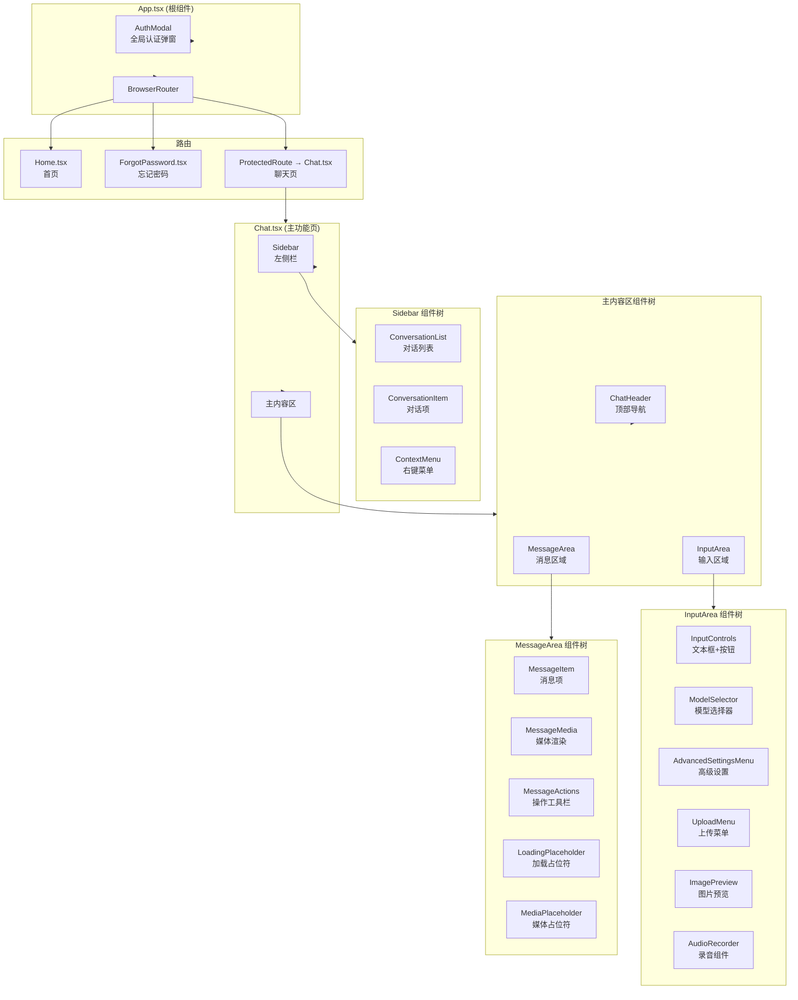
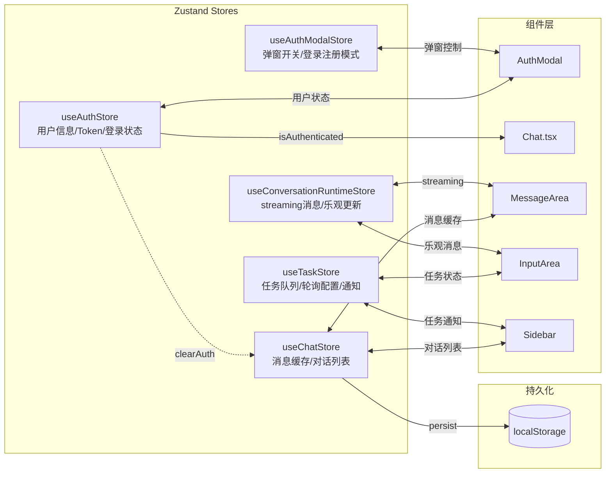
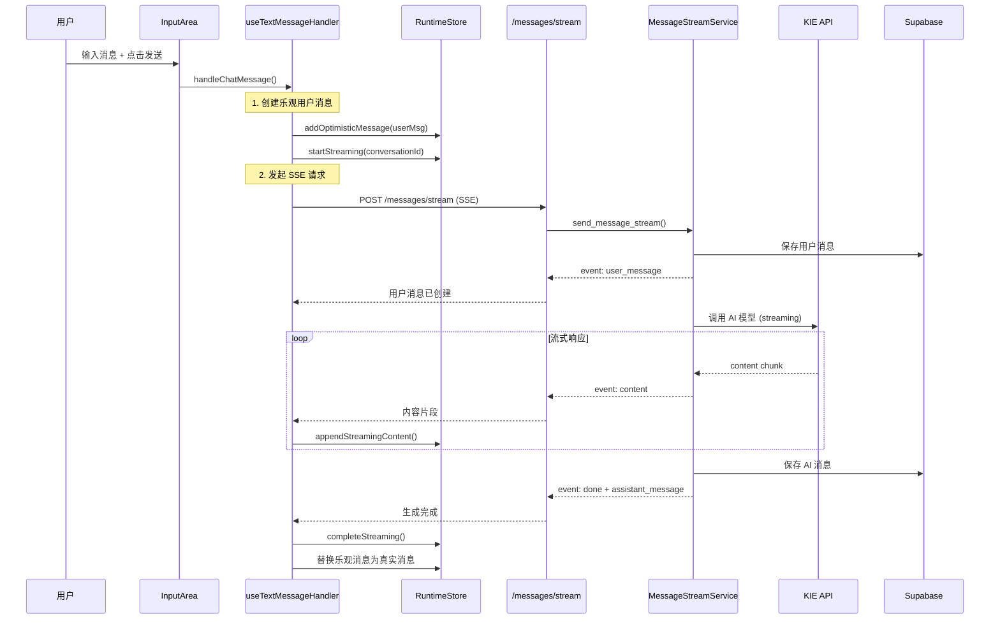
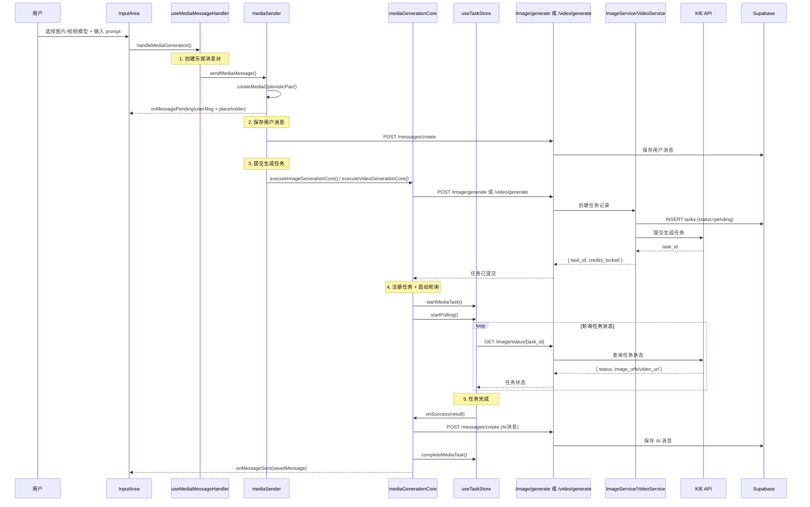
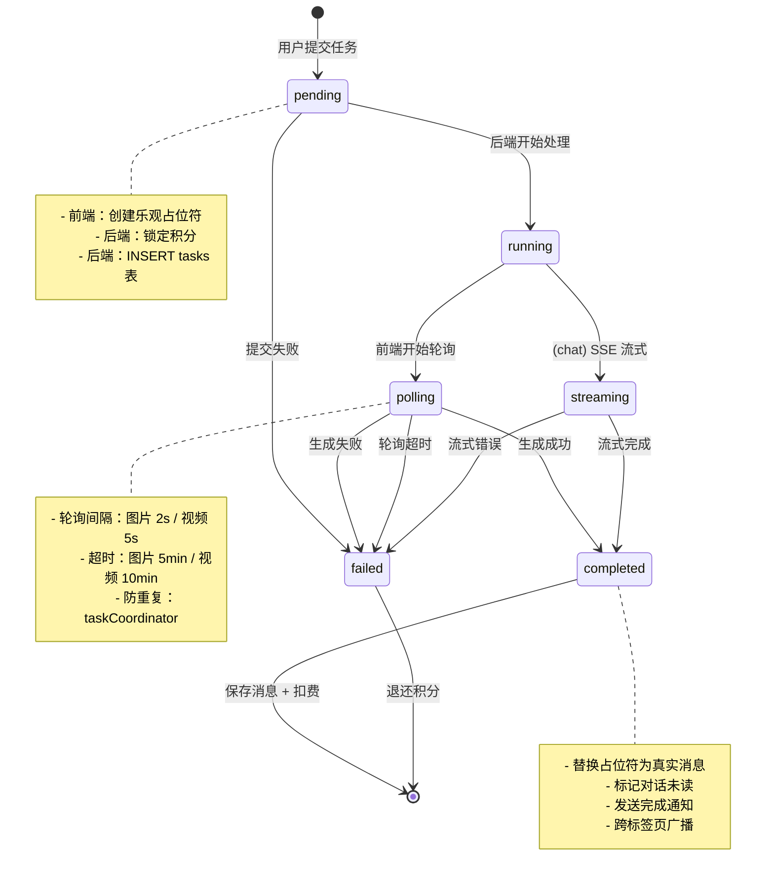
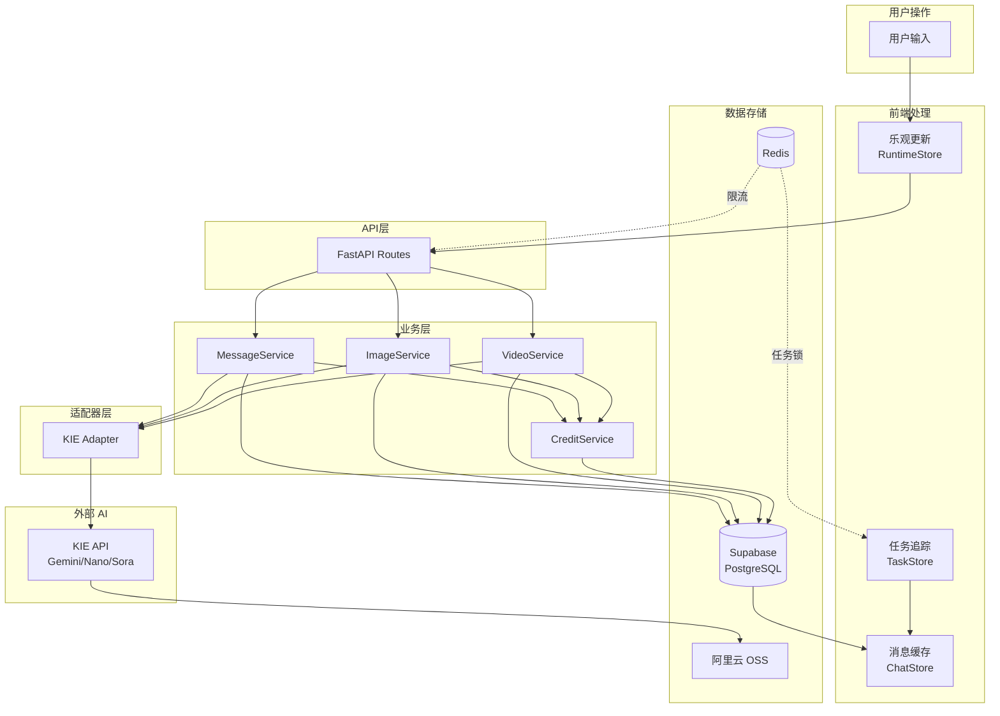

# 程序流转图

> 本文档描述 EVERYDAYAI 项目的核心流程和组件关系，帮助快速理解系统架构和功能挂载。

## 目录

1. [整体架构图](#1-整体架构图)
2. [前端组件层级图](#2-前端组件层级图)
3. [状态管理流转图](#3-状态管理流转图)
4. [核心业务流程](#4-核心业务流程)
   - [4.1 聊天消息流程](#41-聊天消息流程)
   - [4.2 媒体生成流程（图片/视频）](#42-媒体生成流程图片视频)
   - [4.3 任务生命周期](#43-任务生命周期)
   - [4.4 任务恢复流程](#44-任务恢复流程)
5. [前后端通信图](#5-前后端通信图)
6. [数据流向图](#6-数据流向图)

---

## 1. 整体架构图



---

## 2. 前端组件层级图



---

## 3. 状态管理流转图



### Store 职责说明

| Store | 职责 | 持久化 |
|-------|------|--------|
| `useAuthStore` | 用户信息、Token、登录状态 | ✅ localStorage |
| `useAuthModalStore` | 认证弹窗开关、登录/注册模式切换 | ❌ |
| `useChatStore` | 消息缓存（LRU）、对话列表 | ✅ localStorage |
| `useTaskStore` | 聊天任务、媒体任务、轮询配置、通知队列 | ❌ |
| `useConversationRuntimeStore` | streaming 消息、乐观更新、媒体占位符 | ❌ |

---

## 4. 核心业务流程

### 4.1 聊天消息流程



**关键文件**：
- 入口：[InputArea.tsx](frontend/src/components/chat/InputArea.tsx)
- 处理器：[useTextMessageHandler.ts](frontend/src/hooks/handlers/useTextMessageHandler.ts)
- 发送器：[chatSender.ts](frontend/src/services/messageSender/chatSender.ts)
- 后端路由：[message.py:121](backend/api/routes/message.py#L121)
- 后端服务：[message_stream_service.py](backend/services/message_stream_service.py)

---

### 4.2 媒体生成流程（图片/视频）



**关键文件**：
- 处理器：[useMediaMessageHandler.ts](frontend/src/hooks/handlers/useMediaMessageHandler.ts)
- 发送器：[mediaSender.ts](frontend/src/services/messageSender/mediaSender.ts)
- 核心逻辑：[mediaGenerationCore.ts](frontend/src/services/messageSender/mediaGenerationCore.ts)
- 后端图片路由：[image.py](backend/api/routes/image.py)
- 后端视频路由：[video.py](backend/api/routes/video.py)

---

### 4.3 任务生命周期



**任务状态存储**：
- 前端：`useTaskStore` (chatTasks + mediaTasks)
- 后端：`tasks` 表 (status: pending/running/completed/failed)

---

### 4.4 任务恢复流程

```mermaid
flowchart TB
    subgraph 触发时机
        Refresh[页面刷新]
        TabSwitch[标签页切换回来]
        Reconnect[网络重连]
    end

    subgraph 恢复入口["恢复入口 (onRehydrateStorage)"]
        Rehydrate[useChatStore rehydrate]
    end

    subgraph 恢复流程
        FetchPending[fetchPendingTasks<br/>GET /tasks/pending]
        CheckType{任务类型?}

        subgraph ChatRestore[Chat 任务恢复]
            CreateStreaming[创建 streaming 占位符]
            ResumeSSE[恢复 SSE 连接<br/>GET /tasks/{id}/stream]
            SSESuccess{SSE 成功?}
            FallbackPoll[降级轮询<br/>GET /tasks/{id}/content]
        end

        subgraph MediaRestore[媒体任务恢复]
            CreatePlaceholder[创建媒体占位符]
            StartPolling[启动轮询<br/>GET /image/status/{id}]
        end
    end

    subgraph 防重复机制
        TabSync[tabSync 跨标签页广播]
        Coordinator[taskCoordinator 分布式锁]
        IdempotentCheck[activeRecoveries 幂等检查]
    end

    Refresh --> Rehydrate
    TabSwitch --> Rehydrate
    Reconnect --> Rehydrate

    Rehydrate --> FetchPending
    FetchPending --> CheckType

    CheckType -->|chat| ChatRestore
    CheckType -->|image/video| MediaRestore

    CreateStreaming --> ResumeSSE
    ResumeSSE --> SSESuccess
    SSESuccess -->|是| ChatRestore
    SSESuccess -->|否| FallbackPoll

    CreatePlaceholder --> StartPolling

    ChatRestore --> TabSync
    MediaRestore --> TabSync
    TabSync --> Coordinator
    Coordinator --> IdempotentCheck
```

**关键文件**：
- 恢复工具：[taskRestoration.ts](frontend/src/utils/taskRestoration.ts)
- 跨标签页同步：[tabSync.ts](frontend/src/utils/tabSync.ts)
- 任务协调器：[taskCoordinator.ts](frontend/src/utils/taskCoordinator.ts)
- 后端 SSE 恢复：[task.py](backend/api/routes/task.py)
- 后端流管理器：[chat_stream_manager.py](backend/services/chat_stream_manager.py)

---

## 5. 前后端通信图

```mermaid
flowchart LR
    subgraph 前端
        FE_Auth[认证模块]
        FE_Conv[对话模块]
        FE_Msg[消息模块]
        FE_Image[图片模块]
        FE_Video[视频模块]
        FE_Task[任务模块]
    end

    subgraph API["后端 API (/api)"]
        BE_Auth[/auth/*<br/>登录/注册/验证码]
        BE_Conv[/conversations/*<br/>CRUD]
        BE_Msg[/messages/*<br/>发送/查询/删除]
        BE_Image[/image/*<br/>生成/状态查询]
        BE_Video[/video/*<br/>生成/状态查询]
        BE_Task[/tasks/*<br/>pending/stream/content]
    end

    subgraph 通信方式
        HTTP[HTTP<br/>普通请求]
        SSE[SSE<br/>Server-Sent Events]
        Polling[Polling<br/>轮询]
    end

    FE_Auth -->|HTTP| BE_Auth
    FE_Conv -->|HTTP| BE_Conv
    FE_Msg -->|HTTP + SSE| BE_Msg
    FE_Image -->|HTTP + Polling| BE_Image
    FE_Video -->|HTTP + Polling| BE_Video
    FE_Task -->|HTTP + SSE| BE_Task
```

### API 端点清单

| 模块 | 端点 | 方法 | 通信方式 | 说明 |
|------|------|------|----------|------|
| 认证 | `/auth/login` | POST | HTTP | 密码登录 |
| 认证 | `/auth/login/sms` | POST | HTTP | 短信登录 |
| 认证 | `/auth/register` | POST | HTTP | 注册 |
| 认证 | `/auth/sms/send` | POST | HTTP | 发送验证码 |
| 对话 | `/conversations` | GET/POST | HTTP | 列表/创建 |
| 对话 | `/conversations/{id}` | GET/PUT/DELETE | HTTP | 详情/更新/删除 |
| 消息 | `/conversations/{id}/messages` | GET | HTTP | 消息列表 |
| 消息 | `/conversations/{id}/messages/stream` | POST | **SSE** | 流式发送 |
| 消息 | `/conversations/{id}/messages/create` | POST | HTTP | 直接创建 |
| 图片 | `/image/generate` | POST | HTTP | 提交生成 |
| 图片 | `/image/status/{task_id}` | GET | **Polling** | 查询状态 |
| 视频 | `/video/generate` | POST | HTTP | 提交生成 |
| 视频 | `/video/status/{task_id}` | GET | **Polling** | 查询状态 |
| 任务 | `/tasks/pending` | GET | HTTP | 获取进行中任务 |
| 任务 | `/tasks/{id}/stream` | GET | **SSE** | 恢复聊天流 |
| 任务 | `/tasks/{id}/content` | GET | HTTP | 获取累积内容 |

---

## 6. 数据流向图



### 数据存储职责

| 存储 | 数据类型 | 用途 |
|------|----------|------|
| Supabase PostgreSQL | users, conversations, messages, tasks, credit_transactions | 结构化业务数据 |
| Redis | rate_limit:*, task_lock:* | 频率限制、任务分布式锁 |
| 阿里云 OSS | 图片、视频文件 | 生成结果存储 + CDN 加速 |
| localStorage | message_cache, conversations_cache, access_token | 前端持久化缓存 |

---

## 更新记录

- **2026-02-04**：创建流转图文档，包含整体架构、组件层级、状态管理、业务流程、通信方式等
