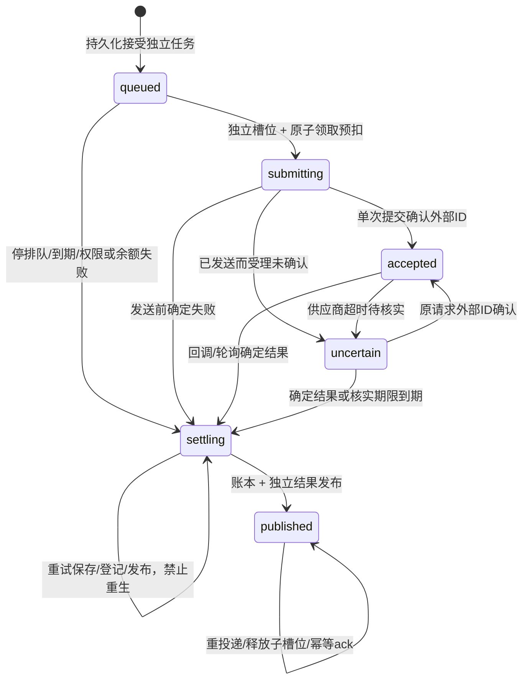

# 聊天 Skill 图片异步任务 API 与状态合同

版本：`_media_request_v1` / `_media_lifecycle_v1`，2026-10-04。新接受默认关闭；总开关开启时可用 `CHAT_IMAGE_ALLOWED_USER_IDS`（逗号分隔UUID）限定账号，空串表示全用户。账号门同时控制工具展示、新接受/trial/快照新版本及成本预览的acceptance_enabled；完成、恢复、详情和既有回执继续可用。认证、组织空间选择及资源权限沿用现有API；没有公开的绕过聊天Policy直接接受任意图片输入的接口。

## generate_image

名称不变，一次接受一张图。多张输出由模型多次调用；输入参考图可以多张并保持顺序。输入不含可信父task、Turn、actor、org或内部执行标记，这些来自服务器dispatch上下文。

```json
{
  "mode": "image_to_image",
  "prompt": "完整最终提示词原文",
  "references": [
    {"message_id": "11111111-1111-4111-8111-111111111111", "content_index": 0, "role": "主体"},
    {"message_id": "22222222-2222-4222-8222-222222222222", "content_index": 1, "role": "构图"}
  ],
  "aspect_ratio": "1:1",
  "resolution": "1K",
  "output_format": "png",
  "plan_item_id": "方案2",
  "variant_id": "方案2/变体1"
}
```

| 字段 | 实际合同 |
| --- | --- |
| `mode` | 必须显式 `text_to_image` / `image_to_image`；文生图不能带生成refs，图生图必须带refs；分析附件不决定mode |
| `prompt` | 必填、完整非空原文；保留空白，不再native prepare改写，按实际模型长度上限校验 |
| `references` | 每项恰选 `resource_ref` / `file_id` / `asset_id` / `message_id` 一种；message必须有整数content_index；role必填1..200字符；原图权限、版本、digest由服务器确认 |
| 生图模型 | 无模型输入参数；服务器按显式mode使用平台默认文生图模型或其图生图配对。当前默认为 GPT Image 2.5 Flare；配置与能力取现有注册表 |
| `aspect_ratio` / `resolution` / `output_format` | 以当前适配器能力与现有价格配置为准；默认1:1/png，支持分辨率的模型默认1K；不支持规格拒绝 |
| `source_prompt` | 可选，`{task_id,sha256}`或`{message_id,content_index,sha256}`；逐字核验原提示词，区段位置由服务器定位；不能用摘要替代 |
| `plan_item_id` / `variant_id` | 可选稳定身份，1..200字符；同prompt变体可区分，不能扩预算或替代call幂等 |
| `source_task_id` | 可选，当前用户/组织内已完成图片来源；不授予控制其它任务的权限 |
| `background` | 仅透明开关开放时schema展示，且实际Flare模型支持；`opaque` / `transparent`，透明必须PNG并校验实际alpha；默认不开启 |

禁止 `model` / `model_name`、`size` / `format`、`prompts[]`、`num_images`、数值weight、mask、伪透明参数和内部可信字段。模型选择字段在接受前明确拒绝，不静默替换。适配器允许的参考数量可能小于schema通用上限16。工具说明只投影默认模型配对的实际模式、规格、参考数和价格，无静态价格副本。原生生图入口仍保留原模型选择。

兼容旧参数只归一到同一异步出口：prompt-only成为文生图；旧 `image_urls` 必须唯一映射本次当前可信manifest的原图，再转为references。任意URL或旧内部 `task_id_override` 等不再可用；没有第二条同步执行链。

接受通过统一AgentResult/ToolResult返回 `status=submitted`、`completed=false`、`task_id`、`message_id`、`submission_state`、实际模式/规格及估算积分。工具调用成功只表示任务持久化接受；`submission_state=queued` 也不表示供应商受理。接受端不等图片、不发供应商请求、不扣款。

接受RPC之前确定的输入拒绝返回 `status=error`、`accepted=false`、`completed=false`、`submission_state=not_accepted`；例如 `IMAGE_MODEL_SELECTION_DISABLED` / `IMAGE_REQUEST_FIELDS_INVALID`。明确告知未创建图片任务、未预扣图片积分，不附加“受理不确定”。RPC异常或回执丢失仍按不确定处理，不能套用输入拒绝后重新提交。此区别不改变通用工具的副作用分类。

同一父task/tool_call重复输入返回原身份；同调用不同冻结输入拒绝。不同调用受同一父预算控制，名额在接受时占用，失败不返还尝试次数。当前默认上限4张/100用户积分，配置范围1..8张/1..200积分。

## 精确历史

`get_conversation_context` 在新接受开启时提供公共schema，沿用当前会话和基线revision权限。`limit`有界，`message_ids`最多8项，`text_exact`最多20000字符；可读取实际文本、任务原prompt、source_prompt/hash、可定位的图片来源。结果总量有界，缺原文不猜测；text_exact仅唯一匹配原文时给出区段与sha256。

历史图片失败/取消只纳入新链路已发布事实，普通失败聊天仍按原筛选。晚到图片发布新revision，不改过去的聊天基线。

## HTTP 控制与详情

以下路径带既有 `/api` 前缀。任务详情/重试/停止/反馈只允许当前用户和组织的非trial新图片任务；原生任务保持原接口。不存在通过这些接口覆盖prompt或参考图的能力。

| 方法与路径 | 输入 | 返回与行为 |
| --- | --- | --- |
| `POST /api/tasks/image/estimate` | mode、可选model/spec/background、reference_count(0..16)、image_count(1..8)；拒绝额外字段 | 当前服务器单张/总用户积分、max_requests/max_credits、within_budget、acceptance_enabled；不创建任务，不读原图，不发供应商请求 |
| `GET /api/tasks/{task_id}/image` | UUID | task/message身份、status/submission_state、完整input快照、临时reference_previews、结果数组、已结算积分、platform_cost/feedback、can_stop/can_replay、cancel_explanation和真实capabilities |
| `POST /api/tasks/{task_id}/image/replay` | 仅 `{request_id: UUID}` | 原快照新task/message回执，原图保留；同request_id重放同身份，关新接受后仍可查已接受回执；拒绝客户端prompt等替换输入 |
| `POST /api/tasks/{task_id}/image/stop` | 无生成参数 | `outcome=stopped`仅queued→settling，Worker收尾；否则already_submitted并准确说明不能撤回 |
| `PUT /api/tasks/{task_id}/image/feedback` | `{rating: "helpful"\|"not_helpful"}` | 当前用户已发布版本的反馈，原子保存，不发外部消息 |

详情中的input是服务器实际冻结输入，包含schema_version、prompt/prompt_sha256、request_hash、mode/model/spec、完整参考图身份/路径/版本/digest/role/顺序、origin与Skill版本/hash、source_prompt/plan/variant/source_task、budget、estimated_credits及estimated_provider_credits。短消息generation_params仅携带渲染/任务/来源定位，完整内容不塞消息字段。

新工具输入取消模型选择，冻结快照中的实际 `model` 仍保留。Worker、历史详情、原快照重试/新版本及其成本预览继续使用原模型，不因平台默认变更而替换。HTTP estimate 的 model 是旧快照预览所需字段，不是聊天AI选择模型的入口；图片trial的模型来自服务器既有规则。

参考图preview是当前权限及原版本校验后的临时签址，独立于快照。原图已替换/不可访问时available=false，不能显示替换后的图冒充原输入。结果中的task_id/asset_id/source_task_id等为可选加性字段，旧图片消息继续解析。

重试/再生成必须原任务published，重新校验当前权限、原图digest和规格、重新签址。用户价格改变时拒绝静默重试，要求当前价格的新显式请求。同一原父下的新版本共享独立重试预算，首次新版本接受时冻结当前服务器上限；后续随机request_id不能扩张或无限接受。关闭开关只拒绝新接受，不影响既有回执、详情或收尾。

现有 `/api/tasks/pending` 排除trial；恢复queued/running及近5分钟终态的新子图片，刷新后不创建父流式槽位。通用cancel/mark_failed识别新图片并转排队停止合同，不能假装撤回已提交任务或直接退款绕过账本。

前端独立图片完成/失败后通过现有用户信息接口刷新真实积分余额，不依赖父聊天输入回调，也不把单任务消耗当成账户余额。WS连接/重连时重新读取余额，覆盖断线期间已结算或退款的情况；图片事件仍不结束父聊天流式状态。

## 状态与计费



粗task.status沿用pending/running/completed/failed/cancelled；只有published是本链路终态已结算。accepted不是完成；uncertain禁止重发。领取后、调用供应商前保存发送标记；若标记前崩溃可确定本地失败退款，标记后崩溃不能推断供应商没收到。

领取与预扣、credit_transaction/task绑定同事务。预扣账本不设通用expiry；由生命周期核实并结算，避免后台过期退款与供应商结果并发。成功确认一次，确定失败退款一次。结果保存失败不重新生成；缓存本地结果丢失只重新保存已记录的provider结果URL；网络/存储读取暂错保持settling。

终态发布同时写task、独立message/trial、会话新revision和账本。delivery_pending持久化，WS失败/服务重启仍扫描补投递并释放对应子槽位。父chat、Turn、流式槽位不作图片终态对象。

## Skill 图片试运行

既有 `GET/POST /api/skills/authoring/proposals/{change_set_id}/trials`、`GET .../trials/estimate`及 `PUT /api/skills/authoring/proposals/trials/{trial_id}/feedback`入口沿用。图片POST在开关关闭时拒绝，estimate返回 `image_trial_enabled=false`；文字trial保持同步行为。

图片POST先显式准备trial输入，再冻结并接受单图task，返回trial running/task_id而非成功图片。GET读取已有trial完成/失败结果，候选过期后仍可读已接受结果；新POST仍拒绝过期候选。前端有界GET轮询，超限保留手动刷新，不以POST重试代替查询。

冻结候选revision/hash、mode/model及参考来源；重复接受同trial identity。未关联task的准备超时可标failed，已接受任务不能按准备超时再次创建付费请求。完成只写trial.images/status，不生成普通聊天消息或revision。

## 管理员平台成本统计

`GET /api/error-monitor/image-platform-costs?days=7&page=1&page_size=20`，有效super_admin才能查询，DB同时校验runtime_admin/身份。days 1..366，page 1..100000，page_size 1..100。当前API统计当前时间向前days的半开区间；没有生产数据读取或外部管理员通知。

响应为 `{summary,items,page,page_size}`。summary包含完整时间范围的count、refunded_user_credits、estimated_provider_credits、evidence、since/until；items是分页task/user/org、完成时间与cost事实，不含prompt、图片URL或密钥。

`_media_platform_cost_v1`区分未知受理到期与供应商成功但合同失败。估算源于接受时既有动态价格：用户退款积分和供应商积分分别统计，evidence表明仍未与实际账单核销，不能把估算当真实支出。迟到回调不能覆盖退款/终态或重新向用户扣款。详情界面和管理员错误监控面板均展示相应事实。

## 进阶能力边界

[KIE Flare文生图](https://docs.kie.ai/43283988e0)与[图生图](https://docs.kie.ai/43285205e0)文档列有background参数；当前适配器已按真实字段接线。透明开关默认关闭，只有实际保存PNG含透明像素才能标 `has_transparency=true`；RGB PNG或全不透明RGBA都不算透明。alpha检查不是语义质量评价。供应商实际效果和透明定价是否无额外成本尚未验证。

当前已接适配器的参数合同没有数值参考权重或区域mask字段；这不等于所有供应商永远不支持。没有启用伪参数、提示词模拟精准遮罩或新增付费语义检查。扩展需要单项证据及相关授权。

测试范围见[实施记录](TECH_聊天Skill图片异步生成_实施记录.md)，发布/迁移/保留型回滚见[发布说明](RELEASE_聊天Skill图片异步任务.md)。
