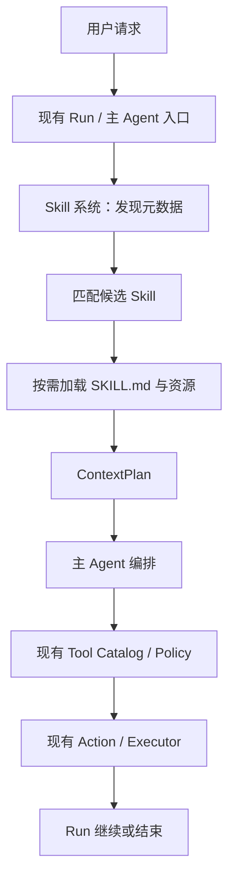

# Agent Runtime Skill 系统分阶段实施计划

> 状态：已确认，按阶段实施
> 范围：产品侧 Skill；不包含开发代理 `.cursor/skills`
> 原则：先完成本计划，再按阶段实现；每阶段验证、提交、部署并确认通过后，才进入下一阶段

## 1. 已确认的架构结论

Skill 是主 Agent 执行前的上下文增强层，不是独立 Agent、独立编排器或独立执行器。



必须保持的边界：

- Skill 只提供指令、资源和多步骤执行说明，不直接执行工具。
- 主 Agent 仍然负责理解任务、拆解步骤、选择工具和继续 Run。
- 多步骤 Skill 复用现有 `Run / Action / Executor`，不新增 `SkillRun`。
- AI 创建或修改 Skill 时，复用现有工作区 `list/read/write` 能力，不新增 Skill 专用读写工具。
- Skill 不能授予工具权限；有效工具仍由现有 Tool Catalog、Policy 和 Action 链路决定。
- 当前 Run 固定已经加载的 Skill 内容哈希；文件修改从下一次 Run 生效，不热更新当前 Run。

## 2. 文件与保存位置

个人或组织 Skill 的事实来源是现有工作区文件系统：

```text
<workspace-root>/
└── Skills/
    └── <skill-name>/
        ├── SKILL.md
        ├── references/
        ├── scripts/
        ├── assets/
        └── tests/
```

作用域沿用现有 Workspace/Runtime Scope：

| Skill 类型 | 工作区边界 |
|---|---|
| 个人 Skill | 散客的 `user_id + org_id=NULL` 工作区 |
| 企业员工个人 Skill | 当前企业下的 `user_id + org_id` 工作区 |
| 企业共享 Skill | 企业 `org_id` 工作区 |
| 平台内置 Skill | 平台只读 Skill 根目录，不进入用户工作区 |

当前 `backend/skills/*.md` 仍是系统内置操作指南，不作为个人 Skill 存储；`.cursor/skills` 与产品 Skill 物理、逻辑隔离。

## 3. Skill 文件契约

首期只要求 `SKILL.md` 具有 YAML frontmatter：

```yaml
---
name: customer-analysis
description: 分析客户数据并输出结论
when_to_use: 用户要求分析客户数据时
---

# Customer Analysis

具体执行说明、约束、完成条件和多步骤流程。
```

目录阶段只读取 `name`、`description`、`when_to_use` 等元数据；完整正文、references、scripts、assets 仅在 Skill 被选中后按需读取。

## 4. 现有系统接入点

| 现有位置 | 复用方式 |
|---|---|
| `backend/services/agent/runtime/context/` | Skill 发现、选择、加载和 ContextPlan 绑定 |
| `backend/services/agent/runtime/context/provider_plan.py` | 固定最终 Provider messages/tools 与计划哈希 |
| `backend/services/handlers/chat/chat_context_mixin.py` | 首次模型请求前的消息组装入口 |
| `backend/services/handlers/chat/execution_engine.py` | 每次模型请求前复用 ContextPlan |
| `backend/services/file_executor.py` | Skill 文件的安全读写、路径隔离和工作区权限 |
| `backend/api/routes/file_browse.py` | 工作区可见性；`Skills/` 作为普通目录展示 |
| 现有 Tool Catalog / Policy / Action / Executor | Skill 指令产生工具调用后的原有执行链路 |

不新增独立 Skill Controller、SkillRun、SkillAction 或 Skill Executor。

## 5. 分阶段实施计划

### 阶段 1：目录规范与元数据发现

目标：知道当前作用域有哪些 Skill，但不把完整 Skill 内容放进上下文。

实施内容：

- 固定 `<workspace>/Skills/` 目录规范。
- 扫描 `SKILL.md` 并解析受限 frontmatter。
- 生成 `name / description / when_to_use / path / content_hash / source`。
- 限制扫描深度、文件大小和符号链接。
- 非法 Skill 跳过并返回结构化问题，不阻断普通任务。
- 多来源候选保持可见，暂不执行冲突裁决。

完成标准：

- 新工作区没有 `Skills/` 时返回空目录，不报错。
- 有效 Skill 可被稳定发现，正文不进入元数据结果。
- 非法 frontmatter、越界路径、符号链接和超大文件被拒绝。
- 发现结果排序和哈希稳定。

当前状态：代码与测试已完成，提交 `7fa88eec`；部署被既有迁移账本缺失 `229_tool_audit_partition_lifecycle.sql` 阻断，未满足阶段发布门禁。

### 阶段 2：接入首次 Run 的 Skill 目录

目标：把当前作用域的 Skill 元数据接入主 Agent 的首次上下文准备，但仍不加载所有正文。

实施内容：

- 从现有 Workspace/Runtime Scope 解析个人、企业和平台 Skill 根目录。
- 在首次模型调用前生成 Skill 目录块。
- 目录只携带名称、用途、来源和有限摘要，设置上下文预算上限。
- 没有 Skill 或目录失败时保持现有主 Agent 行为。
- 目录失败只记录诊断，不让普通聊天整体失败。

验证重点：

- 个人 Skill 不会泄露到其他用户或企业。
- 企业 Skill 不会越过组织边界。
- 目录只在首次 Run 准备阶段注入，不重复累加到后续消息。
- 没有 Skill 时现有 Prompt/ContextPlan 哈希行为保持兼容。

### 阶段 3：候选匹配与按需加载 `SKILL.md`

目标：根据用户请求只加载相关 Skill 的完整正文。

实施内容：

- 支持用户显式指定 Skill 名称。
- 对自动选择先做确定性过滤：作用域、来源、名称、描述和 `when_to_use`。
- 设置单 Run 最大激活数量，首期不超过 3 个。
- 加载匹配 Skill 的完整 `SKILL.md`，不加载无关 Skill 正文。
- 没有匹配项时继续现有主 Agent 流程。
- 同名 Skill 保留来源信息，具体优先级按个人/企业/平台范围确定，不覆盖其他作用域。

验证重点：

- 显式 Skill 不存在时返回可理解的 not-found，并继续或安全结束。
- 自动选择不会把所有 Skill 全量塞入上下文。
- Skill 正文进入主 Agent 上下文后，工具选择仍经过原有 Policy。
- Skill 内容不能修改系统规则或扩大权限。

### 阶段 4：资源渐进加载与 Run 快照

目标：支持 Skill 的 references、scripts、assets 和多步骤说明，同时保证当前 Run 一致性。

实施内容：

- `SKILL.md` 先加载，references/scripts/assets 按需读取。
- 复用现有工作区读取能力和 Sandbox，不自动执行脚本。
- 将已加载 Skill 的 `path / content_hash / resource_hash` 写入当前 Context/Run 事实。
- ContextPlan 固定本次 Provider 请求使用的 Skill 内容。
- Skill 文件发生变化时，当前 Run 不热更新；下一次 Run 重新发现。

验证重点：

- 当前 Run 中途修改 Skill 不改变已发送的上下文。
- references 不存在或读取失败时有明确降级行为。
- 脚本只能进入既有 Sandbox/Executor 链路。
- 资源大小、路径和符号链接限制继续生效。

### 阶段 5：AI 创建和修改 Skill

目标：AI 能够创建新的 Skill、读取已有 Skill 并修改 Skill 文件。

实施内容：

- AI 使用主 Agent 已有的工作区列目录、读取和写入能力。
- 创建 Skill 时在 `<workspace>/Skills/<skill-name>/` 写入 `SKILL.md` 和需要的资源。
- 修改 Skill 时先读取现有文件，再通过普通文件写入形成修改。
- 工作区权限、Action、Executor 和审计沿用现有链路。
- 文件写入成功后，后续 Run 自动通过发现层看到新 Skill。
- 不新增 `skill_create`、`skill_update`、`skill_publish` 等专用工具。

验证重点：

- AI 可以在授权工作区创建 Skill。
- AI 可以修改自己的个人 Skill，但不能越过用户/企业边界。
- Skill 文件写入失败时主 Agent 能够识别失败并继续或结束。
- 修改后的 Skill 不会在当前 Run 中被偷偷热加载。
- Skill 内容不能改变文件工具本身的权限。

### 阶段 6：工作区可见与可编辑

目标：用户可以在产品工作区直接看到和编辑个人 Skill。

实施内容：

- 工作区文件列表展示 `Skills/` 目录和其中的 Skill 文件。
- 用户可以预览、编辑和保存 `SKILL.md` 及允许的资源文件。
- 保存仍走现有工作区写入能力，不建立第二套 Skill 编辑存储。
- 保存后刷新 Skill 元数据索引；新 Run 使用最新内容。
- 当前 Run 仍使用已固定的内容哈希。

验证重点：

- 用户只能看到当前作用域的 Skill。
- 个人 Skill 与企业共享 Skill 的编辑权限明确隔离。
- 工作区普通文件能力与 Skill 发现能力不会互相绕过安全校验。
- 用户编辑后无需额外发布动作即可在下一次 Run 生效。

### 阶段 7：多步骤 Skill 与运行观测

目标：验证 Skill 对多步骤任务的支持，并补齐可观测性。

实施内容：

- Skill 只描述步骤、依赖、完成条件和失败处理。
- 主 Agent 继续使用现有 Run/Action 状态推进多个步骤。
- Action 的授权、重试、unknown/reconcile 和终态不因 Skill 改变。
- 记录 Skill 发现、激活、加载失败、内容哈希和 ContextPlan 绑定信息。
- 增加典型多步骤 Skill 的端到端测试。

验证重点：

- 多步骤 Skill 不需要新增状态机。
- 中途暂停、恢复、失败和重试遵循现有 Run/Action 语义。
- Skill 失败不会破坏 Run 的终态和现有 Action 事实。
- 观测日志不记录 Skill 正文中的敏感内容。

## 6. 每阶段固定交付门禁

每个阶段只实现本阶段范围，依次执行：

```text
集中调查
→ 实现一个完整逻辑批次
→ 静态检查与定向测试
→ git diff --check
→ 只暂存本阶段明确文件
→ 提交
→ 推送
→ 从确定提交创建隔离发布工作树
→ 部署与自动健康检查
→ 记录结果
→ 确认通过后进入下一阶段
```

以下情况必须暂停，不进入下一阶段：

- 发现需要新增专用 Skill 能力或独立编排器。
- 需要改变现有 Run、Action、Policy 或 Executor 公共契约。
- 需要新增数据库结构、发布状态或外部基础设施。
- 发现跨用户、跨企业或工作区路径越权风险。
- 测试、构建、部署、迁移或健康检查失败。
- 生产部署状态无法确认。

## 7. 回滚和兼容策略

- 阶段 1～4 的 Skill 能力通过 feature flag 或空目录降级，不影响没有 Skill 的普通任务。
- Skill 发现或加载失败时，保留原有 Prompt 和工具流程。
- 当前 Run 固定旧的 Skill 内容哈希，Skill 文件更新不会改变历史请求。
- 代码发布失败时回退到上一确定提交，不删除用户工作区 Skill 文件。
- 不执行未经确认的数据库迁移；本计划首期不新增 Skill 数据库表。

## 8. 当前执行位置

当前停在阶段 1 的发布门禁：

- 本地实现和项目测试已通过。
- 提交已推送到远端。
- 生产部署因既有迁移账本缺少 `229_tool_audit_partition_lifecycle.sql` 失败。
- 在迁移门禁解决并重新完成健康验证前，不进入阶段 2。
