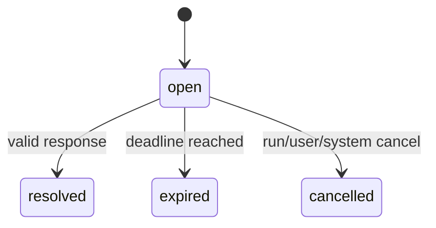
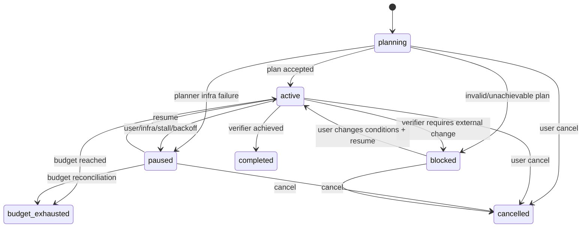

# Agent Runtime 交互与 Goal 状态机附录

> 状态：总体设计第二阶段，待方案评审
> 日期：2026-07-18
> 主文档：`TECH_AGENT_RUNTIME核心状态机.md`
> 本文范围：Interaction、Goal、Continuation、SubRun 父子关系

## 1. Interaction 状态机

### 1.1 InteractionStatus

```text
open
resolved
expired
cancelled
```

Interaction 创建即 open，不增加 pending/requested 两个同义状态。

`resolution_type` 独立记录：

```text
approved
rejected
submitted
selected
acknowledged
```

### 1.2 Interaction 类型

| type | 用途 | 典型结果 |
|---|---|---|
| authorization | 付费/副作用确认 | approved/rejected |
| form | 结构化字段补全 | submitted |
| choice | 多方案选择 | selected |
| credential | 引导连接外部服务 | acknowledged |
| conflict | 文件/计划冲突处理 | selected |
| review | 计划或产物审批 | approved/rejected |

普通自然语言追问不必都成为 Interaction；只有 Runtime 必须暂停并等待结构化输入时才创建。

### 1.3 转移



终态不可逆。迟到响应返回 `INTERACTION_CLOSED` 和当前 receipt，不重新打开。

### 1.4 作用域与安全

Interaction 必须冻结：

```text
session_id / run_id / action_id?
user_id / org_id
interaction_type
request_schema_hash
policy_revision
expires_at
allowed_responders
```

authorization resolution 生成范围有限的 `AuthorizationGrant`：

- 仅绑定 action 或明确 batch。
- 绑定 tool/executor、参数 hash、成本上限和数据范围。
- 不因“本次允许”自动变成永久允许。
- Skill、模型、MCP 不能自行提交 Interaction。

### 1.5 建议参数

| 类型 | 默认有效期 |
|---|---:|
| authorization | 15m |
| form/choice | 24h |
| plan review | 24h |
| credential connection | 30m |

超时后默认：

- 付费/外部副作用：Action rejected，Run paused。
- 可选补充字段：由 schema 定义 default 或 Run 继续降级。
- 计划审批：Goal paused。

## 2. Goal 状态机

### 2.1 GoalStatus

```text
planning
active
paused
blocked
completed
budget_exhausted
cancelled
```

Goal 创建后直接进入 planning；目标文本/预算校验失败则 command 被拒绝，不创建半成品
Goal。`blocked` 可恢复，不是终态。

终态：

```text
completed / budget_exhausted / cancelled
```

### 2.2 PauseReason

paused 的原因独立记录：

```text
user
no_progress
backoff
infrastructure
policy
interaction_expired
maintenance
```

Grok 将 UserPaused、BackOffPaused、NoProgressPaused、InfraPaused 分成状态；本项目建议合并
为 `paused + pause_reason`，减少数据库状态分支，同时保持 UI 可区分。`blocked` 单独保留，
因为它表示目标在现有条件下不可完成，需要用户改变条件。

### 2.3 合法转移



Goal terminal 后不能 resume。用户要继续，创建新 Goal，并通过 `supersedes_goal_id` 关联。

### 2.4 Goal 与 Run

一个 Goal 包含多个顺序 round，每个 round 至少一个 Run：

```text
Goal
  → planning SubRun
  → implementation Run
  → verifier SubRun
  → optional strategist SubRun
  → next implementation Run
```

Run completed 只代表当前 round 完成。只有 Completion Verifier 能把 Goal 标记 completed。

Verifier 输出闭合 verdict：

```text
achieved
continue
blocked
inconclusive
```

- achieved → completed。
- continue → 创建下一 Run。
- blocked → blocked。
- inconclusive → 在 skeptic 次数内复核，耗尽后 paused/infrastructure。

### 2.5 Goal budget

冻结维度：

```text
token_budget?
cost_budget_credits?
wall_time_budget?
run_limit?
action_limit?
subrun_concurrency?
```

建议初始默认：

| 参数 | 初值 |
|---|---:|
| 单 Goal active Run | 1 |
| verifier skeptic | 1 |
| stall strategist 周期 | 每 5 个未进展 round |
| 连续 blocked 判定 | 3 次一致证据 |
| 默认 run limit | 20 |
| 默认 wall time | 2h |

用户未显式创建 Goal 时不套用这些参数。普通 Chat 永远不会因为系统判断“任务复杂”而自动
升级为长期 Goal。

### 2.6 恢复安全

服务重启时：

- active Goal 恢复为 paused，`pause_reason=infrastructure`。
- 已有 live Run 继续由 Run lease 规则恢复。
- 不自动创建新 continuation，直到恢复器确认没有 active/waiting Run。
- 用户或受控自动恢复策略再将 Goal 置 active。

这是比本地 Grok 更保守的 SaaS 策略，避免重启后自动继续付费或执行外部动作。

## 3. Continuation Controller

### 3.1 唯一所有权

每个 Session 同时只能有一个 continuation owner：

```text
none
user_turn
goal
background_wait
interaction
```

`owner_lease_id + state_version` 防止两个控制器同时创建下一 Run。

优先级不是靠 if 顺序决定，而是显式规则：

| 当前 owner | 事件 | 行为 |
|---|---|---|
| goal | background Action completed | 更新状态，由 Goal 决定何时继续 |
| background_wait | Action completed | 创建一次 continuation，然后释放 owner |
| interaction | response resolved | 创建一次 continuation，然后释放 owner |
| user_turn | 新用户 steer | 合并或取消当前 Run |
| none | 普通用户输入 | 创建 user Run |

### 3.2 防重复键

自动 continuation command id：

```text
session_id + source_type + source_id + source_version
```

相同 Action terminal event、Interaction response 或 Goal round 不能创建两次 Run。

### 3.3 新用户输入

用户输入到达时：

- 当前 Run running：形成 steer/interjection 或排队，按客户端语义决定。
- waiting_actions：用户可继续新 Turn；旧 Action 完成不得污染新 Run。
- Goal active：默认暂停 Goal，再处理用户输入；用户明确说“补充条件并继续”时才作为
  Goal steer。
- waiting_interaction：匹配 schema/scope 才解析为 response，否则作为普通输入并提示
  Interaction 仍待处理。

## 4. SubRun 状态与父子关系

Subagent 不需要第二套状态机，使用普通 Run：

```text
run_kind = subagent
parent_run_id
parent_action_id
root_run_id
depth
```

父 Action 的 executor mode 是 `subrun`：

- 子 Run completed → 父 Action completed。
- 子 Run failed → 父 Action failed 或结果回父模型。
- 子 Run cancelled → 父 Action cancelled。
- 子 Run waiting → 父 Action accepted。

父 Run 取消默认向仍未终态的子 Run传播 cancel；已经 accepted/unknown 的孙级外部 Action
仍按各自 reconciliation 处理。

### 4.1 深度与并发

建议初始参数：

| 参数 | 普通 Run | Goal |
|---|---:|---:|
| 最大 SubRun 深度 | 2 | 3 |
| 同父 Run 并发 SubRun | 3 | 4 |
| 同 Session 总 active SubRun | 4 | 6 |

具体值进入 EffectiveConfigSnapshot。子 Run 获得父 capabilities 的交集子集，不自动继承
authorization grant、个人 Memory 或敏感数据范围。

## 5. Interaction、Goal、Action 联动

| 场景 | Action | Run | Goal |
|---|---|---|---|
| 生图需要确认 | awaiting_authorization | waiting_interaction | active |
| 用户批准 | queued | queued | active |
| 用户拒绝 | rejected | queued/取消 | active/paused |
| 确认超时 | rejected | paused | paused |
| Action accepted | accepted | waiting_actions | active |
| Action unknown | unknown | waiting_actions | active，停止新外部动作 |
| Verifier achieved | 无 blocker | completed | completed |
| Verifier blocked | terminal/无 blocker | completed | blocked |
| Goal 用户取消 | queued/running Action 尝试取消 | cancelled | cancelled |

Goal 处于 unknown 外部 Action 时不得继续规划同类副作用，直到对账完成或用户明确裁决。

## 6. 不变量

1. open Interaction 的 response 最多成功写入一次。
2. AuthorizationGrant 只能由 resolved authorization Interaction 或预先存在的明确授权产生。
3. Goal completed 必须有 verifier receipt。
4. Goal active 时最多一个 active implementation Run。
5. active Goal 恢复后先 paused，不自动消费预算。
6. continuation owner 同 Session 唯一。
7. 一个 source event 至多创建一个 continuation Run。
8. SubRun capability 必须是父能力的子集。
9. 父 Run terminal 不意味着所有外部副作用已经停止。
10. unknown Action 阻断 Goal 发起同类非幂等动作。

## 7. 边界场景

| 场景 | 处理 |
|---|---|
| 两端同时批准 | 第一个 CAS 成功，第二个返回 resolved receipt |
| 批量 4 张图只批准 2 张 | Grant 绑定选中的两个 action_id |
| 用户修改参数后批准 | 参数 hash 改变，旧 Interaction cancelled，重新 Policy |
| Goal 重启恢复 | paused/infrastructure，等待恢复命令 |
| Verifier 连续超时 | skeptic 耗尽后 paused，不当作 achieved |
| Strategist 失败 | 保持 active/paused，不直接 blocked |
| 子 Agent 请求更高权限 | Policy deny，不能向上扩权 |
| Goal 与用户新消息竞争 | CAS 抢 continuation owner；用户输入优先暂停 Goal |
| Interaction 已过期但 Action 尚 requested | Action rejected，不执行 |
| Goal budget 在 Action accepted 后耗尽 | Goal budget_exhausted，Action继续对账 |

## 8. 本附录冻结项

- Interaction 四状态，resolution 独立。
- Goal 七状态，pause_reason 独立。
- blocked 可恢复，budget_exhausted/complete/cancelled 终态。
- Goal Completion 只能由 Verifier 驱动。
- Session continuation owner 唯一。
- Subagent 复用 Run 状态机。
- SaaS 重启后 active Goal 默认暂停，不自动继续。

下一阶段设计 PostgreSQL 表、索引、RPC、版本字段和 RuntimeEvent 原子写入。
