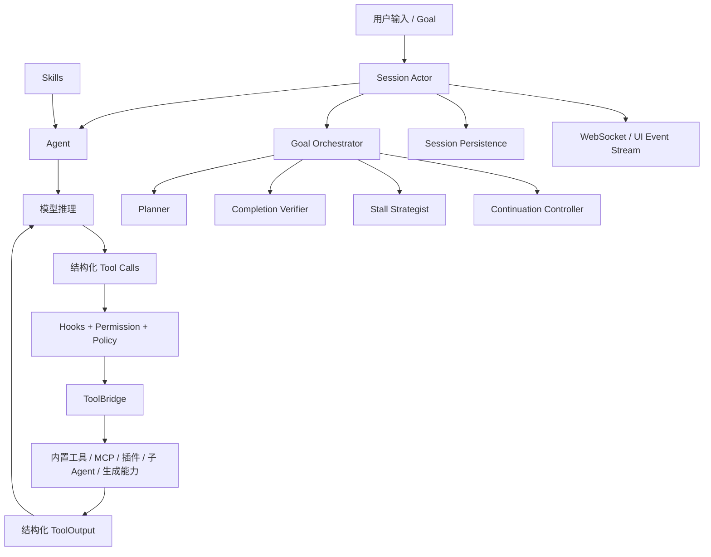

# Agent Runtime 全项目对标与重构总纲

> 状态：调研中
> 建立日期：2026-07-18
> 第一轮对标基线：`c68e39f60462f28d9be5e683d9cbe2c57b1a5027`
> 最新增量核验基线：`7cfcb20d2b50b0d18801a6c0af2e401c0e060894`
> 当前阶段：只做事实调研、差距记录和技术设计，不修改业务实现

## 1. 最终目标

将 EVERYDAYAIONE 从“具备多种 AI 工具和媒体能力的平台”升级为具备以下能力的通用 Agent 平台：

1. 根据用户目标自主决定直接回答、调用工具或进入持续执行。
2. 支持多轮、多工具、并行工具、有依赖工具和长耗时异步工具。
3. 具备 Goal、Plan、继续执行、停滞调整、完成验证、暂停和恢复能力。
4. 统一接入内置工具、Skills、MCP、插件、子 Agent 和外部生成能力。
5. 对权限、成本、积分、资源范围、幂等和副作用执行集中治理。
6. 对模型上下文、运行状态、完整事实、产物和审计信息进行分层管理。
7. 在 Web、企业微信及未来客户端中提供一致、可恢复的 Agent 使用体验。

Grok Build 是完整基线，不是实现上限。若 EVERYDAYAIONE 在多租户、数据库持久化、媒体任务、计费事务或多渠道投递方面更适合 SaaS，则保留并纳入统一架构。

## 2. 固定顶层架构

后续所有调研使用同一张顶层图，不因研究深入而随意增加一级概念：



一级架构保持直观；Action、Observation、Artifact、Checkpoint 等概念只有在对应板块证明必要后，才进入内部协议设计，不提前提升为顶层模块。

## 3. 对标原则

### 3.1 对标的是运行语义

不能以“双方都有类似文件或类”作为能力等价证据。每项能力必须追踪：

```text
入口
→ 参数与配置
→ 调用顺序
→ 状态读写
→ 上下文变化
→ 权限与预算
→ 外部副作用
→ 结构化结果
→ 前端事件
→ 持久化
→ 失败、取消与恢复
```

### 3.2 结论必须有源码证据

每个判断至少记录：

- Grok Build 文件、结构体/函数和关键参数。
- EVERYDAYAIONE 文件、类/函数和关键参数。
- 上下游调用方。
- 测试或运行证据。
- 差距及适用性判断。

### 3.3 不盲目复制

每项能力只能得出以下四类结论之一：

| 结论 | 标准 |
|---|---|
| 采用 Grok | Grok 行为更完整，且适合本项目 |
| 保留现有 | 本项目实现更适合多用户 SaaS 或已有更强保障 |
| 融合升级 | 双方解决不同问题，需要在统一边界内组合 |
| 暂不实现 | 与产品目标无关或当前成本明显高于收益 |

## 4. 单板块固定研究模板

每个板块必须包含以下内容，缺项时明确标记“待核验”，禁止用推测补全。

### 4.1 产品行为

- 用户如何触发。
- 用户可见的状态和反馈。
- 是否允许中断、追加要求、恢复或重试。
- 简单任务与复杂任务是否分流。

### 4.2 Grok Build 实现

- 源码位置。
- 核心结构体、枚举、函数。
- 构造参数、默认值、环境变量和配置优先级。
- 正常控制流、数据流和事件流。
- 内存、文件和持久状态的归属。
- 并发、背压、取消、超时、重试和降级。
- 单元测试、集成测试和已知限制。

### 4.3 EVERYDAYAIONE 实现

- 对应入口、服务、Schema、迁移、前端消费者。
- 具体参数和默认值。
- Web、企微、定时任务、媒体任务是否使用同一链路。
- 数据库、Redis、进程内状态和 OSS 的职责。
- 现有测试和运行证据。

### 4.4 差距与决策

- 能力差距。
- 重复实现和断层。
- 可直接复用部分。
- 安全、成本、兼容和迁移风险。
- 采用 Grok、保留现有、融合升级或暂不实现。
- 进入总重构设计的候选修改点。

### 4.5 验收场景

每个板块必须给出可执行验收场景，至少覆盖：

- 正常路径。
- 空值或未初始化。
- 并发与竞态。
- 超时与重试。
- 取消与中断。
- 进程退出与恢复。
- 权限不足。
- 上下文或资源预算耗尽。

## 5. 全项目研究目录

| 编号 | 板块 | 主要内容 | 状态 |
|---:|---|---|---|
| 01 | 项目全景与组件装配 | 入口、运行模式、进程边界、启动关闭 | 第一轮完成 |
| 02 | Session Actor | 会话命令、状态、并发、取消、恢复 | 第一轮完成 |
| 03 | Agent | Agent 定义、构建、上下文和能力装配 | 第一轮完成 |
| 04 | Model Loop | 模型请求、流式输出、工具轮次和停止条件 | 第一轮完成 |
| 05 | Policy | Hooks、权限、成本、确认、沙盒和副作用 | 第一轮完成 |
| 06 | ToolBridge | 注册、发现、参数、分发、错误和 ToolOutput | 第一轮完成 |
| 07 | Tool Executors | 内置、媒体、ERP、文件、搜索、外部动作 | 第一轮完成 |
| 08 | Goal Orchestrator | Planner、Verifier、Strategist、Continuation | 第一轮完成 |
| 09 | Context Engineering | 信息分层、预算、压缩、检索和恢复 | 第一轮完成 |
| 10 | Skills | 发现、加载、优先级、预算和允许工具 | 第一轮完成 |
| 11 | MCP / Plugins / Hooks | 扩展发现、认证、生命周期和隔离 | 第一轮完成 |
| 12 | Subagents / Background | 子上下文、权限、并发和后台任务 | 第一轮完成 |
| 13 | Persistence | Session、Plan、Goal、事件、Checkpoint | 第一轮完成 |
| 14 | Protocol / UI | ACP、WebSocket、过程状态和产物展示 | 第一轮完成 |
| 15 | Observability / Config | 日志、Trace、指标、配置和反馈 | 第一轮完成 |
| 16 | Testing / Operations | 测试体系、部署、灰度、迁移和回滚 | 第一轮完成 |
| 17 | 端到端链路 | Web、企微、媒体、ERP、Skills、MCP、Goal | 第一轮完成 |

## 6. 文档产物

### 6.1 调研阶段

- 本总纲：范围、标准、索引和阶段结论。
- `research/`：逐板块源码级对标。
- 差距矩阵：所有结论及证据索引。

### 6.2 总体设计阶段

完成全部事实调研后，输出：

- 目标架构。
- 模块职责与依赖规则。
- 数据库和状态机。
- API、工具、事件和持久化协议。
- 上下文预算与信息路由。
- MCP、插件和 Skill 扩展规范。
- 兼容、迁移、灰度与回滚方案。

总体设计属于 A 级方案，完成后必须等待用户确认，未经确认不进入业务代码重构。

### 6.3 实施阶段

按可独立验证、可独立回滚的阶段实施：

```text
协议基线
→ ToolBridge
→ Session / Run
→ Model Loop
→ Policy
→ Goal Orchestrator
→ Context / Skills
→ MCP / Plugins
→ UI Runtime
```

具体顺序以全量调研后的依赖图为准，本阶段不提前锁死实现。

## 7. 当前项目上下文

### 7.1 架构现状

EVERYDAYAIONE 当前为 FastAPI + React 的多用户 SaaS，PostgreSQL 是业务事实源，Redis 主要承担唤醒、缓存、限流和跨进程实时通知。Chat 已有独立 Conversation Actor Worker、模型工具循环、结构化内容块、WebSocket 投递和媒体异步任务。能力较完整，但形成于不同阶段，入口、协议和生命周期尚未全部收口为一个 Agent Runtime。

### 7.2 可复用模块

- Conversation Actor 的数据库队列、租约、fencing 和原子终态。
- Chat 流式执行内核及 Tool Loop。
- Tool Registry、Tool Selector、ToolOutput 和专业工具执行器。
- 图片/视频计费、Provider 任务、回调、轮询、退款和 OSS 持久化。
- ContentPart、WebSocket、企微 Outbox 和数据库恢复。
- ResourceManifest、Sandbox、文件注册表和组织权限。

### 7.3 设计约束

- 保持 Web、企微、定时任务、图片、视频、ERP 和文件能力兼容。
- 数据库继续作为持久执行事实源，Redis 不承载唯一执行状态。
- 所有付费和外部副作用必须经过确定性策略校验。
- 超过一秒的操作优先异步化并支持超时、取消和恢复。
- 新旧链路必须可灰度、可观测、可回滚。

### 7.4 潜在冲突

- 当前工作区存在尚未提交的图表、Mermaid、规则和文档修改，调研阶段不得覆盖。
- `backend/services/agent/tool_loop_executor.py` 当前 756 行，超过项目 500 行硬阈值；只记录为既有结构风险，不在调研阶段擅自拆分。
- `backend/main.py` 当前 589 行，启动职责较多；只记录为 composition root 风险，是否拆分由总体设计决定。
- 现有 `Agent`、`Task`、`ToolOutput` 等名称已有多种业务含义，未来协议命名需要兼容审计。

## 8. 阶段门禁

1. 单板块调研完成：更新状态和证据。
2. 全量调研完成：形成差距矩阵和目标架构候选。
3. 多角色评审完成：识别必须由用户决定的分歧。
4. 用户确认总体方案：才能输出最终实施设计。

## 9. 最新源码增量审计

17 个板块的第一轮文档仍保留 `c68e39f...` 作为当时证据快照，不通过批量替换伪装成已
重新核验。总体设计和后续专项以 `7cfcb20...` 为最新基线，逐板块记录增量变化。

当前确认需要优先复核的变化集中在：

- Session prompt queue、interjection、取消和自动唤醒抑制。
- Context request builder、前缀稳定性、ToolResult Pruning 和图片高低水位。
- Compaction、full-replace history、抑制与模型切换恢复。
- Tool completion reminder、后台任务输出和 kill 语义。
- Permission manager、shell access 和持久权限状态。
- Toolset resolve、ToolBridge 和动态能力装配。

统一运行合同见
`docs/document/TECH_AGENT_RUNTIME统一Session运行时与上下文加载合同.md`。各板块只有
完成最新增量源码、当前项目调用链和测试三方复核后，才能从“第一轮完成”升级为
“最新基线完成”。
5. 用户确认实施设计：才能修改业务代码。
