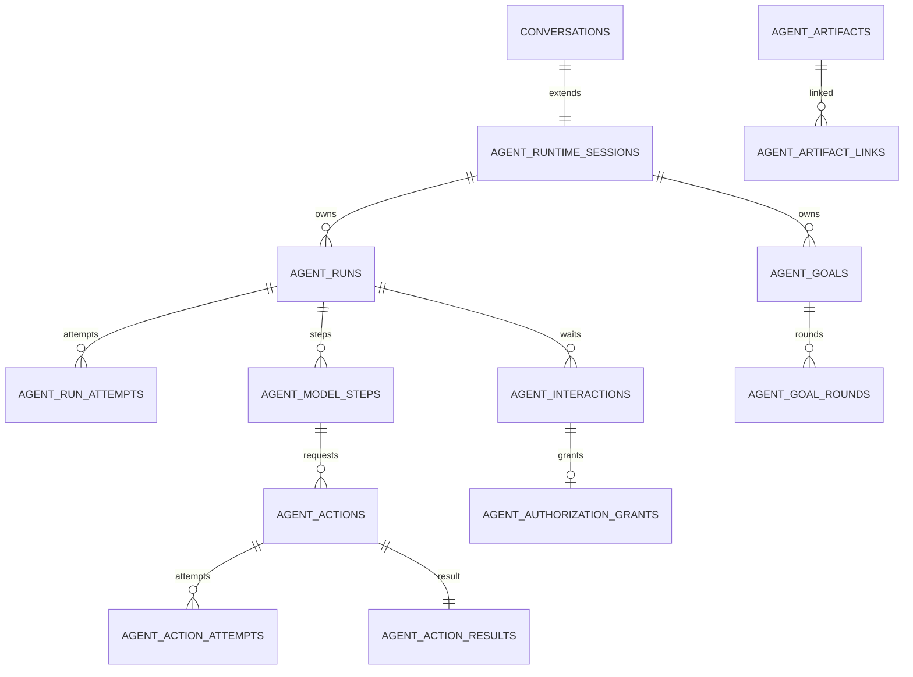

# Agent Runtime PostgreSQL 数据模型

> 状态：总体设计第三阶段，待方案评审
> 日期：2026-07-18
> 前置：目标架构、核心状态机、Interaction/Goal 附录
> 本文范围：表、字段、约束、索引、租户边界、兼容映射
> 配套：`TECH_AGENT_RUNTIME数据库RPC与原子边界.md`、`TECH_AGENT_RUNTIME事件存储与保留附录.md`

## 1. 设计结论

采用新增 `agent_*` 表，不继续把 Runtime 字段堆入现有 `tasks`：

```text
conversations/messages/tasks（现有兼容事实）
            ↕ compatibility mapping
agent_runtime_sessions
  → agent_runs
      → agent_model_steps
      → agent_actions
          → agent_action_attempts
          → agent_action_results
      → agent_interactions
      → agent_artifacts
  → agent_goals
  → agent_runtime_events
```

迁移期：

- 旧 `tasks/messages` 仍是生产展示与执行主链。
- `agent_*` 先 shadow write。
- 每个旧 task 映射到一个 Run；每个 Tool Call 映射到 Action。
- 媒体 task 映射到 ActionAttempt。
- 验证稳定后按能力切换 single terminal owner。

## 2. 方案对比

| 维度 | A：继续扩展 tasks | B：新增 agent_* 表（推荐） | C：纯 Event Sourcing |
|---|---|---|---|
| 兼容 | 表面简单，约束越来越宽 | 新旧映射清晰 | 需重建全部读模型 |
| 状态约束 | Chat/媒体/Action 互相冲突 | 每个聚合闭合 | reducer 复杂 |
| 回滚 | 字段语义难回退 | 关闭双写即可 | 回滚 projection 困难 |
| 查询 | 单表但大量 NULL/JSON | 索引按职责设计 | 所有查询依赖 projection |
| 迁移风险 | 高 | 中 | 极高 |
| 长期维护 | 低 | 高 | 中 |

推荐 B，并采用“状态表 + append-only event”混合模式，不做纯 Event Sourcing。

## 3. 共通约定

### 3.1 类型

- 主键：`UUID DEFAULT gen_random_uuid()`。
- 时间：`TIMESTAMPTZ`，数据库 `NOW()`。
- 序号/版本：`BIGINT`。
- 金额/积分：现有积分整数继续 `INTEGER`；Provider 原始货币使用 `NUMERIC(18,6)`。
- enum：首期使用 `TEXT + CHECK`，便于 additive migration；应用层使用闭合 StrEnum。
- 任意 JSON：必须有 `jsonb_typeof` CHECK 和大小上限 RPC 校验。

### 3.2 多租户

所有根事实包含：

```text
org_id UUID NULL
scope_kind TEXT NOT NULL CHECK IN ('user','channel','system')
scope_id TEXT NOT NULL
created_by_user_id UUID NULL
```

个人会话：`scope_kind=user`、`scope_id=user_id::text`。企微群：`scope_kind=channel`、
`scope_id` 使用数据库派生 channel owner。所有子表冗余 `org_id`，RPC 同时校验父子一致，
避免只靠外键跨租户串联。

### 3.3 版本与删除

- 可变聚合均有 `state_version BIGINT NOT NULL DEFAULT 0 CHECK >= 0`。
- Runtime 事实不硬删除；用户删除会话后按数据治理策略异步 purge。
- 外键默认 `ON DELETE RESTRICT`；只有纯子记录可 `CASCADE`。
- `updated_at` 只能由 RPC 推进，不依赖通用 trigger 隐式修改。

## 4. `agent_runtime_sessions`

Conversation 的 Runtime 扩展，一对一，不复制消息正文。

| 字段 | 类型/约束 | 说明 |
|---|---|---|
| id | UUID PK | Runtime session ID |
| conversation_id | UUID NOT NULL UNIQUE FK conversations RESTRICT | 现有会话 |
| org_id | UUID NULL FK organizations | 租户 |
| scope_kind | TEXT CHECK | user/channel/system |
| scope_id | TEXT NOT NULL | 稳定作用域 |
| created_by_user_id | UUID NULL FK users | 创建人 |
| agent_definition_id | TEXT NOT NULL | 默认 Agent 定义 |
| agent_definition_revision | TEXT NOT NULL | 冻结版本 |
| active_goal_id | UUID NULL | Goal 表创建后加 FK |
| continuation_owner | TEXT NOT NULL DEFAULT 'none' | none/user_turn/goal/background_wait/interaction |
| continuation_source_id | UUID NULL | owner 对象 |
| continuation_lease_id | UUID NULL | continuation CAS |
| next_event_sequence | BIGINT NOT NULL DEFAULT 1 CHECK > 0 | Session 事件序号分配 |
| state_version | BIGINT NOT NULL DEFAULT 0 | CAS |
| created_at/updated_at | TIMESTAMPTZ NOT NULL | 时间 |

约束：

- `continuation_owner='none'` 时 source/lease 必须 NULL。
- 其他 owner 时 `continuation_lease_id` 必须非 NULL。
- `(org_id, scope_kind, scope_id, conversation_id)` 不额外唯一；conversation 已唯一。

索引：

- `UNIQUE(conversation_id)`。
- `(org_id, scope_kind, scope_id)`。
- partial `(active_goal_id) WHERE active_goal_id IS NOT NULL`。

## 5. `agent_runs`

| 字段 | 类型/约束 | 说明 |
|---|---|---|
| id | UUID PK | Run ID |
| session_id | UUID NOT NULL FK session RESTRICT | 所属 Session |
| org_id | UUID NULL | 冗余租户 |
| root_run_id | UUID NOT NULL FK self | 根 Run；根记录等于 id |
| parent_run_id | UUID NULL FK self | 父 Run |
| parent_action_id | UUID NULL | SubRun 对应 Action，后加 FK |
| goal_id | UUID NULL | 所属 Goal |
| run_kind | TEXT CHECK | user/continuation/subagent/planner/verifier/strategist |
| status | TEXT CHECK | 八个 RunStatus |
| command_id | UUID NOT NULL | 创建命令 |
| idempotency_key | TEXT NOT NULL | 入口幂等 |
| input_message_id | UUID NULL FK messages SET NULL | 现有输入 |
| output_message_id | UUID NULL FK messages SET NULL | 兼容投影 |
| base_context_revision | BIGINT NULL CHECK >=0 | 现有 ContextSnapshot |
| context_through_message_id | UUID NULL FK messages SET NULL | 闭合边界 |
| context_receipt | JSONB NOT NULL DEFAULT '{}' | hash/预算/来源，不存大正文 |
| config_snapshot | JSONB NOT NULL DEFAULT '{}' | EffectiveConfigSnapshot |
| capability_snapshot | JSONB NOT NULL DEFAULT '{}' | EffectiveCapabilities |
| blocking_action_count | INTEGER NOT NULL DEFAULT 0 CHECK >=0 | 完成 gate |
| open_interaction_count | INTEGER NOT NULL DEFAULT 0 CHECK >=0 | 完成 gate |
| execution_token | UUID NULL | 当前 claim |
| lease_expires_at | TIMESTAMPTZ NULL | 当前 lease |
| attempt_count | INTEGER NOT NULL DEFAULT 0 CHECK >=0 | claim 次数 |
| state_version | BIGINT NOT NULL DEFAULT 0 | CAS |
| terminal_reason/error_code | TEXT NULL | 终态分类 |
| created_at/started_at/completed_at/updated_at | TIMESTAMPTZ | 生命周期 |

约束：

- `UNIQUE(session_id, idempotency_key)`。
- `running` 时 token、lease、started_at 非 NULL。
- 非 running 时 token、lease 必须 NULL。
- 终态必须 `completed_at` 非 NULL；非终态必须 NULL。
- `parent_action_id` 与 `parent_run_id` 同时为空或同时非空。
- `run_kind='subagent'` 必须有父关系。
- JSON 必须 object，RPC 限制各自不超过 256 KB。

索引：

- claim：`(status, created_at, id) WHERE status='queued'`。
- expired：`(lease_expires_at) WHERE status='running'`。
- Session：`(session_id, created_at DESC)`。
- Goal：`(goal_id, created_at) WHERE goal_id IS NOT NULL`。
- parent：`(parent_run_id) WHERE parent_run_id IS NOT NULL`。
- active：`(session_id, status) WHERE status NOT IN terminal`。

## 6. `agent_run_attempts`

| 字段 | 类型/约束 |
|---|---|
| id | UUID PK |
| run_id/org_id | UUID NOT NULL |
| attempt_number | INTEGER NOT NULL CHECK >0 |
| execution_token | UUID NOT NULL UNIQUE |
| worker_id | TEXT NOT NULL |
| claimed_at/lease_expires_at | TIMESTAMPTZ NOT NULL |
| ended_at | TIMESTAMPTZ NULL |
| outcome | TEXT NULL CHECK completed/lease_lost/crashed/cancelled/failed |
| error_class | TEXT NULL |
| metrics | JSONB object DEFAULT '{}' |

约束 `UNIQUE(run_id, attempt_number)`。历史 attempt 不续租；Run 表保存当前 token。索引
`(run_id, attempt_number DESC)` 和 `(lease_expires_at) WHERE ended_at IS NULL`。

## 7. `agent_model_steps`

| 字段 | 类型/约束 | 说明 |
|---|---|---|
| id | UUID PK | Step |
| run_id/session_id/org_id | UUID NOT NULL | 作用域 |
| step_number | INTEGER NOT NULL CHECK >0 | Run 内单调 |
| status | TEXT CHECK | pending/running/completed/failed/cancelled |
| model_id/provider | TEXT NOT NULL | 逻辑模型和 Provider |
| model_revision/prompt_revision | TEXT NOT NULL | 可回放版本 |
| tool_catalog_revision | TEXT NOT NULL | 工具快照 |
| request_receipt | JSONB object | Context hash、参数，不默认存敏感正文 |
| response_receipt | JSONB object | response hash/结构摘要 |
| stop_reason/provider_stop_reason | TEXT NULL | 停止原因 |
| input/output/reasoning_tokens | BIGINT NOT NULL DEFAULT 0 CHECK >=0 | Usage |
| execution_token/lease_expires_at | UUID/TIMESTAMPTZ NULL | 当前 Step 执行权 |
| attempt_count/state_version | INTEGER/BIGINT NOT NULL | CAS |
| started_at/completed_at/created_at/updated_at | TIMESTAMPTZ | 时间 |

约束 `UNIQUE(run_id, step_number)`。completed 必须 stop_reason 非 NULL；失败/取消有
terminal reason。索引 `(run_id, step_number)`、expired lease partial。

`agent_model_attempts` 保存 provider 重试：

```text
id, model_step_id, attempt_number, provider_request_id,
model_id, provider, started_at, first_token_at, ended_at,
outcome, status_code, error_class, usage JSONB, fallback_reason
```

唯一 `(model_step_id, attempt_number)`；Provider request id 非空时唯一
`(provider, provider_request_id)`。

## 8. `agent_actions`

| 字段 | 类型/约束 | 说明 |
|---|---|---|
| id | UUID PK | Action |
| run_id/model_step_id/session_id/org_id | UUID NOT NULL | 作用域 |
| action_index | INTEGER NOT NULL CHECK >=0 | Step 内顺序 |
| parent_action_id | UUID NULL FK self | batch/compensation |
| action_kind | TEXT NOT NULL | tool/media/file/erp/mcp/subrun/external |
| tool_name/tool_revision | TEXT NOT NULL | Catalog 身份 |
| executor_kind/executor_revision | TEXT NOT NULL | 路由 |
| status | TEXT CHECK | 十个 ActionStatus |
| blocking | BOOLEAN NOT NULL DEFAULT TRUE | 是否阻塞 Run |
| side_effect_class | TEXT CHECK | none/local/reversible/external/irreversible |
| concurrency_key | TEXT NULL | 资源冲突键 |
| request_payload | JSONB object NOT NULL | 类型化参数 |
| request_hash | TEXT NOT NULL | 规范化 hash |
| idempotency_key | TEXT NOT NULL | 业务幂等 |
| policy_decision_id | UUID NULL | 决策 |
| authorization_grant_id | UUID NULL | 授权 |
| cost_reservation_id | UUID NULL FK credit_transactions | 现有积分预留 |
| attempt_count | INTEGER NOT NULL DEFAULT 0 CHECK >=0 | 尝试 |
| next_reconcile_at | TIMESTAMPTZ NULL | accepted/unknown |
| reconcile_deadline_at | TIMESTAMPTZ NULL | SLA |
| state_version | BIGINT NOT NULL DEFAULT 0 | CAS |
| terminal_reason/error_code | TEXT NULL | 分类 |
| created_at/started_at/accepted_at/completed_at/updated_at | TIMESTAMPTZ | 时间 |

约束：

- `UNIQUE(model_step_id, action_index)`。
- `UNIQUE(run_id, idempotency_key)`。
- accepted/unknown 必须 `accepted_at` 或 ambiguity evidence 由 Attempt 保证。
- terminal 必须 completed_at。
- rejected 不得 started_at。
- JSON object 且 RPC 限制 256 KB；大输入只存 Artifact reference。

索引：

- claim `(status, created_at, id) WHERE status='queued'`。
- reconcile `(next_reconcile_at) WHERE status IN ('accepted','unknown')`。
- run `(run_id, created_at)`。
- external lookup 由 Attempt 索引。
- concurrency `(concurrency_key, status) WHERE active`。

## 9. `agent_action_attempts` 与结果

`agent_action_attempts`：

| 字段 | 类型/约束 |
|---|---|
| id | UUID PK |
| action_id/run_id/org_id | UUID NOT NULL |
| attempt_number | INTEGER NOT NULL CHECK >0 |
| status | TEXT CHECK 七状态 |
| execution_token | UUID NOT NULL UNIQUE |
| worker_id | TEXT NOT NULL |
| idempotency_key/request_hash | TEXT NOT NULL |
| provider/provider_request_id/external_task_id | TEXT NULL |
| receipt | JSONB object DEFAULT '{}' |
| ambiguity_evidence | JSONB object DEFAULT '{}' |
| retry_disposition/error_class/status_code | TEXT/INTEGER NULL |
| lease_expires_at/started_at/accepted_at/ended_at | TIMESTAMPTZ |

唯一：

- `(action_id, attempt_number)`。
- `(provider, provider_request_id)` 非空 partial unique。
- `(provider, external_task_id)` 非空 partial unique。

`agent_action_results` 一对一：

```text
action_id UUID PK
org_id UUID
status TEXT CHECK IN ('success','empty','degraded','error')
summary TEXT NOT NULL DEFAULT ''
data JSONB NULL
artifact_ids UUID[] NOT NULL DEFAULT '{}'
usage JSONB NOT NULL DEFAULT '{}'
cost JSONB NOT NULL DEFAULT '{}'
receipt JSONB NOT NULL DEFAULT '{}'
result_hash TEXT NOT NULL
created_at TIMESTAMPTZ NOT NULL
```

结果 JSON 单项最大 1 MB；更大数据必须存 Artifact。`result_hash` 用于重复 terminal 提交
一致性校验。

## 10. Interaction 与授权

`agent_interactions`：

```text
id, session_id, run_id, action_id?, org_id,
type, status, request_schema JSONB, request_schema_hash,
prompt_artifact_id?, allowed_responders JSONB,
resolution_type?, response JSONB?, response_hash?,
policy_revision, expires_at, resolved_by_user_id?,
state_version, created_at, resolved_at
```

约束：

- status 为 open/resolved/expired/cancelled。
- open 时 resolution/response/resolved_at NULL。
- resolved 时三者非 NULL。
- `UNIQUE(run_id, idempotency_key)`，需增加 `idempotency_key TEXT NOT NULL`。
- open claim 索引 `(expires_at) WHERE status='open'`。

`agent_authorization_grants`：

```text
id, session_id, run_id, interaction_id, org_id, granted_by_user_id,
scope_type CHECK action/batch/session_policy,
scope JSONB, parameter_hash, max_cost_credits,
data_scope JSONB, policy_revision,
valid_from, expires_at, revoked_at, created_at
```

默认 scope_type 为 action。唯一 `(interaction_id)`，撤销不删除。

## 11. Goal 与 Round

`agent_goals`：

```text
id, session_id, org_id, created_by_user_id,
objective_artifact_id, status, pause_reason, blocked_reason_artifact_id?,
budget JSONB, usage JSONB, plan_artifact_id?,
round_count, active_run_id?, continuation_version,
supersedes_goal_id?, state_version,
created_at, started_at, paused_at, completed_at, updated_at
```

约束：

- 每 Session 最多一个非终态 Goal：partial unique
  `(session_id) WHERE status NOT IN ('completed','budget_exhausted','cancelled')`。
- paused 必须 pause_reason；其他状态 pause_reason NULL。
- terminal 必须 completed_at。
- budget/usage 是 object，字段由应用 schema 校验。

`agent_goal_rounds`：

```text
id, goal_id, round_number, implementation_run_id,
verifier_run_id?, strategist_run_id?,
verdict CHECK achieved/continue/blocked/inconclusive NULL,
progress_fingerprint, verifier_receipt JSONB,
started_at, completed_at
```

唯一 `(goal_id, round_number)`。

## 12. Artifact 与关联

`agent_artifacts` 保存 metadata，不把大文件写 PostgreSQL：

```text
id, org_id, owner_scope_kind, owner_scope_id,
kind, mime_type, storage_kind CHECK inline/oss/workspace/database,
uri, content_hash, byte_size,
schema_version, metadata JSONB,
sensitivity, retention_class,
created_by_run_id?, created_by_action_id?,
created_at, expires_at?, deleted_at?
```

约束：

- inline 仅允许 byte_size ≤ 64 KB，内容放 `inline_content JSONB/TEXT` 二选一字段。
- 非 inline 必须 uri。
- `(org_id, content_hash, kind)` 不做全局唯一，避免不同权限资产错误去重。

`agent_artifact_links`：

```text
artifact_id, entity_type, entity_id, relation, ordinal, created_at
PRIMARY KEY(artifact_id, entity_type, entity_id, relation)
```

entity_type 为 run/model_step/action/goal/interaction/message。因多态 FK 无法数据库强制，
所有写入只允许 RPC，并由对应 scope 校验。

## 13. Usage 与积分关联

新增 `agent_usage_entries`，作为不可变计量事实：

```text
id, org_id, session_id, run_id, model_step_id?, action_id?, attempt_id?,
usage_kind, provider, model_or_executor,
quantity NUMERIC(20,6), unit, unit_price NUMERIC(18,6),
currency, credits_equivalent INTEGER,
source_receipt JSONB, dedupe_key TEXT,
occurred_at
```

唯一 `(org_id, dedupe_key)`，个人 org_id NULL 时使用两个 partial unique index，避免
PostgreSQL NULL 唯一语义漏重。

现有 `credit_transactions` 增加可空：

```text
runtime_run_id UUID
runtime_action_id UUID
usage_entry_id UUID
```

现有余额、预留、确认和退款 RPC 继续做资金事实；Usage entry 不能直接修改余额。

## 14. 兼容映射

`agent_legacy_mappings`：

```text
id, org_id,
legacy_type CHECK task/message/tool_step/media_task/delivery,
legacy_id TEXT,
runtime_type CHECK session/run/model_step/action/artifact/interaction,
runtime_id UUID,
mapping_revision, created_at
```

唯一 `(legacy_type, legacy_id, runtime_type)`。映射只允许新 Runtime 引用旧对象，不允许
旧表 trigger 自主反推复杂 Runtime 状态。

首期可在 `tasks` 增加 `runtime_run_id/runtime_action_id` 两个可空字段以加速热查询，但
事实映射仍以 mapping 表/专用 RPC 为准。

## 15. 关系图



## 16. 容量、风险与冻结项

写放大、事件合并、保留、分区触发条件和本模型的风险/冻结项统一记录在
`TECH_AGENT_RUNTIME事件存储与保留附录.md`，避免数据库模型与事件容量策略重复。

配套 RPC 文档定义锁顺序、事件序号、Callback Inbox 和迁移/回滚边界。
