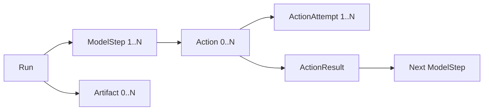
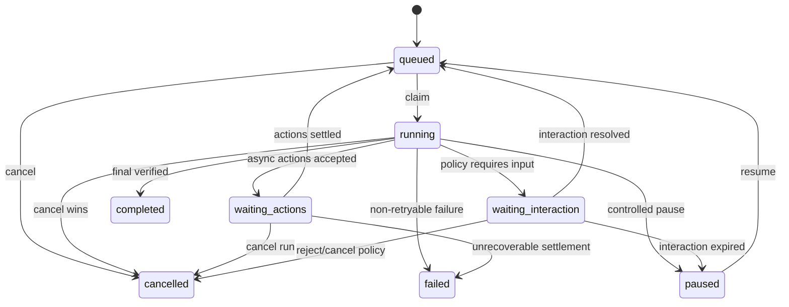
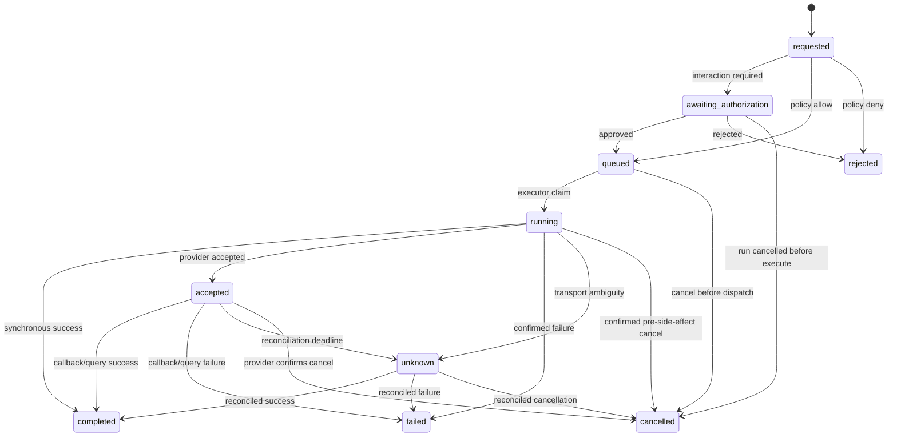

# Agent Runtime 核心状态机

> 状态：总体设计第二阶段，待方案评审
> 日期：2026-07-18
> 前置：`TECH_AGENT_RUNTIME目标架构与模块边界.md`
> 本文范围：Run、ModelStep、Action、ActionAttempt、终态所有权、取消、重试和恢复
> 配套：`TECH_AGENT_RUNTIME交互与Goal状态机附录.md`

## 1. 结论摘要

核心原则是：

```text
业务状态 ≠ Worker 执行权
Run 取消 ≠ 外部 Action 已取消
Action 失败 ≠ 一定可以重试
消息展示状态 ≠ Runtime 事实状态
```

目标状态关系：



Run 是一次用户目标或自动 continuation；ModelStep 是一次确定模型请求；Action 是模型
或系统要求执行的能力；ActionAttempt 是一次真实调度/Provider 请求。Run、Action 各有
业务状态，claim token/lease 只表示当前谁能推进它们。

## 2. 现有状态与复用基础

### 2.1 当前 Chat Actor

现有 Chat task：

```text
pending → running → completed / failed / cancelled
```

并已有：

- `execution_token`。
- `lease_expires_at`。
- `execution_attempt >= 0`。
- lease 参数范围 `15..300s`。
- 默认 Actor lease `90s`。
- Runtime Worker 每 `5s` 续租。
- 默认最大 attempt `3`。
- 当前 fencing token 才能 progress/commit/fail。
- cancel 立即使旧 token 失效。

这些机制直接复用为 Run 执行权，不再创建另一套 Worker lease。

### 2.2 当前媒体任务

媒体 Provider task 使用 pending/running/completed/failed/cancelled，Webhook 和轮询由
`TaskCompletionService` 统一收口；Redis 完成锁 `300s`、每 `60s` 续期，DB version
再做一次乐观锁。

缺口是“Provider 已接受但本地不知道最终结果”没有独立 `accepted/unknown` 语义，
也没有 Action 与多次 Attempt。

### 2.3 当前消息与投递

Message 有 pending/completed/failed；企微 Outbox 有 pending/delivering/delivered/dead。
它们都属于 Projection/Delivery 状态，不能与 Run/Action 状态合并。

## 3. 状态建模规则

### 3.1 状态只表达业务阶段

禁止把以下内容编码进 status：

- retry 次数。
- Worker ID。
- Provider 名。
- cancel reason。
- pause reason。
- stop reason。
- error code。
- UI loading 类型。

这些使用独立字段或事件。

### 3.2 终态不可逆

统一业务终态：

| 对象 | 终态 |
|---|---|
| Run | `completed / failed / cancelled` |
| ModelStep | `completed / failed / cancelled` |
| Action | `completed / failed / rejected / cancelled` |
| ActionAttempt | `completed / failed / cancelled` |

`unknown` 不是终态；它表示外部副作用结果不确定，必须 reconcile 或人工裁决。

### 3.3 compare-and-set

任何状态推进都必须同时校验：

```text
current_status
+ state_version
+ owner token（需要执行权时）
+ tenant/session/run scope
```

写成功后 `state_version + 1` 并追加 RuntimeEvent。重复提交返回已有结果，不重复扣费、
创建 Artifact 或发送外部动作。

## 4. Run 状态机

### 4.1 RunStatus

```text
queued
running
waiting_actions
waiting_interaction
paused
completed
failed
cancelled
```

| 状态 | 含义 | 可有执行 lease |
|---|---|---:|
| queued | 已持久化，等待 claim | 否 |
| running | 正在构建 Context、模型推理或处理结果 | 是 |
| waiting_actions | 等待一个或多个异步 Action | 否 |
| waiting_interaction | 等待用户确认/表单/选择 | 否 |
| paused | 可恢复但当前不自动推进 | 否 |
| completed | 目标已在本 Run 内完成 | 否 |
| failed | 不可在本 Run 自动恢复 | 否 |
| cancelled | 用户/上层明确终止 Run | 否 |

不增加 `retrying`：重试属于新的 `run_attempt`，业务状态仍为 running 或 queued。

### 4.2 合法转移



终态没有出边。

### 4.3 Run 完成条件

Run 只有在以下条件同时成立时 completed：

1. 最新 ModelStep 的 stop reason 是 final/structured_final。
2. 没有 blocking Action 处于 requested/queued/running/accepted/unknown。
3. 没有 open Interaction。
4. Runtime contract/Completion Gate 通过。
5. 如果属于 Goal，Run 完成只表示本轮完成，不代表 Goal 完成。

普通聊天可在一次 ModelStep 后完成；有 Tool 的 Run 通常包含多个 ModelStep。

### 4.4 Run 失败与暂停

| 场景 | Run 处理 |
|---|---|
| 模型暂时超时且重试未耗尽 | 保持 running，新 run_attempt |
| Worker lease 丢失 | 保持原业务状态，新 Worker 接管 |
| 达到最大基础设施重试 | failed |
| Policy 拒绝单个 Action | Action rejected，结果回模型；不必失败 Run |
| 用户拒绝关键 Interaction | cancelled 或继续降级，由 Interaction policy 决定 |
| Goal 暂停 | 当前 Run 可完成/取消；不创建下一 Run |
| context 无法恢复 | failed，reason=context_unrecoverable |
| waiting Action 进入 unknown | 保持 waiting_actions，触发 reconcile |

### 4.5 RunAttempt

RunAttempt 不需要复杂业务状态，只记录一次 claim：

```text
attempt_number
execution_token
worker_id
claimed_at / lease_expires_at / ended_at
outcome: completed / lease_lost / crashed / cancelled / failed
error_class
```

同一 Run 同时最多一个有效 lease。`attempt_number` 单调递增，不回收。

## 5. ModelStep 状态机

### 5.1 ModelStepStatus

```text
pending → running → completed / failed / cancelled
```

ModelStep 不使用 waiting 状态。模型一旦返回 Tool Calls，该 Step 以 completed 结束，
`stop_reason=tool_calls`；Action 完成后创建下一个 ModelStep。

### 5.2 StopReason

闭合协议：

```text
final
tool_calls
structured_final
length
content_filter
model_refusal
budget_exhausted
cancelled
provider_error
protocol_error
```

未知 Provider reason 保存到 `provider_stop_reason`，Runtime 映射不到时使用
`protocol_error`，不能静默当 final。

### 5.3 Model retry

一次 ModelStep 对应一个逻辑请求，可有多个 provider attempt：

- 网络错误、429、可恢复 5xx：同 Step 重试。
- fallback model：仍属于同 Step，但记录 model revision 改变和 fallback reason。
- 已收到不完整 Tool Call 后断线：该 attempt 失败；不能执行半截参数。
- 已形成完整响应并持久化：重复回包按 provider request id 去重。

建议初始参数：

| 参数 | 初值 |
|---|---:|
| provider attempt 上限 | 3 |
| 单 attempt connect timeout | 10s |
| 首 token timeout | 60s |
| stream idle timeout | 300s |
| 同 Run ModelStep 上限 | 沿用现有 ExecutionBudget，再按模型配置冻结 |

参数必须进入 EffectiveConfigSnapshot，不写死在状态机。

## 6. Action 状态机

### 6.1 ActionStatus

```text
requested
awaiting_authorization
queued
running
accepted
unknown
completed
failed
rejected
cancelled
```

| 状态 | 含义 |
|---|---|
| requested | ActionRequest 已持久化，尚未完成策略决策 |
| awaiting_authorization | 等待 Interaction/Grant |
| queued | 已允许，等待 Executor claim |
| running | Executor 正在本地执行或提交 Provider |
| accepted | 外部系统已确认接收，等待回调/查询 |
| unknown | 请求可能产生副作用，但无法确认结果 |
| completed | 结果和必要 Artifact 已持久化 |
| failed | 确认没有成功结果，且当前 Action 不再自动执行 |
| rejected | Policy 或用户拒绝，未执行 |
| cancelled | 确认在产生目标副作用前取消，或 Provider 确认取消 |

### 6.2 合法转移



`unknown → running` 被禁止。若人工确认可以安全重试，应关闭旧 Action 为 failed，并由模型
或补偿流程创建一个新 Action，保留完整审计链。

### 6.3 Action 类型与持久阈值

所有模型 Tool Call 都创建 Action 记录，不按耗时决定是否持久化。区别只在调度方式：

| executor mode | 示例 | 推进方式 |
|---|---|---|
| inline | 计算、只读查询、小型格式化 | Run Worker claim Action 并执行 |
| worker | 沙盒、ERP、文件处理 | 专业 Worker claim |
| external_async | 图片、视频、外部导出 | submit 后 accepted，Reconciler 推进 |
| subrun | ERP 深度 Agent、Subagent | 子 Run 终态推进 |

这样短 Tool 同样可回放，但不必为每个 Tool 启动独立进程。

### 6.4 Action 完成条件

completed 必须满足：

- Executor result schema 通过。
- 必需 Artifact 已持久化且 hash/URI 有效。
- Usage/Cost facts 已记录。
- 费用完成 confirm，或明确标记 no_charge。
- 对外副作用 receipt 已保存。
- ActionResult 可安全回填模型。

如果 Artifact 上传失败，即便 Provider 已成功，也不能直接 failed 后重试 Provider；应保持
accepted/unknown，重试 Artifact 持久化。

### 6.5 Action 与 Run 取消

用户取消 Run 时逐个处理：

| Action 状态 | 处理 |
|---|---|
| requested/awaiting/queued | 原子转 cancelled |
| running inline 且可中断 | 发 cancellation，确认后 cancelled |
| running 结果未知 | unknown |
| accepted | 请求 Provider cancel；Run 可先 cancelled，Action 继续 reconcile |
| unknown | 保持 unknown，后台对账 |
| terminal | 不改变 |

因此 Run cancelled 后仍可能出现 Action completed。Artifact 仍保存，但默认不主动插入已
取消 Run 的最终消息；由 Projection 标记“取消后完成”，并允许用户查看/复用。

## 7. ActionAttempt、恢复与不变量

以下内容移入 `TECH_AGENT_RUNTIME_Action恢复与不变量附录.md`：

- ActionAttempt 状态和字段。
- 重试分类与幂等键。
- single terminal owner。
- Run/Action 恢复和 reconciliation 参数。
- 当前 task/message/outbox 状态映射。
- 数据库不变量、边界场景和架构风险。

## 8. 本层冻结项

建议冻结：

- Run 八状态。
- ModelStep 五状态 + 独立 StopReason。
- Action 十状态，`unknown` 非终态。
- ActionAttempt 七状态。
- 业务状态与 lease/attempt 分离。
- Run cancel 与 Action cancel 分离。
- 所有 Tool Call 持久为 Action。
- single terminal owner。
- reconcile-first 外部副作用策略。

配套附录完成后，下一阶段设计 PostgreSQL 表、索引和原子 RPC。
