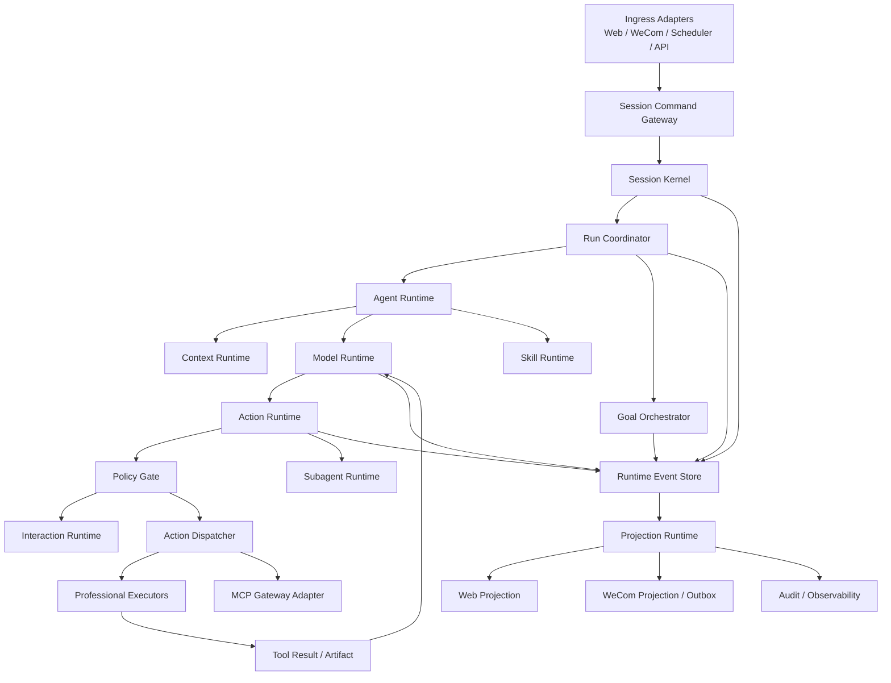

# Agent Runtime 目标架构与模块边界

> 状态：总体设计第一阶段，待方案评审
> 日期：2026-07-18
> 输入：Grok Build 17 层源码对标、全项目差距矩阵、EVERYDAYAIONE 当前代码
> 本文范围：模块、职责、依赖方向、进程边界和现有模块归属
> 后续文档：状态机、数据库、协议、Policy、Context、Skill/Goal/Subagent/MCP、UI、迁移

## 1. 设计结论

目标采用：

```text
模块化单体 Runtime
  + PostgreSQL 持久 Actor
  + 专业 Executor
  + 必要的异步 Worker
  + 多 Channel Projection
```

它吸收 Grok 的直观主链：

```text
Session → Agent → Model → Action → Policy → Executor → Result → Model
```

同时保留本项目更适合 SaaS 的持久执行：

```text
Ingress
  → SessionCommand
  → Run
  → ModelStep
  → ActionRequest
  → PolicyDecision / Interaction
  → ActionDispatcher
  → Professional Executor
  → ActionResult / Artifact
  → RuntimeEvent
  → PostgreSQL + Projection
```

Goal、Skill、Subagent、MCP 不再建立各自的聊天主链，而是接入这条骨架：

```text
Skill      → 改变 Agent 指令与工作步骤
Goal       → 控制是否继续创建 Run/ModelStep
Subagent   → 创建带能力子集的子 Run
MCP        → 向 Tool Catalog 提供动态工具和远程 Executor
Channel    → 投影 RuntimeEvent，不改变业务事实
```

## 2. 项目上下文

### 2.1 架构现状

EVERYDAYAIONE 是 FastAPI + React 多租户 SaaS。PostgreSQL 已承担消息、任务、积分、
Conversation Actor、Outbox 和业务事实；Redis 用于唤醒、缓存、限流和锁。Web 与企微
已通过 Conversation Actor 共用固定 ContextSnapshot 和 `execute_chat`，图片/视频、
ERP、文件、沙盒、图表等专业能力已经可用。

当前问题不是执行器缺失，而是 Session、Chat、媒体任务、ERP 内部 Agent、企微投递和
前端恢复缺少统一 Run/Action/Event 事实协议。

### 2.2 可复用模块

| 当前模块 | 目标归属 | 处理方式 |
|---|---|---|
| Conversation Actor queue/lease/fencing | Runtime Kernel / Run Coordinator | 保留并扩展 |
| `execute_chat` | Model Runtime | 保留，逐步改为 ModelStep Worker |
| Tool Registry/Selector | Capability / Tool Catalog | 收口接口，不重写工具定义 |
| ToolExecutor + Mixins | Executor adapters | 保留专业实现 |
| MediaToolMixin/TaskCompletionService | Media Executor/Reconciler | 兼容迁移到 Action |
| ERPAgent | Professional SubRun Executor | 保留内部专业规划 |
| ContextSnapshot/PromptBuilder/Compressor | Context Runtime | 组合为 ContextPlan/Receipt |
| PermissionMode/CreditMixin | Policy/Cost adapters | 收口到统一决策 |
| ContentPart/emit payload | Artifact/Projection adapters | 保留展示协议兼容 |
| WS manager | Web Projection transport | 不再充当事实源 |
| WeCom Outbox | WeCom Projection delivery | 保留 lease/checkpoint |
| ResourceManifest/file_id/Sandbox | Resource/Artifact Runtime | 保留安全边界 |

### 2.3 设计约束

- PostgreSQL 继续是唯一持久执行事实源；Redis 不决定 Run/Action 终态。
- Web、企微、定时任务和未来 API/MCP 入口共享同一个 Runtime。
- 付费、敏感数据和外部副作用必须经过 Policy，不由 Prompt/Skill/MCP 隐式授权。
- `execute_chat`、媒体、ERP、文件和企微只能渐进接入，不能一次重写。
- 新旧链路必须可按组织灰度、shadow compare 和独立回滚。
- 同一业务事实只允许一个 owner 提交终态和费用。
- 所有公共协议必须版本化，新增字段优先 additive。

### 2.4 潜在冲突

- 现有 `tasks` 同时承载多种生成任务，不能直接重命名为 Runtime Action。
- `Agent`、`Task`、`ToolOutput` 已有多种业务含义，目标类型必须使用明确命名。
- Chat Tool Call 是 Turn 内对象，媒体 task 是跨进程对象，不能只靠一个 status enum
  强行合并内部细节。
- `TaskCompletionService` 616 行、既有 `tool_loop_executor.py` 超过 500 行；迁移时必须
  先划职责，不能继续向原文件堆逻辑。
- 当前前端以 Message 为中心，直接切成 Run UI 会破坏历史消息恢复。

## 3. 方案对比

| 维度 | A：扩充现有 ChatHandler | B：模块化 Runtime（推荐） | C：拆分 Runtime 微服务 |
|---|---|---|---|
| 思路 | 把 Skill/Goal/MCP 都塞入现有工具循环 | 新建稳定 Kernel，旧能力作为 adapter | Session/Action/Policy 各自服务化 |
| 侵入性 | 初期低，后期极高 | 中等，可分阶段 | 极高 |
| 主链直观性 | 低，Mixin 继续膨胀 | 高，一条 Run/Action 主链 | 中，跨服务链复杂 |
| 持久恢复 | 依赖现有 task 特例 | 统一状态，复用 Actor | 可做但分布式事务复杂 |
| 性能 | 进程内快 | 进程内快，长任务异步 | 网络与序列化开销大 |
| 测试 | 难隔离 | 可按模块/协议测试 | 需要完整集成环境 |
| 灰度迁移 | 难区分新旧职责 | adapter + shadow 最清晰 | 双系统迁移成本最高 |
| 10x 扩展 | 单体内部耦合成为瓶颈 | Worker/Executor 可独立横扩 | 可横扩但过早复杂化 |
| 风险 | 巨型类、重复状态机 | 协议设计和双写一致性 | 运维、网络、数据一致性 |

推荐 B。它不是追求抽象，而是用最少的核心对象把已经存在的状态机接起来。只有 MCP
Gateway、Provider callback、企微 Outbox consumer 等天然外部边界保留独立进程。

## 4. 目标模块图



## 5. 模块职责

### 5.1 Ingress Adapters

负责认证、租户解析、请求规范化和稳定幂等键。输出 `SessionCommand`，不得：

- 直接调用模型。
- 直接调用业务 Tool。
- 自己判断 Tool 权限。
- 自己写 Run/Action 终态。

现有 Web route、企微 normalizer/actor enqueue、Scheduler 分别成为 adapter。

### 5.2 Session Command Gateway

统一接收：

```text
submit_input / steer / cancel / approve / reject
create_goal / pause_goal / resume_goal
invoke_skill / switch_agent / compact
```

负责 command idempotency、Session scope 和 command routing，不执行模型推理。

### 5.3 Session Kernel

持有一个 Session 的协调视图：

- 当前 AgentDefinition 与 effective capability revision。
- active Run/Goal/Interaction。
- channel bindings。
- config/context/catalog revision。
- cancellation/continuation ownership。

它是 Grok Session Actor 在 SaaS 中的对应物，但事实存 PostgreSQL，不依赖进程内对象长期
存活。它不包含图片、ERP、文件等业务实现。

### 5.4 Run Coordinator

负责 Run 的创建、claim、lease、fencing、pause/wait/resume/cancel 和终态提交。现有
`ConversationExecutionService` 是第一版底座。

Run Coordinator 决定何时调 Model Runtime，Goal Orchestrator 决定是否创建后续 Run；
两者不能同时成为 continuation owner。

### 5.5 Agent Runtime

将四类输入解析为不可变 `AgentInstance`：

```text
AgentDefinition
+ EffectiveCapabilities
+ EffectiveConfigSnapshot
+ ContextPlan
```

不直接保存全局可变 Handler。现有 ChatHandler 在迁移期作为 Model/Tool adapter，
最终只保留协议实现所需的 facade。

### 5.6 Context Runtime

负责信息路由和预算：

- DB/Workspace/Artifact 事实选择。
- Message history。
- Memory/Knowledge。
- ResourceManifest。
- Skill instruction。
- Goal/Plan。
- compaction。
- `ContextReceipt`。

它只决定“模型看到什么”，不决定“模型能做什么”。

### 5.7 Model Runtime

负责一次 `ModelStep`：

- 构造 provider request。
- 流式接收 text/thinking/tool calls。
- 结构化解析。
- usage。
- stop reason。
- retry/fallback。

`execute_chat` 将拆成由 Run Coordinator 驱动的 step loop，但首期可以继续作为兼容
Worker，只旁路记录 ModelStep。

### 5.8 Action Runtime

负责 Tool Call 到持久 Action：

- 参数 schema validation。
- idempotency key。
- dependency/concurrency/resource conflict。
- Policy request。
- attempt。
- Accepted/Unknown/reconciliation。
- Result 回填 Model Runtime。

Action Runtime 不实现具体 Tool。

### 5.9 Policy Gate 与 Interaction Runtime

Policy 聚合：

```text
用户原始意图/授权
+ tenant/user/role
+ tool risk metadata
+ data scope
+ cost
+ environment
+ prior grant
```

输出 `allow / deny / require_interaction`。Interaction 负责可持久化确认、表单、选择和超时。
用户明确说“生成图片”可形成受范围约束的 Grant；“写提示词”不形成执行授权。

### 5.10 Action Dispatcher 与 Executors

Dispatcher 只根据 `executor_kind` 路由：

- local read/query。
- file/sandbox。
- ERP。
- media provider。
- scheduled task。
- external action。
- MCP。
- subagent。

Executor 返回统一外层结果，内部状态保持专业化。同步 Executor 可直接 Completed；长时
Executor 返回 Accepted，后续由 callback/poller/reconciler 推进。

### 5.11 Goal、Skill、Subagent、MCP

| 模块 | 控制对象 | 不允许承担 |
|---|---|---|
| Goal Orchestrator | continuation、plan、verify、stall | 直接绕过 Action Policy |
| Skill Runtime | 指令、步骤、requested capabilities | 签发权限 |
| Subagent Runtime | 子 Run、隔离 Context、能力子集 | 共享父 Agent 可变内存 |
| MCP Gateway | 连接、认证、Catalog、远程调用 | 决定租户业务授权 |

### 5.12 Event Store 与 Projection

所有重要状态变化在同一事务写业务状态和 RuntimeEvent/Outbox。Projection 消费事件生成：

- Message/ContentPart。
- Web Run/Action UI。
- WeCom 文本、媒体、卡片和降级。
- audit/usage/metrics。

Projection 可以重建，不能反向决定业务终态。

## 6. 依赖方向

允许：

```text
Ingress → Application(Runtime Kernel)
Application → Domain Protocols
Infrastructure → Domain Protocols
Application → Executor SPI
Executor Adapter → Existing Services
Projection Adapter → Existing WS/WeCom
```

禁止：

```text
Domain → FastAPI / WebSocket / WeCom / Provider SDK
Executor → UI Store
Projection → Policy decision
Skill → direct ToolExecutor
MCP → database tables directly
Goal → Provider adapter directly
Context → grant permissions
```

Domain 协议不得 import 现有 `ChatHandler`、Supabase client 或 Provider adapter。

## 7. 进程与部署边界

首期保持四类进程：

| 进程 | 责任 |
|---|---|
| API | Ingress、查询、Interaction command、WS connection |
| Runtime Worker | Session/Run/Model/同步 Action 协调 |
| Reconciler Workers | media callback/poll、Unknown Action、Outbox |
| MCP Gateway Worker | 未来隔离远程连接和租户凭据 |

同一 Runtime Worker 可同时执行 Model 和短 Tool；后续只有容量数据证明需要时才拆 Worker
queue。Redis 继续只做 wakeup，所有 claim 从 PostgreSQL 获取。

## 8. 建议目录边界

```text
backend/services/agent_runtime/
  domain/          # 无框架依赖的类型、状态转移和策略输入输出
  application/     # Session、Run、Model、Action、Goal 用例
  ports/           # Repository、Model、Executor、Event、Projection SPI
  infrastructure/  # PostgreSQL、Redis、Provider、MCP adapter
  projections/     # message、web、wecom、audit
  compatibility/   # 现有 Chat/Task/ContentPart 双写和映射
```

放入新的子目录是因为现有 `backend/services/agent` 已有 100 个 Python 文件，混合 ERP、
文件、图片和旧 Agent 概念；继续塞入会制造命名和依赖冲突。新目录只承载统一 Runtime，
现有专业能力留在原位置并通过 ports 接入。

前端后续建议：

```text
frontend/src/runtime/
  protocol/
  store/
  projections/
  interactions/
```

历史 `Message` 组件继续消费 Message Projection，首期不迁移全部聊天 UI。

## 9. 架构影响评估

| 维度 | 评估 | 风险 | 应对 |
|---|---|---:|---|
| 模块边界 | 新增统一 Runtime，跨 Chat/媒体/ERP/企微 | 高 | ports + compatibility，按能力迁移 |
| 数据流 | 从多旁路变为 Event/Projection | 高 | shadow event，旧链继续主写 |
| 扩展性 | Worker/Executor 可按类型横扩 | 中 | PostgreSQL claim、容量指标 |
| 耦合度 | 初期存在新旧双映射 | 高 | compatibility 只允许单向依赖并设删除门禁 |
| 一致性 | 需协调 task、action、积分和消息 | 高 | 原子 RPC、single terminal owner |
| 可观测性 | 统一 run/action correlation | 中 | typed event + usage ledger |
| 可回滚性 | additive schema 可关闭新入口 | 中 | org flag、shadow/canary、旧链保留 |
| 性能 | 事件写入增加数据库负载 | 中 | append 索引、chunk 合并、异步 projection |
| 安全 | MCP/Skill/Subagent 扩大能力面 | 高 | capability subset、Policy fail closed |

这些高风险来自项目规模，不是未决的路线冲突。已通过“additive schema、single owner、
compatibility adapter、分波次 canary”限定；数据库状态机设计阶段仍需再次审查原子边界。

## 10. 边界场景

| 场景 | 处理 | 模块 |
|---|---|---|
| Session 无 active Run | 创建普通 Run，不创建 Goal | Session Kernel |
| 重复 submit command | 返回已有 command/run receipt | Command Gateway |
| 模型返回空内容无 Tool | 明确 empty stop reason，可受控重试 | Model Runtime |
| 多 Action 同写一资源 | concurrency key 串行 | Action Runtime |
| 用户取消且 Provider 已接受 | Run cancelled，Action 进入 reconcile | Run/Action |
| Policy 服务异常 | 敏感/付费 fail closed，只读按配置降级 | Policy |
| Worker 丢 lease | 取消本地执行，禁止写终态 | Run Coordinator |
| 回调早于 Accepted 落库 | callback inbox 按 external key 等待关联 | Reconciler |
| UI 断线 | Snapshot + sequence replay | Projection |
| 企微不支持组件 | ChannelCapability 降级，不改 Artifact | WeCom Projection |
| Skill 请求未授权工具 | 从 EffectiveToolset 删除并记录原因 | Skill/Policy |
| Goal 与后台完成同时唤醒 | Continuation Controller 单 owner | Goal |
| MCP 断开 | Action retry/Unknown 取决于副作用分类 | MCP/Action |

## 11. 连锁影响范围

总体重构将影响但不在本阶段修改：

| 改动点 | 现有范围 | 后续同步内容 |
|---|---|---|
| Run/Action 协议 | tasks、Actor RPC、conversation services | additive 表、双写、claim/commit |
| ModelStep | `execute_chat`、Adapter、PromptBuilder | step receipt、stop reason、usage |
| ToolBridge | registry/selector/ToolExecutor/ChatToolMixin | catalog、Action adapter、result mapping |
| Artifact/Event | ContentPart、WS schema、message store | envelope、sequence、projection |
| Media Action | MediaToolMixin、TaskCompletionService、webhook | task/action mapping、reconcile |
| Policy | PermissionMode、CreditMixin、tool confirmation | Grant、Decision、Interaction |
| Context | ContextSnapshot、compressor、Memory | ContextPlan/Receipt |
| Channel | WS handlers、task restoration、WeCom Outbox | snapshot/replay/capability |
| Extensions | 尚无统一实现 | Skill/Goal/Subagent/MCP 新模块 |

具体文件、函数和数据库字段将在各专项设计中列出，避免本层提前制造不稳定接口。

## 12. 本层冻结项与待评审项

建议冻结：

1. 模块化单体，而非巨型 ChatHandler 或微服务群。
2. PostgreSQL 是 Run/Action/Event 事实源。
3. 六个核心：Session、Run、ModelStep、Action、Artifact、RuntimeEvent。
4. Policy、Context、Projection 是独立边界。
5. 专业 Executor 保留，统一外层协议。
6. Goal 唯一控制 continuation。
7. Skill 请求能力但不授权。
8. MCP 经统一 Tool/Policy。
9. 新旧兼容层只单向依赖并最终删除。

待后续专项确定：

- 状态枚举和合法转移。
- 表、索引、RPC 和事件分区参数。
- 同步 Action 与持久 Action 的创建阈值。
- Interaction 默认超时。
- Event chunk 合并和保留期限。
- Goal/Subagent 预算默认值。

本架构经评审确认后，下一份设计进入 Run/Action/Interaction/Goal 状态机。
