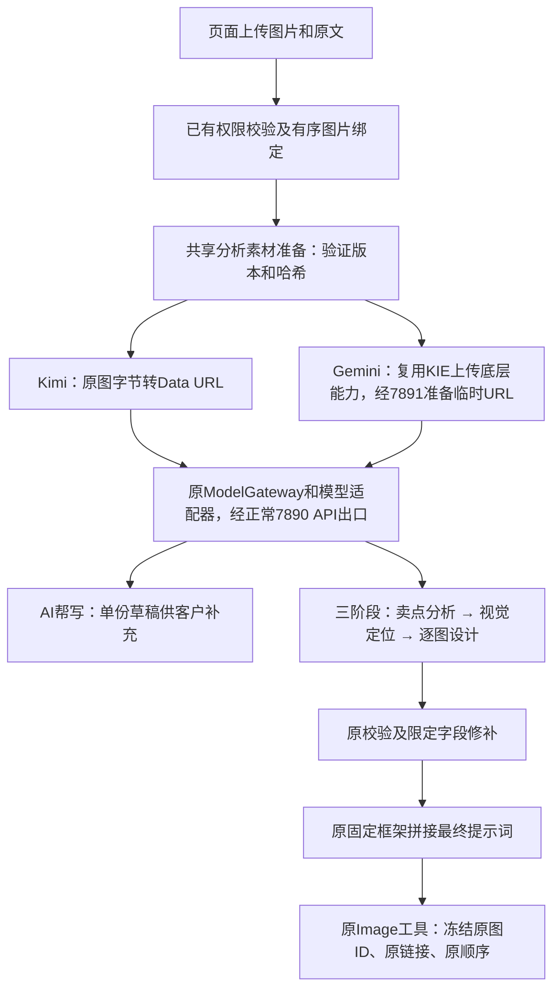

# AI 帮写通用创作简报技术设计

## 2026-10-10：分析图片传输与参数补齐（本地已实现，待发布）

复用现有任务工作树、ModelGateway、页面三阶段执行器、文件权限／版本／摘要、KIE上传客户端及原生图受理链。没有新增数据库表、迁移、图片ID、任务队列或积分账本；未修改三阶段资源正文、固定框架组装、页面排版或模型选择。

- 新增共享 `analysis_media`，仅AI帮写和专用页面调用。Kimi从可信工作区读取原字节，验证冻结版本与SHA后转Data URL；Gemini调用提取出的 `KieClient.upload_image_bytes`，显式使用现有7891代理上传同一原字节。模型API继续沿用现有代理配置；主聊天千问仍使用原CDN路径，生图海外旁路保持原受理与重试语义。
- 每次帮写／每个计划准备一次完整有序素材，三阶段及其有限重试复用同一表示；进程恢复时按原冻结引用重新验证和准备。Data URL／临时URL不写回原绑定、任务快照、最终提示词或生图参数，不在日志输出。全组准备失败即停止，不把部分数组交给模型，不静默回退CDN。
- 付费模型调用前检查实际JPEG／PNG／WebP、原文件10MiB、Kimi宽高大于10及比例不超过200:1、大尺寸WebP限制、Base64字符串10000000字节。编码总量由原文件长度推算；进程内按原字节及表示／HTTP复制的保守估算共享384MiB配额。等待和准备纳入原绝对预算，取消读取复用 `finish_file_io`，磁盘线程结束后才释放配额；不自动裁切、压缩或改原图。
- Kimi流式与sync共用规范化消息及参数构建，强制思考，合法low／high／max显式透传；非法medium、内置搜索及不支持的输出格式在本地拒绝。旧页面冻结medium仅在调用边界保持原供应商默认语义，不回写历史配置。AI帮写及Kimi阶段一／三（含修补）使用json_object，阶段二保持Markdown；Gemini不发送未文档化的response_format。
- 精确识别已复现的 `invalid_parameter_error`＋包装后的图片下载超时正文；不泛化所有400。继续沿用帮写最多两次／120秒、策划每阶段最多三次／持久化截止时间与幂等结算。已输出或结果不确定的调用仍不盲目重放。准备超时、具体图片超限／文件变化／上传失败、鉴权及额度分别返回明确错误；页面沿用原错误位置显示。

发布配置（使用现有环境配置系统，无凭据变化）：

| 环境变量 | 默认 | 作用 |
| --- | --- | --- |
| DETAIL_KIMI_INLINE_IMAGES | true | 新帮写／新计划使用原图Data URL |
| DETAIL_GEMINI_OVERSEAS_IMAGES | true | 新Gemini计划经7891准备临时URL |
| DETAIL_KIMI_JSON_OUTPUT | true | 帮写及Kimi阶段一／三启用JSON对象模式 |
| ECOM_ANALYSIS_MEMORY_MB | 384 | 当前进程内分析媒体配额，范围128—1024MiB |

新计划在原 `model_settings.profile` 冻结策略；旧计划没有策略字段时沿用CDN和原输出模式。Gemini缺7891在受理前报配置错误；准备失败不启动模型。主动关闭传输开关可回到旧CDN方式，但会重新暴露供应商拉图超时风险，不作自动降级。已经受理的任务保持冻结策略直到终态。

验证：后端518项不同定向测试通过（分批运行，含隔离PostgreSQL48项；最终新增图片绑定与取消边界26项通过），前端16项／TypeScript及Vite构建／改动文件ESLint通过。新增真实worker＋SQL测试覆盖两模型、15张及7张、九张有序原图、第三阶段拒绝后恢复仅调用第三阶段、前序结果及原生图引用不变；外部模型响应在这些数据库测试中使用替身。

真实供应商验证：生产端隔离进程载入本地候选代码，原项目两张1254×1254 PNG，未写业务数据库、未结算用户积分、未提交生图。AI帮写Kimi low＋原字节＋JSON模式34.98秒返回并通过草稿schema；Gemini两图经7891上传10.97秒，图像识别总31.62秒成功。九位置原字节准备约0.53秒，Data URL合计25358750字节，进程历史峰值RSS约174MiB（此前约152MiB）；这是九图资源探针，未发送九图模型请求，不能作为全并发容量结论。15张测试中两模型阶段一／二通过，Gemini第三阶段前两次返回JSON语法错误，未回跑前序阶段；随后诊断SSH连接失去响应，服务器上已无对应进程，没有最终回执，故本次15张不记作完整通过，也不推断为模型超时。结果不确定的调用没有重放；独立7张测试：Gemini主图三阶段各一次通过，阶段耗时28.81／44.83／65.19秒，含上传总165.33秒，已组装7份完整执行提示词。Kimi详情三阶段各一次通过149.89／100.13／225.94秒，含准备总476.20秒，已组装7份完整执行提示词；两组共14份提示词逐份核对正文SHA、位置和无分析临时媒体地址。原始日志的assembled_count字段误取items导致显示0，两组产物实际均存于images且长度为7；导出核对已纠正统计值并保留原值，应用组装及SQL保存不受影响。完整结果与14份逐图正文保存在本任务visualizations的`分析媒体改造验证-20261010`目录。

此前恢复／诊断及页面修改已随 fa68334b 发布；本节新传输、参数及校验代码尚未提交部署。测试通过不代表上游永不失败，生产用户页面端到端及持续稳定性仍待发布后验收。

## 2026-10-10：分析图片传输与适配缺口补充方案（实施前设计）

本节保留形成方案时的调查快照。下述“当前／待实施／尚未验证”均指实施前状态；最新实现及验证以本文件上方实施记录为准。此前恢复及诊断修改已发布为 fa68334b，本批传输修改尚未发布。

### 1. 已核实的网络边界

生产后端与 conversation actor 的实际进程环境均配置 HTTP_PROXY／HTTPS_PROXY 为本机7890，KIE_SHADOW_OVERSEAS_PROXY 为本机7891；DashScope、api.kie.ai和KIE上传域名没有命中这些进程的NO_PROXY。DashScope与KIE聊天HTTP客户端默认继承环境代理，因此正常API请求使用7890。这里核实的是客户端配置，不是7890各域名最终地理出口的网络追踪。

当前分析发送的是image_url中的原CDN链接。供应商自行访问CDN，不会继承我们进程的7890或7891。模型API走代理不代表供应商拉图片也走代理。本次捕获的61.14秒错误就是供应商返回的Download multimodal file timed out，不能用扩大我们客户端等待时间消除该下载失败。

现有KIE海外旁路在生图create_task取得task_id后启动：CDN下载继承7890，临时文件上传显式使用7891，全组成功后保存链接，供既有400单次重试使用。它没有挂在KIE聊天、Kimi聊天、AI帮写或三阶段分析入口。保持这套生图任务状态、缓存映射、受理和积分语义；不把分析任务伪装成图片task。

### 2. 推荐传输：同一有序素材，按供应商选择分析表示



- Kimi使用百炼部署的kimi-k3，将实际图片字节放入data:image/...;base64,...。不再要求供应商拉取我们的CDN。同图字节的隔离对照已返回HTTP200，但应用schema、九图和整链仍须按下述计划验证。不要混用仅支持公网URL的月之暗面直供kimi/kimi-k3限制。
- Gemini保持KIE文档的image_url URL协议。将既有KIE multipart上传及响应检查提取成可复用的底层字节上传方法，在分析调用前通过已配置7891上传已验证的图片，得到临时URL。此路径需要先做真实图片请求验证后启用；不能把KIE聊天的Base64支持当作已知事实，也不能失败后静默回退到CDN。
- 两个入口共用一个轻量分析素材准备模块，输入只接受服务端鉴权取得的文件引用及模型策略，输出按原位置排列的分析媒体表示。图片ID、角色、位置、file_version、content_sha256保持原冻结值；Data URL或临时URL只替换此次分析消息中的媒体地址，不能写回原图绑定或进入最终生图参数。
- 原图只读，逐图校验版本和摘要后准备。每次AI帮写／每个策划计划只准备一次，重试和三个阶段复用同一份表示；进程恢复后重新验证并准备，不持久化Base64。默认主图／详情两计划各自受原租约及预算控制，不建立跨用户的图片内容缓存。
- Gemini上传必须全部成功才开始模型调用；中间失败不传残缺图片数组、不重新编号。临时链接失效可在尚未发送新模型请求前重新准备，保持原图哈希及顺序；已发送且结果不确定时不得借换链接盲重发模型。

### 3. 同时补齐的适配及恢复缺口

| 编号 | 修改 | 现有能力及边界 |
| --- | --- | --- |
| P1 图片限制 | 在付费请求前检查真实格式、宽高、长短边比例及传输字节量；Kimi宽高均大于10、比例不超过200:1，Base64字符串不超过官方10MB限制 | 复用FileTargetResolver、文件版本／哈希和read_image_dimensions，不信任浏览器MIME与路径；原上传10MiB上限不能直接当作编码上限。编码长度按4×ceil(原字节数/3)检查，另计Data URL前缀和整份HTTP负载 |
| P2 超限行为 | 本批不自动裁切、去背景或有损压缩商品图；超限在模型调用前说明具体图片及限制，让客户替换或减小文件 | 现有resize_image为cover裁切，360px缩略图会丢细节，均不适合作为分析原图的静默替代。单图合规不代表九图请求内存、上传时长和token总量合规，实施时测量最坏组合并给准备过程设置有界字节／并发额度；额度不足排队或提前明确反馈，不先发半组 |
| P3 错误分类 | 加入本次invalid_parameter_error与包装后的明确多模态下载超时组合 | 仅匹配受约束code和下载失败原因；不能把全部400／InvalidParameter视为可重试。复用现有error_facts、safe_error及状态投影 |
| P4 参数统一 | DashScope流式与非流式共用消息规范化、Kimi思考及推理参数构建；Kimi固定enable_thinking=true，显式low／high／max | AI帮写low，新页面策划high；兼容已有其他DashScope模型规则。旧任务冻结profile不改写。非法显式档位在适配边界拒绝，不能默默丢弃为默认max；需核对旧medium调用方，不能全局改其他模型档位 |
| P5 结构化输出 | Kimi AI帮写及阶段一／三显式请求json_object；第二阶段保持原Markdown。DesignRepair等JSON调用沿用对应JSON模式 | 在现有Gateway参数通道和DashScope适配器透传response_format，先真实验证kimi-k3端点接受此模式，再开启；保留原业务schema及限定路径修补，JSON模式不保证字段与事实正确。KIE Gemini没有核实同名参数支持，本批不盲传 |
| P6 能力开关 | 在现有模型策略记录当前用途允许的输出格式、推理档位、媒体传输；禁止把不支持的参数原样透传或静默忽略 | Kimi无enable_search内置搜索，本批遵循用户暂缓联网的决定，搜索与工具均不开启。将来需要时通过现有工具框架另接，不另造Agent客户端或当前即引入动态工具加载 |
| P7 恢复及时间 | 素材准备、上传、等待、退避、模型调用共用原绝对截止时间；失败保留已完成阶段及客户编辑 | AI帮写最多两次／原120秒；策划每阶段最多三次／页面总预算，不能每次重试重新计时。明确临时拒绝且无响应开始才自动重试；已流式输出或受理未知沿用uncertain。第三阶段出错只修对应字段／阶段，不重跑前两阶段 |
| P8 可诊断性 | 每次记录模型、阶段、transport、图片数／字节数、素材准备／上传／首响应／生成耗时、HTTP状态、供应商code及request_id | 复用现有日志和回执；不记录Base64、密钥、完整原文或带签名URL。不把本地网络超时、供应商下载超时、schema失败全部显示成“模型不可用” |

P2保留用户已上传的原文件及可编辑草稿，但可能让现有上传成功、编码后超限的图片在分析前得到明确提示。这是本方案公开的边界，不声称所有上传文件都能原样内联。实际内存额度和上传write timeout必须结合生产可用内存及九图测量设置，不能简单把30秒write／120秒总时间一起无限增大。

### 4. 修改位置与开发批次

| 批次 | 位置 | 交付和依赖 |
| --- | --- | --- |
| A 共享准备与两模型传输 | 新增services/agent/image/analysis_media.py；修改input_adapters.py、requirement_assist_prompts.py、requirement_assist_service.py、detail_page_generation.py及kie/client.py | 共用有序准备，复用现有FileTargetResolver和KIE上传底层方法；KIE生图旁路继续读取原CDN，不更改其调度、task_id缓存或回调。先验证Kimi内联／Gemini临时URL真实接收和九图资源边界 |
| B 参数及输出格式 | dashscope/chat_adapter.py、ecommerce_planner/page_profile.py、service.py和现有ModelGateway参数通道调用点 | 流式／非流式消息与Kimi策略一致；能力检查限定到具体模型／用途；JSON只用于对应阶段。与A共享绝对预算，不另建HTTP客户端、模型注册或队列 |
| C 恢复与诊断 | dashscope/chat_adapter.py、ecommerce_planner/recovery.py、service.py、requirement_assist_service.py及现有错误展示投影 | 加入真实下载错误变体；阶段／部分输出／调用次数／费用保护不变；客户能区分可补充输入、临时上游故障与结果核实中 |
| D 联合验收 | 上述模块现有测试及必要的analysis_media定向测试；两份现有TECH文档和CURRENT_ISSUES | 故障注入及真实模型测试分开记录；验收明确按模型、图片数、输出数、模式与修补次数，不把最小请求成功当整链稳定 |

不需要新增数据库表、图片ID系统、积分账本、上传路由或前端模型选择器；三阶段资源正文和最终组装契约沿用当前版本。需要向用户显示的输入超限／具体错误沿用已有弹窗与任务错误位置，不改变左侧输入、右侧分组及占位符布局。

### 5. 验证与回退

1. 传输契约：一图／九图、产品与参考混排、同内容不同ID、乱序准备完成，逐项核对ID、角色、位置、原图摘要；验证Kimi请求不含CDN媒体URL，Gemini上传显式7891而API仍7890，临时URL只出现在分析消息。原生图请求、图片顺序与固定拼接内容不受分析表示影响。
2. 资源及权限：跨组织／用户、路径跳出、文件替换、坏图、10像素、200:1边界、4K以上WebP、编码边界和九图总负载，全部在模型付费调用前处理；准备取消后释放内存与上传会话，临时链接不写日志。
3. 参数及故障：使用实际包装的400正文进行HTTP故障注入；覆盖限流、鉴权、额度、未知400、上传失败及部分流式后断开；核对次数／绝对时间／旧阶段／幂等usage与费用。流式和sync都测试Kimi合法参数；第二阶段不被JSON模式破坏，其他DashScope模型回归。
4. 真实验收：先AI帮写及两模型单图分析，运行原schema校验；再按主图、详情分别跑完整三阶段，验证最终完整提示词。最后用当前允许的代表性上限（单类15张、默认7＋7张）及九张输入检查总耗时、内存、上传、修补和费用，避免再做无关多模型竞赛；本方案阶段尚未执行这些新实测。
5. 发布／回退：按原受控发布流程，不改现有生图海外旁路。两模型分析传输与Kimi JSON模式使用现有环境配置体系的独立开关，任务受理时冻结选择；缺海外代理应提前明确报配置错误。回退优先停止新受理／关闭新增策略，已受理任务继续用冻结策略至终态；只有明确未发送模型的失败才能重准备。若主动回退到旧CDN分析方式，要明确它会重新暴露已定位的供应商拉图风险，不能自动静默降级。

官方依据：[百炼Kimi图片限制、结构化输出及搜索支持范围](https://help.aliyun.com/zh/model-studio/kimi-api)、[KIE Gemini媒体URL协议](https://docs.kie.ai/market/gemini/gemini-3-8-flash-openai)。网络配置来自本轮生产实际进程的脱敏只读检查；未输出认证信息，也未修改代理路由。

## 2026-10-10：参数与内置能力审计（诊断，应用未改）

本节是对上一节“原始HTTP400原因未知”的新增证据：本轮从生产端隔离进程复现了同项目AI帮写的61秒失败并在旧适配器解析前捕获HTTP正文。原有历史请求正文仍不存在，不能据此追认所有历史失败均属同一原因。

供应商返回HTTP400，`error.code=invalid_parameter_error`，`error.message=<400> InternalError.Algo.InvalidParameter: Download multimodal file timed out`，请求编号`e39b010e-d2be-92d6-8c7e-4fff23f2beae`，耗时61.14秒。这次错误的具体含义是下载多模态图片超时，不是请求字段或推理档位非法；进一步定位CDN、源站或供应商网络的哪一段仍缺对应服务日志。

| 检查项 | 真实请求／代码事实 | 判断 |
| --- | --- | --- |
| 模型与接口 | `kimi-k3`，`dashscope.aliyuncs.com/compatible-mode/v1/chat/completions` | 使用百炼部署型号与Chat Completions，不是月之暗面直供`kimi/kimi-k3`；两者参数限制不可混用 |
| 流式及思考 | `stream=true`，`stream_options.include_usage=true`，`enable_thinking=true` | 当前链路符合要求；无thinking_budget或错误的false开关 |
| 推理档位 | AI帮写low；已部署页面medium在适配器被丢弃，HTTP请求未包含该参数 | 页面实际默认max是性能缺口，不等于真的发送medium引发400；本地上一轮改为high尚未部署 |
| 消息与素材 | 规范化后system/user，text/image_url，image_url为url对象；两张原图顺序相同 | 未混用Responses的input_text/input_image；页面参数、数量及JSON Schema放在提示词数据中，并未误作供应商顶层参数或n |
| 图片 | 两张PNG，各1254×1254，2098998／2130980字节，宽高比1 | 该样本尺寸、格式和10MB文件上限合规；路径由既有CDN函数编码 |
| 工具、搜索、JSON格式 | 无tools／tool_choice／enable_search／response_format | 没有未知框架工具被附加到当前三阶段请求；结构化输出目前依赖提示词及应用校验 |
| 多轮思考历史 | 每个阶段都是新的system＋user请求，前阶段正文通过输入数据传递 | 没有丢弃assistant工具轮次reasoning_content的触发条件 |

传输对照：同一AI帮写提示词、low档、原图字节和顺序，只把image_url.url从CDN链接改为`data:image/png;base64,...`，HTTP200，30.50秒返回1344字符。两图编码后约2.80／2.84MB，逐图SHA256与冻结原图一致。该探针只验证接口接收及返回正文，未运行应用草稿schema校验；不是已发布功能，也不是长期稳定性证明。

新增发现的框架边界：

1. 现有本地恢复白名单不识别本次`invalid_parameter_error`加包装后的下载超时信息，仍归为business／不自动重试。应按受约束的错误码及具体下载失败原因补充，不能把所有InvalidParameter都改为可重试。
2. 通用DashScope `chat_sync`默认发送`enable_thinking=false`，没有流式路径的角色／媒体规范化，也不透传Kimi推理档位；这不符合K3仅思考模型及消息格式要求。AI帮写经`_collect_stream_response`、三阶段经`session.stream_chat`均走流式，因此这是潜在适配缺口，不是本次实际失败的调用路径。
3. 图片入口已校验10MB、可解码和JPEG／PNG／WebP，但尚未统一检查Kimi宽高均大于10、长短边不超过200:1等模型约束；Base64的10MB指编码后的字符串，不能直接复用原文件10MB限制。上述问题未在本次1254方图触发。
4. Kimi K3支持结构化输出，但当前DashScope适配器不透传response_format；当前调用也未请求该字段，不能视为失败原因。若后续接入，应区分JSON阶段一／三与Markdown阶段二。

内置功能核对：百炼Kimi系列不支持`enable_search`内置搜索，当前也未发送该参数；需要联网时应通过现有工具执行框架单独接搜索工具，不能照搬千问搜索开关。本轮继续遵循用户暂缓联网功能的决定。深度思考已实际启用；三阶段不需要Function Calling或动态工具加载，不主动添加工具。KIE Gemini使用官方OpenAI端点，真实最小请求携带`reasoning_effort=medium`、`include_thoughts=false`，4.11秒返回HTTP200及OK；该实验只验证这些参数被接收，不代表整套Gemini流程已复测。KIE文档有“chat only／Agent未适配”提示，当前三阶段是应用串行调度普通多模态聊天、不携带工具；不能仅因应用名为Agent就认定用了不支持的工具协议。

建议下一修复批次：复用现有工作区权限、文件版本／哈希和有序图片绑定，在分析输入边界提供符合大小限制的直接图片数据；原图、图片ID、最终生图链接及顺序继续由原框架维护。补充下载错误分类和非流式Kimi消息／思考适配，增加模型图片边界校验。未执行生产应用修改、数据迁移、部署或搜索功能开关。

官方依据：[百炼Kimi与图片限制](https://help.aliyun.com/zh/model-studio/kimi-api)、[百炼推理档位](https://help.aliyun.com/zh/model-studio/qwen-api-via-dashscope)、[月之暗面直供差异](https://help.aliyun.com/zh/model-studio/kimi-api-by-moonshot-ai)、[联网搜索模型范围](https://help.aliyun.com/zh/model-studio/web-search/)、[KIE Gemini OpenAI协议](https://docs.kie.ai/market/gemini/gemini-3-8-flash-openai)。脱敏请求与结果保存于本任务visualizations的`模型参数审计-20261010/parameter-audit.json`；阶段二／三抓包使用前阶段占位数据，仅检查协议形状，不冒充原生产完整提示词或真实模型调用。

## 2026-10-10：上游拒绝恢复与Kimi推理配置（本地，待发布）

生产最近两次页面策划在阶段一约61秒收到DashScope HTTP400，未进入后二阶段。AI帮写另有约61秒无输出异常后重试成功。旧适配器没有保存上游错误码及请求编号，无法从既有记录确定原始400的具体原因；本轮修复恢复和诊断缺口，不把单次成功当作根因已消失。

- 复用DashScope适配器及现有恢复分类，保存HTTP状态、受约束的供应商错误码／请求编号和脱敏原因摘要。明确的图片下载暂时失败、限流和文档列明的服务不可用可在原模型内有限重试。参数、鉴权、额度或安全拒绝不自动循环；未知推理超时及已开始输出后的错误仍按结果不确定处理，避免无证据重放付费调用。
- AI帮写最多两次同Kimi调用，共享原120秒绝对截止时间；重试前释放会话，输入文字和有序图片完全复用，前端125秒不变。客户编辑、回答与补充仍由原界面保留，无跨模型降级、整份重写或新提示词强化。
- 页面Kimi显式使用支持的`high`，修复旧`medium`被适配器丢弃而实际采用供应商默认`max`的问题；Gemini保持`medium`，AI帮写继续`low`。已受理任务的冻结配置不回写，新受理才采用新档位。
- 策划直接复用持久化重试、已完成阶段、每阶段最多三次、总预算及幂等结算。无输出的明确拒绝不再一律记为uncertain；流式任何输出开始后不自动重发。旧生产uncertain记录不猜测回填，未新增数据库迁移或图片任务逻辑。

验证：首次104项、扩展94项通过；最新受影响110项通过（含错误正文为字符串／null／数组的兼容测试），隔离PostgreSQL38项通过，共242项不同测试。HTTP故障注入经过真实ModelGateway与DashScope适配器：首次返回`InvalidURL.Timeout`，随后同一输入恢复成功；还验证61秒拒绝后仅剩58秒预算、最多两次调用及部分响应不重发。PostgreSQL验证阶段保留、调用预算、权限隔离与结算保护；临时数据库服务已关闭。

使用原失败轮次的冻结输入（两张图片、1张主图），从生产端隔离进程调用真实Kimi，载入本地修改的核心代码：三阶段均一次通过原校验，分别77.87、100.03、113.13秒，总291.03秒。阶段一对照旧默认max的156.8秒有所缩短，但供应商负载与缓存也会影响耗时，不能归因全部收益于推理档位。诊断仅内存保存阶段和调用记录，未写生产业务数据库、未结算用户积分或提交生图；不代表15张、主图详情混合及长期稳定性已验证。原始结果保存在`/private/tmp/ecom-reliability-probe-20261010.log`，生产应用未部署本次修改。

错误分类依据：[百炼错误码](https://help.aliyun.com/zh/model-studio/error-code)；Kimi档位依据：[百炼兼容接口参数](https://help.aliyun.com/zh/model-studio/qwen-api-via-dashscope)。

## 2026-10-10：插入按钮可见性修复（本地，待发布）

生产版本 `27a390be` 中，AI 帮写正文自身使用 `78vh`，叠加通用 Modal 标题、内边距后超出 Dialog 的 `min(90vh, 800px)` 上限，底部操作被外层 `overflow-hidden` 裁切。此前 jsdom 交互测试没有浏览器布局，未覆盖此问题。

通用 Modal 增加可选固定 footer，提供时由同一弹窗高度约束正文滚动和底部操作；原有未提供 footer 的调用方保持原布局。AI 帮写移除内部独立视口高度，按钮改为“插入到输入框”，固定显示在底部。插入复用原有程序拼接及 `updateForm({requirement})`：产品细节、编辑/新增卖点、背景风格、问题回答和自由补充一并回填左侧输入框，关闭弹窗，不自动再次调用模型或触发生图。

验证：前端定向32项、改动文件 ESLint、TypeScript/Vite 构建通过。真实浏览器使用实际弹窗组件和12条模拟卖点，在1366×768、1024×600、390×700及1440×1000下检查正文滚动、按钮未裁切；实际编辑并插入后确认所有资料均回填，未调用模型或生产接口。截图和布局指标保存于本任务 visualizations 的 `AI帮写插入按钮修复-20261010` 目录；临时预览文件及服务已清理。待生产发布与用户验收。

## 2026-10-09：单份 Kimi K3 草稿（本地实现，未部署）

本节替代下方历史“三方案／主备模型／冲突自动删除”的产品行为。旧 POC 脚本及其测试仅保留历史实验，不参与页面运行。

- 最新用户定位：AI 帮写负责拆解已有产品资料、建议卖点并向客户提问；输出是可以不完整的初稿，由客户继续补充和修改，不以一次生成完整成稿为目标。已撤回追加的语义禁问强化和300—600字篇幅要求，保留基本数据格式。
- 输入复用当前项目上传/工作区图片：产品图用于产品分析，参考图用于风格理解；实际图像与用户当前输入原文进入同一次多模态请求。程序保存图片 ID、角色和上传位置，按全局位置发送，不要求模型回写绑定。
- 模型固定 `kimi-k3`，复用 ModelGateway → 已有百炼适配器及平台默认配置；AI帮写显式使用 `reasoning_effort=low`，K3仍为思考模式。适配器仅向K3透传其支持的low/high/max，不改变其他模型或未指定调用；一次请求、120 秒总预算，前端 125 秒，无自动跨模型降级或整份重写。
- 输出改为一个 `RequirementAssistResult`：`product_description`、`selling_points`（特点／价值／direct 或 inferred）、`creative_requirements`（topic／text／explicit 或 suggested）、最多三条可跳过的 `supplement_questions`。模型不重复输出完整简报、图片链接或技术参数。
- 合理推断保留并标注为 AI 建议，用户审核后可采用、局部编辑、增删卖点或创作要求；具体参数/功能不能凭空编造。取消旧的关键词删除机制，具体疑点转为补充问题。
- 同一个弹窗提供产品描述、卖点、背景风格编辑区、问题回答与“暂不知道／跳过”、自由补充。客户补充或直接编辑后可以立即采用，不要求模型再写一遍；需要AI再次整理时，主动点击“更新草稿”，才携带当前人工编辑稿、按时间累计的补充及跳过项发起请求，输入时不请求。
- “采用内容”由程序组装单份策划输入，保留原始输入留档、补充历史和最新人工确认资料；本轮尚未经模型整理的客户回答/补充放在最后，明确优先于旧稿冲突内容。未回答问题不强制阻塞。以前跳过的问题也可通过自由补充填写。
- 复用既有请求取消、请求版本防护及每用户限流。失败返回中文错误，保留编辑稿、回答和自由补充，允许人工继续编辑。
- 请求支持 `default` 默认14张及主图/详情15张；输入图片仍最多9张。详情表单、草稿保存与 AI 帮写原文长度统一10000字符，补充历史4000字符，超限提示精简，不截断；数据库原字段为 TEXT，无新增表/迁移。
- 后续三阶段 Agent 的 Kimi/Gemini 模型选择独立保留。主图/详情页面排版、上传图片、工作区入口及生图任务链路继续复用。

请求继续使用 `POST /api/ecom-image/requirement-suggestions`，可选新增 `revision: {draft, supplement, skipped_questions}`；返回 envelope 的 `data` 是单份草稿，`meta.model=kimi-k3`。前后端合同须随同一次发布，不支持旧前端的三方案读取。

验证：后端定向116项通过（含适配器/工厂），前端相关33项通过（首次32项，最新受影响19项含新增1项），包含“回答与自由补充直接采用，仅调用模型一次”的页面测试。前端 TypeScript/Vite 构建与改动文件 ESLint 通过。全量 lint 为106个问题（83 errors / 23 warnings），改动文件定向无报错；HEAD 的 App.tsx 复现既有 react-refresh 错误，不扩大到无关模块。

真实服务验证（使用本地环境配置、真实两图，不写业务数据库、不生图）：默认max版本120.68秒超时；轻度推理首轮62.75秒返回但格式校验失败（未保留原文，无法确定具体字段原因），随后相同输入27.76秒完成、模拟人工补充更新31.37秒完成。后一组命中输入缓存，不能归因全部速度收益于推理强度；错误返回及失败保留稿机制生效。追加强化版首轮72.76秒完成，更新在用户纠正定位后由我们主动取消，不算模型失败；该强化已撤回。最终“拆资料、提问、客户补充可直接采用”的定位调整通过定向测试，未再重复付费模型测试，不宣称稳定性保证。原始记录保留于本任务visualizations下的`AI帮写正式实现验证-20261009*`目录；测试补充规格仅为模拟数据。

K3推理参数依据：[Kimi官方模型说明](https://www.kimi.ai/help/kimi-api/api-model-selection)、[百炼参数说明](https://help.aliyun.com/zh/model-studio/qwen-api-via-dashscope)。

生产认证、实际页面端到端和部署后用户验收尚待完成。本轮不改变定价或生产开关。


---

以下为历史设计记录：


> 版本：v1.0
> 日期：2026-07-15
> 状态：技术方案已确认
> 任务等级：A级
> 前置文档：`UI_主图详情制作页面.md`、`TECH_主图详情页真实上传与草稿恢复.md`

## 一、目标与范围

### 1.1 目标

为主图详情制作页提供真实的“AI 帮写”能力。系统结合产品图、参考图、用户文字和平台设置，一次生成三套可选择、可编辑的整组通用创作简报。

该能力采用共享核心服务和入口适配器架构。第一阶段接入主图详情页，后续聊天窗口通过独立入口复用相同的 Prompt、Schema、模型调用、输出校验和失败降级能力。

### 1.2 本阶段包含

- 产品图必填，参考图可选。
- 支持仅参考图、仅用户文字、参考图与用户文字融合三种模式。
- 一次多模态调用返回卖点直达型、场景氛围型、视觉创意型三套通用简报。
- 展示产品事实、参考图解读和输入冲突处理结果。
- 用户可切换并分别编辑三套方案。
- 确认后将最终简报写入现有 `requirement` 字段。
- 主模型超时或失败时调用备用模型。
- 免费调用但增加用户级频率限制和结构化日志。

### 1.3 本阶段不包含

- 聊天窗口 UI 接入。
- 真实“分析产品”接口。
- 真实图片生成、积分结算和任务恢复。
- 三套候选方案持久化。
- 数据库表或字段变更。

## 二、已确认业务规则

### 2.1 两个 AI 动作的职责

1. AI 帮写是可选动作，生成整组图片共同遵守的通用创作简报。
2. 分析产品是后续必经动作，将用户确认的简报拆成 N 张逐图规划和 Prompt。
3. 确认生成后，N 张图片使用 N 次独立生图 API 调用。

### 2.2 输入优先级

```text
产品真实信息 > 用户明确要求 > 平台规范 > 参考图视觉特征 > AI 自主发挥
```

### 2.3 参考图职责

参考图只定义画面如何设计，包括背景、场景、构图、布局、色彩、光线、质感、排版和详情页内容节奏。

参考图不能覆盖产品事实，不能向最终结果引入参考商品、品牌、Logo、商标或原有文案，也不能改变真实产品的外形、包装、颜色和结构。

参考图既参与 AI 分析，也在后续真实生图阶段作为视觉输入。逐图规划必须为每张任务选择相关参考图，不能把全部参考图无差别发送给每个任务。

### 2.4 多图生成契约

```text
AI 帮写：1 次多模态调用 → 3 套通用创作简报
分析产品：1 次多模态调用 → N 张逐图规划和 Prompt
确认生成：N 次生图调用 → N 张图片
```

真实生成阶段使用受控并发，建议并发上限为 3。每张任务具有独立 Prompt、产品图选择、参考图选择、状态、重试和积分结算。

## 三、总体架构

```text
主图详情页入口                          聊天窗口入口（后续）
     │                                       │
详情项目输入适配器                       聊天附件输入适配器
     │                                       │
     └────────── RequirementAssistInput ─────┘
                         │
            RequirementAssistService
                         │
          多模态模型 + 结构化输出校验
                         │
              三套通用创作简报
```

入口适配器只负责鉴权、资产解析和表单标准化。核心 Service 不依赖详情页面或聊天组件。

## 四、项目上下文

### 4.1 架构现状

- `/detail-page` 使用独立 Zustand Store 管理上传、草稿和五步状态。
- 详情项目图片以 Workspace 路径引用保存，后端已实现用户、组织和文件归属校验。
- `/ecom-image/enhance-prompt` 已支持产品图和风格参考图的多模态分析，但职责是直接生成逐图规划。
- `EcomImageHandler` 已能将产品图和参考图交给图生图模型，但当前参考图分配粒度较粗。
- 通用 `Modal` 已基于 Radix Dialog，具备焦点锁定、ESC、遮罩关闭和无障碍能力。

### 4.2 可复用模块

- 详情项目和图片归属校验。
- Workspace、OSS 原图和缩略图解析。
- `DashScopeChatAdapter` 多模态调用。
- 现有主模型、备用模型和超时配置。
- 通用 API 响应、认证、日志及错误处理。
- `Modal`、`Button` 和详情页现有表单组件。
- `saveDetailSettings()` 与 `updateForm()` 的草稿保存链路。

### 4.3 设计约束

- 前端不能提交任意图片 URL，只能提交受控业务来源。
- 三套候选方案不写数据库，最终确认简报复用 `requirement`。
- 用户文本只能进入 user content，不能拼入 system 指令区域。
- TypeScript 禁止 `any`，异步请求必须处理取消和过期响应。
- 日志必须包含 `user_id`、`org_id`、`source_type` 和 `source_id`。
- 新文件不得超过 500 行，函数不得超过 120 行。

### 4.4 潜在冲突

- 旧 `/ecom-image/enhance-prompt` 接收前端 URL，不能直接作为详情页安全入口。
- 旧接口返回逐图规划，与三套通用简报职责不同。
- `image_ecom.py` 已有 373 行，不继续加入新接口。
- `useDetailPageStore.ts` 已有 318 行，弹窗临时状态使用独立 Hook。
- 现有 UI 文档只描述按钮 Loading 后直接回填，实施前需要同步为三套方案弹窗。

## 五、标准输入协议

核心 Service 接收标准化输入：

```text
RequirementAssistInput
├── user_id
├── org_id
├── source_type
├── source_id
├── product_images[]
│   ├── id
│   ├── original_url
│   └── display_name
├── reference_images[]
│   ├── id
│   ├── original_url
│   └── display_name
├── content_type
├── platform
├── language
├── aspect_ratio
├── quality
├── image_count
└── user_requirement
```

第一阶段 `source_type=detail_project`。未来增加聊天附件适配器时不修改核心 Service。

## 六、API 设计

### 6.1 生成三套简报

```http
POST /api/ecom-image/requirement-suggestions
```

请求示例：

```json
{
  "source": {
    "type": "detail_project",
    "project_id": "3b4a1ccb-ea6c-49ee-9d48-b720e2462ce1"
  },
  "settings": {
    "content_type": "main_image",
    "platform": "taobao",
    "language": "zh-CN",
    "aspect_ratio": "1:1",
    "quality": "1k",
    "image_count": 5,
    "requirement": "希望画面清新自然，突出400页大容量"
  }
}
```

前端发送表单快照，避免 500ms 防抖保存导致服务端读取旧设置。图片由后端根据项目读取，前端不提交 URL。

成功响应核心结构：

```json
{
  "success": true,
  "data": {
    "product_facts": {
      "product_name": "风景系列活页笔记本/讲义本",
      "confirmed_attributes": ["多款风景封面", "活页装订"],
      "unclear_items": ["纸张克重", "产品尺寸"]
    },
    "reference_analyses": [
      {
        "image_id": "reference-image-id",
        "primary_uses": ["background", "composition"],
        "summary": "浅色自然背景，主体偏右，左侧保留文案空间",
        "excluded_elements": ["参考商品", "品牌", "Logo", "原有文字"]
      }
    ],
    "conflicts": [],
    "suggestions": [
      {
        "id": "selling_point",
        "name": "卖点直达型",
        "style_name": "清新自然商品展示风",
        "brief_markdown": "完整可编辑通用创作简报"
      },
      {
        "id": "scene",
        "name": "场景氛围型",
        "style_name": "治愈系自然美学风",
        "brief_markdown": "完整可编辑通用创作简报"
      },
      {
        "id": "creative",
        "name": "视觉创意型",
        "style_name": "四季风景叙事风",
        "brief_markdown": "完整可编辑通用创作简报"
      }
    ]
  },
  "error": null,
  "meta": {
    "model": "实际模型",
    "fallback_used": false,
    "latency_ms": 8420,
    "project_version": 5
  }
}
```

### 6.2 错误码

| 错误码 | 场景 |
|---|---|
| `DETAIL_PROJECT_NOT_FOUND` | 项目不存在或无权限 |
| `DETAIL_PRODUCT_IMAGE_REQUIRED` | 没有有效产品图 |
| `DETAIL_IMAGE_NOT_READY` | 图片上传中或已失效 |
| `REQUIREMENT_ASSIST_RATE_LIMITED` | 调用过于频繁 |
| `REQUIREMENT_ASSIST_TIMEOUT` | 主模型和备用模型均超时 |
| `REQUIREMENT_ASSIST_INVALID_OUTPUT` | 输出无法通过 Schema |
| `REQUIREMENT_ASSIST_UNAVAILABLE` | 模型服务不可用 |

## 七、输出结构与校验

接口同时返回结构化信息和 `brief_markdown`：

- 结构化信息保证三套方案共享同一产品事实，并用于展示参考图解读和冲突处理。
- `brief_markdown` 用于用户编辑、确认后保存和后续分析产品。

服务端约束：

- `suggestions` 必须正好三项。
- 三个 `id` 不重复。
- `brief_markdown` 不为空且单份不超过 4000 字。
- 图片 ID 必须来自输入图片集合。
- 不允许模型返回或生成新的图片 URL。
- 无法确认的产品事实必须进入 `unclear_items`，不能作为营销事实输出。

## 八、Prompt 分层

### 8.1 System 层

- 定义角色为电商视觉策略师。
- 当前任务只生成通用创作简报，不生成逐图 Prompt，不触发生图。
- 区分产品事实与营销建议。
- 三套方案共享产品事实。
- 禁止复制参考图商品、品牌、Logo 和文字。
- 只输出符合 Schema 的 JSON。

### 8.2 Context 层

注入内容类型、平台、语言、比例、清晰度、数量、图片角色和用户原始需求。

### 8.3 图片角色层

```text
Image 1-N：产品图，只用于确认真实产品外观和信息。
Image N+1-M：视觉参考图，只用于背景、构图、色彩、光线、质感和排版。
```

### 8.4 三套差异约束

| 方案 | 重点 |
|---|---|
| 卖点直达型 | 核心功能、参数、购买理由和信息效率 |
| 场景氛围型 | 使用场景、目标人群和情绪价值 |
| 视觉创意型 | 视觉记忆点、叙事构图和差异化配色 |

## 九、前端状态与交互

候选状态放入独立 `useDetailRequirementAssist` Hook：

```text
idle → loading → success | error
```

状态包含弹窗开关、请求状态、返回结果、当前方案、三套编辑文本、错误和请求版本。

交互规则：

- 没有产品图或图片仍在上传时禁止调用。
- 弹窗打开后立即开始分析。
- 三套方案切换时分别保留编辑结果。
- 重新帮写期间保留旧结果，成功后才整体替换。
- 重新帮写失败时继续展示旧结果。
- 确认选择后调用现有 `updateForm({ requirement })`。
- 关闭弹窗和页面卸载时取消请求或忽略过期响应。

## 十、超时、降级和并发

- 总请求预算 100 秒。
- 主模型最多使用 60 秒；若耗尽主模型预算，备用模型最多使用剩余 40 秒。
- 主模型失败或超时后，备用模型使用剩余预算。
- 解析顺序：直接 JSON → 提取 JSON 块 → Pydantic 校验 → 安全缺省补齐。
- 两个模型均失败时返回可重试错误，不使用固定假方案冒充 AI 结果。
- 请求期间禁止重复提交。
- 新请求取消旧 `AbortController`，并使用递增 request ID 防止旧响应覆盖新状态。

## 十一、安全与可观测性

### 11.1 安全

- 不接受任意外部图片 URL。
- 校验当前用户、组织和业务来源归属。
- Workspace 路径继续使用安全解析。
- 用户文本不进入 system 指令。
- 返回内容按普通文本或安全 Markdown 渲染，不执行 HTML。
- 日志不记录完整签名 URL、完整用户需求、供应商原始错误或内部路径。
- 免费调用增加用户级频率限制。

### 11.2 日志

每次调用记录：用户、组织、来源类型、来源 ID、产品图和参考图数量、用户文字长度、模型、是否降级、耗时、解析结果、方案数量和错误码。

第一阶段不新增日志表，使用现有结构化日志和错误监控。

## 十二、边界场景

| 场景 | 处理策略 |
|---|---|
| 无产品图 | 禁止调用并提示上传 |
| 图片仍在上传 | 等待关联完成 |
| 无参考图、无用户文字 | 根据产品图和平台生成三套方向 |
| 只有参考图 | 参考图作为主要视觉方向 |
| 只有用户文字 | 用户要求和平台规范作为主要方向 |
| 两者都有 | 按固定优先级融合并输出冲突说明 |
| 图片引用失效 | 返回明确错误并提示重新上传或移除 |
| 快速连续点击 | 单有效请求 + request ID |
| 关闭弹窗 | 取消请求或忽略返回 |
| 主模型超时 | 调用备用模型 |
| 输出不可解析 | 返回可重试错误 |
| 重新帮写失败 | 保留旧三套方案 |
| Token 失效或越权 | 使用统一认证错误，不泄露资源状态 |
| 参考图互相冲突 | 输出逐张解读和最终取舍 |
| 用户要求与参考图冲突 | 用户明确要求优先并展示处理结果 |

## 十三、文件设计

### 13.1 新增后端文件

- `backend/schemas/ecom_requirement.py`：请求、标准输入和响应 Schema。
- `backend/services/agent/image/requirement_assist_service.py`：共享 AI 帮写核心服务。
- `backend/services/agent/image/requirement_assist_prompts.py`：专用 Prompt。
- `backend/services/agent/image/input_adapters.py`：详情项目输入适配，后续增加聊天适配。
- `backend/api/routes/ecom_requirement.py`：薄路由和统一响应。
- 对应后端测试文件。

### 13.2 修改后端文件

- `backend/main.py`：注册新路由。
- 详情项目 Service：仅在缺少安全读取 AI 输入图片的方法时增加最小方法。

### 13.3 新增前端文件

- `frontend/src/types/ecomRequirement.ts`：页面和未来聊天共用类型。
- `frontend/src/services/ecomRequirement.ts`：API 客户端。
- `frontend/src/hooks/useDetailRequirementAssist.ts`：页面入口适配和局部状态。
- `frontend/src/components/detail-page/RequirementAssistModal.tsx`：弹窗展示和编辑。
- 对应前端测试文件。

### 13.4 修改前端文件

- `GenerationSettings.tsx`：固定文案行为改为事件回调。
- `DetailPage.tsx`：连接 Hook、弹窗和最终 `updateForm()`。

## 十四、依赖、部署与回滚

### 14.1 依赖

无需新增前端或后端依赖。

### 14.2 数据库

无迁移，无回滚 SQL。

### 14.3 API 兼容

新增接口，不修改 `/ecom-image/enhance-prompt`，不影响现有 Chat 电商图模式。

### 14.4 回滚

1. 回滚前端弹窗接入提交。
2. 回滚后端新路由注册和相关文件。
3. 重启后端并重新部署前端。
4. 原有上传、草稿和手动填写需求继续可用。

## 十五、测试范围

### 15.1 后端

- 三种输入模式。
- 项目越权、产品图缺失、图片状态失效。
- 主模型成功、备用模型降级、双模型超时。
- 非 JSON、方案不足、非法图片 ID 和超长简报。
- 频率限制和统一错误响应。

### 15.2 前端

- 无产品图时禁用。
- 加载、成功、错误和重试状态。
- 三套方案切换和独立编辑。
- 确认后写入 requirement。
- 关闭取消、卸载 cleanup 和过期响应隔离。
- 重新帮写成功替换、失败保留旧结果。
- 弹窗键盘和焦点行为。

## 十六、实施顺序

### Phase 1：真实模型 POC

- 用真实产品图和参考图覆盖三种输入模式。
- 验证三套方案差异度、事实幻觉率和参考图理解。
- 记录响应时间、输出稳定性和模型成本。

POC 结论（2026-07-15）：

- `qwen-vl-max` 使用现有 DashScope 适配器可直接接收本地图片编码后的多模态消息，三种模式均一次返回 3 套合法结构。
- 第二轮耗时分别为 33.875 秒、36.694 秒、36.206 秒，结构校验、参考图分析和用户要求保留均通过。
- 使用“笔记本产品图 + 拼豆收纳参考图”进行污染测试，三套最终简报未复制参考商品名，证明图片角色标记基本有效。
- 产品图显示 200 页、用户要求 400 页时，模型能识别并报告冲突，但即使强化 Prompt，仍可能给出“暗示容量加倍”“模拟厚度”“替代卖点”等误导建议。
- 因此 Phase 2 必须增加确定性事实冲突闸门：冲突字段只进入 `conflicts/unclear_items`，从可执行简报字段中删除或替换为“待确认”；不能把模型原文未经校验直接交给前端或下游生图。

### Phase 2：后端核心能力

- Schema、Prompt、输入适配器、共享 Service、路由、限流、日志和测试。

### Phase 3：前端弹窗

- 公共类型、API、Hook、弹窗、按钮接入和测试。

完成状态（2026-07-16）：

- 已完成页面接入；仅在草稿存在、至少一张产品图就绪且没有上传/关联中的图片时允许调用。
- 选中方案只回填当前 `requirement` 并沿用现有草稿保存逻辑，不自动触发“分析产品”。
- API 请求、弹窗关闭和组件卸载均支持取消，过期响应不会覆盖当前状态。

### Phase 4：联调验证

- 三种模式、冲突、多标签页、请求取消、超时和降级端到端验证。

### 后续阶段

- 聊天入口适配器。
- 真实分析产品公共 Service。
- 逐图参考图选择协议。
- 真实生图、受控并发、任务恢复和积分结算。

## 十七、设计自检

- [x] 项目上下文、可复用模块、设计约束和潜在冲突已确认。
- [x] 需求和多角色方案评审已完成。
- [x] 入口适配与共享核心 Service 边界清晰。
- [x] 空值、超时、竞态、权限、取消和降级均有策略。
- [x] 无数据库迁移和新增依赖。
- [x] 新文件职责单一，预估不超过 500 行。
- [x] API 向后兼容，支持独立回滚。
