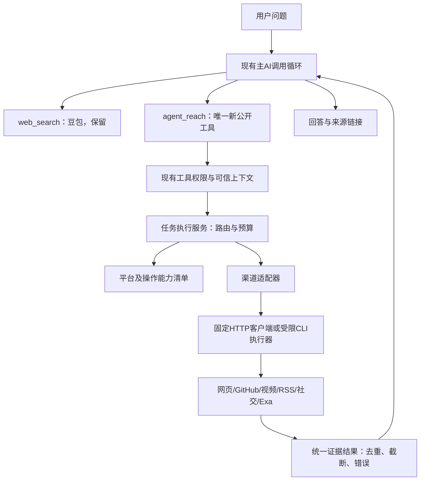

# Agent Reach 统一查询与操作工具接入方案

日期：2026-10-06。状态：基础及媒体发布适配已实现；真实账号与服务器验收待完成，未部署。任务基座：`6da321f84a6e4d1ac684c1dfd7550775d35e1976`。

## 1. 已确认范围与未决事项

- R1：保留现有豆包 `web_search`；增加唯一公开工具 `agent_reach`。
- R2：纳入网页正文、GitHub 仓库/Issue、YouTube 搜索/字幕、B站搜索/详情/字幕、RSS读取、小红书搜索/读取、Twitter/X搜索/读取、Reddit搜索/帖子/评论、Exa搜索；适用平台增加发帖、点赞、发表评论。用户已确认首期不接私有仓库；小红书图文、视频发布及B站/YouTube视频上传纳入。
- R3：工具内部适配现成上游工具，统一结果、来源、故障、预算和凭据管理。
- R4：以软件内真实任务验证可用性和回答质量；不能把安装成功或 doctor 成功当成完成。
- R5：本轮交付规划，不能自动开始生产安装或实现。
- 边界：发帖、发表评论和点赞按平台可表达的动作规划；网页阅读/RSS/Exa没有通用发帖点赞动作。RSS定时订阅未授权。Facebook、Instagram、LinkedIn、Boss、雪球、小宇宙和V2EX未在最近确认的功能清单中，不自动扩展；架构应支持未来追加。
- D1（已确认）：首期组织管理员连接专用账号，本组织获授权成员使用；发帖、点赞、评论不需要管理员逐条审核。账号连接底层预留个人归属，便于以后用户连接自己的账号；本轮不自动扩展为完整个人连接页面。全站不得共用一份Cookie；查询和写入权限需区分。用户已要求设计写入功能，本轮没有授权实际向外发布测试内容。
- D2（实施前核验）：真实服务器网络、依赖版本、账号、限额、平台条款及上游许可证；本轮没有进行生产探测，不能承诺全部渠道在服务器稳定运行。
- D3（待能力验证）：B站字幕的服务器可行路径。Agent Reach通道文件推荐OpenCLI，但随后读取bilibili-cli当前README发现其声明登录后可取字幕，存在上游材料差异；以锁定版本和服务器真实样本为准，不能据README直接承诺。需要新增桌面执行端时另作产品决策。
- D4（持续费用）：免费入口仍存在额度/限流和模型成本；不自动购买搜索服务或代理。免费入口不满足生产要求时提供同题证据及费用后再决策。

## 2. 项目事实与外部证据

### 项目事实

- `backend/services/tools/definitions/general.py` 是 `web_search` 和 `social_crawler` 的 ToolSpec 注册位置。
- `backend/services/agent/tool_executor.py::_web_search` 使用父执行预算，默认60秒，输出 AgentResult。
- `backend/services/agent/web_search/service.py` 选择豆包或 legacy provider，限制单进程并发并生成主模型可见的来源文本。其信号量不是跨进程总限额。
- `backend/services/agent/crawler_tool_mixin.py` 调用 `services/crawler/service.py` 的 MediaCrawler；已有小红书和B站能力，是否在生产安装和可用尚未验证。当前 crawler 从全局 Settings 获取 Cookie，不能直接作为多租户凭据层复用。
- ToolContext 提供可信 actor、workspace、org、budget、cancellation；身份不能来自模型参数。ToolExecutionService、Policy、Dispatcher 和 ToolResult 为现有公共边界。
- `backend/services/tools/mcp_client.py`/`mcp_allowlist.py` 仅连接固定测试服务；不能声称项目已有通用生产 MCP 接入能力，不能直接扩展成模型可选 URL/命令的执行器。本方案优先固定 CLI/HTTP，遵守项目当前 MCP 约束；若某渠道必须新增 MCP，作为明确待决项，不绕过现有入口。
- `backend/services/kuaimai_external/credential_store.py` 展示组织隔离和加密凭据的现有实现模式，但该表及业务权限属于 ERP，不能直接存社交凭据。
- `deploy/everydayai-backend.service` 仓库模板为 Linux systemd、两 worker、root 用户；尚未核对线上实际服务配置。外部执行器应隔离于 API 权限，不继承 ERP、数据库和模型密钥。
- `backend/services/prompt_builder/templates/modes.md` 对计划模式限制 social_crawler；新增工具必须尊重同一行为边界，不能经新名字绕过。

### 外部证据（2026-10-06读取，均为项目特定实现，不是通用标准）

1. [Agent Reach 设计说明](https://github.com/Panniantong/Agent-Reach#设计理念)：负责选型、安装、体检和路由；实际调用上游工具，不提供统一自然语言任务执行引擎。
2. [安装指南](https://github.com/Panniantong/Agent-Reach/blob/main/docs/install.md)：独立环境安装，默认 install 为检查；社交平台需要登录态；服务器与桌面支持不同。
3. [上游依赖声明](https://github.com/Panniantong/Agent-Reach/blob/main/pyproject.toml)：读取时声明1.5.0、Python>=3.10、多个下界依赖；该声明不是已验收锁文件。
4. [B站通道源码](https://github.com/Panniantong/Agent-Reach/blob/main/agent_reach/channels/bilibili.py)：搜索与字幕后端不同；部分 doctor 检查不执行实际平台命令。因此健康状态必须细化到操作，不能仅参考 active_backend。
5. [GitHub通道源码](https://github.com/Panniantong/Agent-Reach/blob/main/agent_reach/channels/github.py)：凭据存在检查不等于实际 API 调用通过。
6. [yt-dlp](https://github.com/yt-dlp/yt-dlp)：视频元数据与字幕工具；没有字幕的视频不能当作已经理解视频内容。
7. [小红书上游服务](https://github.com/xpzouying/xiaohongshu-mcp)：支持服务端部署，但仍需账号/浏览器状态。名字含 MCP 不代表当前项目可直接接入；应验证固定 HTTP 能力或沿用现有 MediaCrawler，协议变更另行审定。

## 3. 接入架构



推荐 D5：复用主 AI 工具循环完成理解、拆题和追加查询；统一工具执行指定操作及有界搜索后阅读。首版不增加独立搜索子模型，不把问题交给任意 shell。若真实评测发现主 AI 调度明显不足，再以证据决定增加独立研究循环。

Agent Reach 安装/诊断用于运维和适配器选型参考；生产请求直接调用已审定、锁定版本的工具。不能每次请求安装依赖、动态获取 SKILL.md 或全量 doctor。平台返回的文本始终是外部资料，不进入系统指令。

## 4. 统一工具契约

公开名称 `agent_reach`；建议参数：

```json
{
  "task": "查找某开源项目最近的已知问题，给出原帖链接",
  "platform": "github",
  "operation": "search",
  "query": "项目名 具体问题",
  "url": null,
  "max_results": 5
}
```

- `task` 必填，保留完整意图；`platform` 枚举 `auto/web/github/youtube/bilibili/rss/xiaohongshu/twitter/reddit/exa`。
- `operation` 枚举 `auto/search/read/transcript/comments`；平台/操作组合由能力清单限制。read/transcript/comments要求合法目标URL；search要求query。max_results为服务端上限内的提示。
- 不接受命令、可执行文件、服务地址、Cookie、org_id/user_id或代理参数；拒绝额外字段。可信身份和凭据由 ToolContext 和连接管理提供。
- URL优先匹配已知平台域名；显式平台与URL不符时报参数错误，不自动使用另一份账号。短链接受控解析后重新校验。
- 明确平台查询严格使用该平台；故障不能悄悄替换成普通网页搜索并冒充平台结果。
- 自动操作选择固定规则：链接文章→read、视频摘要→transcript、仓库/Issue→read；无链接的平台查找→search。不能可靠选择时提示主AI补齐信息，不猜私有目标。
- 多平台研究由主 AI 对同一公开工具多次调用实现；批量与并行仍受公共预算约束。首版不要求生成复杂计划JSON。

内部 `ReachRequest/ReachResult/ReachItem/ReachError`：

```text
status: success | partial | empty | error | timeout | cancelled
items[]: id, platform, title, url, author?, published_at?, fetched_at,
         content, content_kind, language?, transcript_segments?, truncated
content_kind: full_text | snippet | transcript | metadata | comment
errors[]: code, platform, operation, retryable, safe_message
metadata: backend, backend_version, elapsed_ms, attempts, cache_age?,
          coverage, omitted_count, source_ids
```

错误码含 CONFIG_REQUIRED、AUTH_REQUIRED、AUTH_EXPIRED、RATE_LIMITED、PLATFORM_BLOCKED、NETWORK_ERROR、UPSTREAM_CHANGED、UNSUPPORTED_OPERATION、NO_TRANSCRIPT、INVALID_URL、BUDGET_EXHAUSTED。业务错误与公共权限拒绝分开；映射到现有 AgentResult/ToolResult，不能引入公共模型不认识的status。

success意味着请求的操作完成，不意味着内容真实或代表全部互联网。empty只用于真实完成查询且无结果。截断、部分页面失败、只有摘要时标partial并说明覆盖。NO_TRANSCRIPT不等于视频内容不存在。主模型可见文本包含来源和能力缺口，不只放metadata。

## 5. 渠道开发矩阵

| 板块 | 内部动作和后端建议 | 接入工作 | 完成证据 |
|---|---|---|---|
| 网页 | 固定Jina HTTP读取 | URL/重定向/出站限制，正文清洗，正文与摘要区分 | 正常文章正文与原文一致；受限页明确失败 |
| GitHub | 固定gh或官方HTTP API，公开仓库/Issue | 结构化JSON，分页预算，仓库和Issue链接解析 | 真实仓库与Issue读取，限流/不存在/私有目标隔离 |
| YouTube | yt-dlp元数据、搜索、字幕 | 字幕语言选择，时间段保留，禁止默认下载整段视频 | 有字幕/自动字幕/无字幕三个真实样本 |
| B站 | bili-cli搜索/详情；字幕独立后端探测 | 解析JSON，短链/BV号，搜索和字幕独立开关 | 搜索/详情真查；字幕另验，未通过就明确不可用 |
| RSS | feedparser加受控HTTP获取 | XML尺寸限制，RSS/Atom解析，条目链接和日期 | 两类feed，坏XML/空feed/重定向；不新增自动订阅 |
| 小红书 | 先验证现有MediaCrawler；比较服务端上游 | 搜索、详情、已有评论只读适配；账号串行和隔离 | 登录后真查；过期/挑战即停止；链接可追溯 |
| Twitter/X | twitter-cli固定只读操作 | 通过子进程环境传最小凭据，搜索/阅读/时间线按实际命令验证 | 真实推文/搜索；过期/限流行为；不开放发帖 |
| Reddit | rdt-cli服务端路线；桌面OpenCLI非默认 | 登录态、搜索、正文、评论树分页/深度预算 | 真实搜索、帖子评论；403不当作空结果 |
| Exa | 审定固定搜索入口 | 搜索参数、结构化来源、免费额度与延迟观测 | 同题与豆包并排评测；不可用时报告，保留豆包入口 |

每个适配器声明操作能力、凭据要求、执行环境、返回类型、限流类别和允许后端。备选只能完成同一操作、使用相同授权范围；CLI存在不能宣称全部动作可用。底层版本和协议以探测结果为准，不在设计里伪造安装成功。

## 6. 稳定性和资料质量机制

- 预算：复用父绝对截止时间；排队、DNS、连接、读取、解析、重试共用截止时间。操作上限从真实样本校准，长字幕不能无条件复用网页60秒；父更短预算始终优先。
- 取消：取消时终止子进程组或HTTP操作、释放平台/账号槽、清理临时文件；等待槽本身可取消。
- 并发：平台＋连接账号限额；浏览器会话同一账号串行；API两个worker不能只使用本地Semaphore冒充全局限制。采用单实例受限执行服务或已有跨进程协调设施，具体依部署探测定；不未经授权新增Redis等基础设施。
- 重试：仅对确定只读且安全的短暂故障进行预算内有限重试，遵守Retry-After。认证失败、验证码、环境风险、403挑战停止；不重试登录、不自动更换身份绕过限制。
- 故障隔离：单渠道异常不影响其他渠道；连续失败暂时停用该操作，明确恢复条件。回退后端及结果覆盖记录可见。
- 缓存：首次接入默认不缓存认证结果。公开元数据如需短期缓存，以操作/查询/语言/版本为键并显示抓取时间；个人/组织资料严格以连接范围隔离。实时请求不得默默使用陈旧结果。
- 资料：按平台稳定ID和规范URL去重，保留发布时间与抓取时间；搜索摘要不标成已读正文，视频简介不标成字幕。浏览/阅读优先与问题相关的来源，不因条数多宣称完整覆盖。
- 回答：使用S1等来源编号供主AI引用；只能引用真实返回的URL，来源不足和冲突须说明。评论样本不外推成整体民意。
- 安全：固定argv执行，不拼shell；受控env和临时目录；拒绝file及非HTTP协议、内网/回环/云元数据地址，检查DNS与重定向及出站网络路径，防止DNS重绑定。模型不能选择远端执行服务地址。
- 日志：记录call_id、平台、操作、后端版本、状态、耗时、来源条数和错误类别。Cookie/Token不得进入argv、日志、主AI上下文或前端；外部正文和用户查询日志须限界/脱敏。
- 运维：依赖安装在独立环境，上游代码不混入业务仓库；生成审定版本锁清单。生产不自动更新main；每次升级先跑契约和真实样本。doctor结果仅作诊断信号，真实查询单独验收。

## 7. 账号管理与旧爬虫兼容

D1已确认首期组织模型并预留个人账号：连接归属由服务端验证，scope为organization/user，两种归属互斥；组织连接必须有org_id，个人连接必须有owner_user_id。首期仅启用组织连接，个人连接入口后续授权实施。组织凭据只供获授权组织成员；成员操作无管理员逐条审核。群聊/定时任务必须验证组织和调用成员授权。未来个人凭据仅本人获授权上下文使用，不因加入组织就共享。

推荐新增独立reach_connections表：id、scope、org_id、owner_user_id、platform、account_id、display_name、secret_encrypted、credential_version、status、created_by、verified_at、created_at、updated_at；具体类型、互斥归属约束和RLS在实现前按当前数据库规范细化。复用现有SecretMaterialService的每条凭据信封加密与组织AAD绑定，不复用ERP业务表；预留个人密钥归属但不把组织密钥直接用于个人连接。管理员管理组织连接、分配read/write权限，不审核每条帖子/评论/点赞；新增API管理连接和状态，不成为第二套工具执行入口；不回显secret。撤销使缓存与执行会话失效。凭据更新必须核对平台account_id，避免账号被静默替换。连接选择由可信上下文及明确账号选择决定，不在个人/组织账号之间静默回退。

旧social_crawler暂保留兼容；已验证可复用的MediaCrawler作为内部后端。新工具上线后提示词优先将已支持的同类操作路由到agent_reach，旧平台抖音/快手/微博/贴吧/知乎继续走旧工具；不能为了统一名字删除尚未覆盖能力。旧路径的全局Cookie不能无条件继承给新连接。

## 8. 文件职责与实施顺序

建议新增：

```text
backend/services/agent/agent_reach/
  contracts.py          内部请求、资料、错误类型
  capabilities.py       平台×操作×后端与环境要求
  service.py            路由、预算、同操作回退、资料聚合
  presentation.py       AgentResult来源和限制说明
  runner.py             受限CLI/HTTP执行及取消清理
  connections.py        可信范围到凭据连接（D1后细化）
  adapters/             web/github/youtube/bilibili/rss/xhs/twitter/reddit/exa
backend/tests/          契约、权限、取消、隔离、适配器与端到端测试
deploy/                 固定版本锁清单、安装检查和执行服务配置
```

拟修改现有位置：general.py新增唯一ToolSpec；tool_executor.py新增_agent_reach handler并继承可信上下文；crawler服务只在复用确有必要时做内部拆分；prompt_builder/templates/tool_strategy.md和modes.md补路由、来源和计划模式约束；core/config.py增加总开关、操作开关与固定服务配置；前端沿用工具步骤卡和来源展示，需要连接管理时再明确最小页面；部署经受控release流程。不得为了新增工具重写通用Dispatcher或泛化固定测试MCP。

P0：在任务工作树完成上游版本/命令/许可证清单、服务器网络与依赖探测、现有crawler实际状态、样本基线；补齐D1/D3/D4。没有正式通过的操作仍在范围内，但状态为待接通，不能宣布全功能完成。

P1：实现统一工具、能力清单、runner、结果合同与来源投影；先以网页/GitHub/RSS验证完整调用链、权限、父预算和取消。

P2：接YouTube与B站搜索/详情、Exa；B站字幕单独做可行性样本，不用元数据代替字幕。

P3：完成已确认的连接管理，接小红书/Twitter/Reddit，验证真实登录、到期、挑战、并发和多租户隔离。此阶段依赖用户提供相应登录态，但不需索取账号密码。

P4：软件内同题质量评测、双worker负载与故障验证、小范围启用、受控发布；逐操作验收后才可报告范围完成。

## 9. 将“像GPT一样好用”转化为验收

当前没有GPT同环境同题基线，也没有新工具生产成功率数据，不能给出等价承诺。使用项目当前主模型和真实问题集记录：选对工具/平台、回答覆盖、事实可核验、引用匹配、成功/部分成功/故障比例、耗时分布、费用/请求量。固定模型、问题、时间窗和账号条件比较豆包与新增渠道；两者任务不同的部分单独评价。

每个渠道需正向真实样本和故障样本，至少覆盖：

| 验证项 | 判定要求 |
|---|---|
| 工具路由 | 普通网页问题保持豆包；明确平台任务调用正确渠道；已知链接直接读而非盲搜 |
| 来源真实性 | 回答引用均能对应真实取得的资料；摘要/正文/字幕区分清楚 |
| 故障真实性 | 未登录、无字幕、限流、挑战、网络超时与真实空结果可区分 |
| 多入口权限 | 聊天、群聊、计划模式、定时任务遵守既有政策，不因新工具绕过 |
| 隔离 | 不可跨用户/组织读取凭据、缓存、浏览器会话或私有资料 |
| 预算和并发 | 双worker同账号限制有效；取消后无遗留进程/锁；回退不重置父预算 |
| 防注入 | 命令/URL/来源文本不能导致任意命令执行、内网访问或泄密 |
| 全功能完成 | 已确认矩阵中的每项操作均真实验收；待接通或仅装好不算完成 |

成功率、P95延迟和费用阈值待P0实测与用户体验目标确定，不凭空写99%或固定秒数。自动契约测试保护实现，真实平台测试证明能力，两者不能互相替代。

## 10. 上线与回滚

新增agent_reach总开关和逐操作开关，默认关闭未验收操作；豆包配置与行为保持兼容。先在授权测试范围启用，然后逐操作扩大；不隐含新增定期自动任务。

故障时关闭新工具或单操作，旧web_search继续服务；取消活动任务、停止独立执行器但保留连接数据以便恢复。连接迁移按新增表/字段可兼容方式实施，回滚不自动删除凭据。依赖升级回滚到已验收的锁定版本。用户明确提交部署后才进入受控release，不直接运行deploy.sh。

本轮结论：统一工具＋操作级适配可在现有架构内实施；实际全渠道可靠性必须通过P0和真实验收证明。组织账号归属已确认；操作者确认已沿用现有工具确认机制；GitHub私有仓库已明确排除；媒体发布范围已确认，真实服务器可用性仍需验收。以下新增写入设计为本轮用户扩展后的必需范围，覆盖前文只读阶段的限制。

## 11. 用户扩展的写入能力设计

### 11.1 按平台核验，不能假定安装后全都支持

| 平台 | 发帖/发布 | 点赞 | 发表评论 | 2026-10-06证据状态 |
|---|---|---|---|---|
| 小红书 | 图文/视频发布 | 支持声明 | 评论/回复 | [上游README](https://github.com/xpzouying/xiaohongshu-mcp)声明；需固定接口及服务器验收 |
| Twitter/X | 文本/图片发推 | 支持声明 | 回复推文 | [twitter-cli](https://github.com/public-clis/twitter-cli)公开命令具备；尚未实测 |
| B站 | 文本动态发布 | 支持声明 | 待核验 | [bilibili-cli](https://github.com/public-clis/bilibili-cli)声明dynamic-post/like；不能把动态当作视频投稿，评论能力待核验 |
| Reddit | 待核验 | upvote支持声明 | comment支持声明 | [rdt-cli](https://github.com/public-clis/rdt-cli)具备upvote/comment；未查到submit声明，不伪造完整发布能力 |
| YouTube | 视频上传与社区帖子含义不同，需界定 | 官方OAuth API | 官方OAuth API | yt-dlp仅作读取；[commentThreads.insert](https://developers.google.com/youtube/v3/docs/commentThreads/insert)与[videos.rate](https://developers.google.com/youtube/v3/docs/videos/rate)要求授权，需另接写入后端 |
| GitHub | Issue/PR，不等同社交帖子 | star/reaction，不等同统一点赞 | Issue/PR评论 | 具体动作和指定仓库待用户确认；不隐含写代码、push或merge |
| 网页/RSS/Exa | 不适用通用发布动作 | 不适用 | 不适用 | 特定网站发布需要网站专门接口，不因网页可读获得写权限 |

资料差异应进入依赖清单：Agent Reach的B站通道文件与bilibili-cli当前README对字幕能力描述不一致。P0锁版本/核验命令/实际取字幕，选择证据成立的路径；禁止凭通道名字复制旧结论。

### 11.2 单一公开工具下的权限边界

依然使用唯一agent_reach；将operation扩展成明确action枚举（search/read/transcript/read_comments/create_post/create_comment/set_like等），auto仅允许只读路由。写入必须显式action、目标和内容，不能由只读请求自动升级。

当前ToolPolicyRules.action_rule只接受ERP/定时任务等固定规则；因此同名读写工具必须新增受审定的agent_reach动作解析规则，修改spec.py/action_rules.py/policy.py相关契约，而非将整个工具注册为safe/read。动作事实在公共执行入口之前确定：查询→read；发布/评论/点赞→business_write，effects按真实外部效果声明，缓存关闭。未知动作和不匹配平台失败关闭，计划模式不执行外部写入。

写入交互D6部分已确认：不需要管理员逐条审核，不建立管理员待审队列；组织管理员负责连接和权限，获授权成员自行发起操作。此决定不等于取消操作者自身的内容确认。按用户接受的方案，发帖/评论沿用现有工具危险动作确认，由操作者查看最终参数后确认；明确点赞直接执行，仍需账号写权限。未来个人连接使用相同动作流程，权限主体切为账号本人，不增加管理员依赖。实现需复用项目可信授权和参数摘要绑定，必要变更受独立验证；预览如采用只能由操作者确认，不流转管理员。

### 11.3 执行账本与不确定结果

推荐新增reach_operations表，至少包括org_id、connection_id、actor_user_id、action、target_id/url、payload_digest、credential_version、idempotency_key、confirmation_binding、state、remote_id/url、error_code、created_at/updated_at。实际正文/媒体在获授权资源中保存并限定保留期；凭据绝不入账本。

状态流：prepared→awaiting_confirmation（按D6）→executing→succeeded/failed/uncertain。幂等键由可信调用身份和固定内容版本产生，不可仅由模型随意指定；重放读账本，不能重新发帖。连接账号、目标、正文/媒体或凭据版本变化使原确认失效。

远端可能已发布但本地超时：标uncertain，返回“不确定是否完成”，执行读回核对或人工恢复，禁止自动再发、换后端再发。不能用HTTP成功或CLI退出0代替remote_id/回执；点赞使用期望状态而非toggle，已有状态可核实时跳过重复操作。跨worker同账号串行写入。

撤销发布并非通用回滚；本轮用户未明确要求删除帖子/评论，不把删除命令自动暴露。测试也不得随意发布到真实账号；采用模拟契约与用户明确指定的测试账号/目标和内容验收。

### 11.4 补充实施批次与验收

在P1加入动作权限解析；P3加入组织连接和授权管理；新增P3W完成写入账本、预览/确认、幂等、不确定恢复，再按平台接写入。YouTube OAuth和视频发布、Reddit发帖/B站评论的能力缺口作为明确调研任务，不能用待支持掩盖范围未完成。

关键验证：有读权无写权成员被拒；跨组织目标/连接被拒；确认后内容或账号变更被拒；同一请求重放不重复发布；响应丢失不自动重试；同账号多worker写入不串目标；媒体引用经现有资源授权验证；主AI不能因网页指令发帖。发布后的来源链接/操作回执进入前端，用户能知道用哪个组织账号做了什么。

### 11.5 GitHub私有仓库解释与范围

公开仓库任何人可读取；私有仓库仅获得该仓库授权的账号可读取。管理员连接GitHub身份后应限定明确仓库列表和最小读取权限，而非接入即开放组织全部代码。是否读私有仓库、是否创建Issue/PR/评论为不同产品授权；PR涉及分支/文件修改，不能归并成普通发帖。用户已明确首期不需要私有仓库，故不实现私有授权。


## 12. 当前实现及验证记录（2026-10-06）

本节是已实现事实；前文“推荐/拟”字段不是数据库实际契约。实际迁移为291_agent_reach_connections.sql，连接凭据字段为secret_envelope；状态active表示已配置并获准使用，不表示平台登录已验证。首期没有个人账号入口。

已实现：唯一agent_reach注册、可信组织上下文、动作级权限/操作者确认、九个平台查询路由；组织账号增建/授权/断开；信封加密；单主机多API进程账号锁；持久幂等执行账本与本人回执查询；预算、输出上限、取消进程组清理；DNS全部地址检查和连接地址固定；组织设置“互联网账号”入口。原豆包web_search保持现有契约。

| 平台 | 当前适配 | 仍未完成的范围/验收 |
| --- | --- | --- |
| 网页 | Jina文本阅读 | 公开样例超时；真实服务器网络待验收 |
| GitHub | 公开仓库搜索/README、Issue/PR正文及评论 | 私有仓库明确不纳入；代码搜索未接 |
| RSS | RSS/Atom条目 | 不做长期订阅定时任务 |
| YouTube | 视频搜索/简介/字幕/评论读取；OAuth点赞/评论及视频上传 | 字幕运行时、OAuth与上传真实验收 |
| B站 | 搜索/详情/字幕/评论；文字动态、视频评论及点赞/取消点赞、视频投稿 | 登录后字幕及全部写操作真实验收 |
| Twitter/X | 搜索/正文/回复；文字发帖/回复/点赞/取消 | 组织账号真实验收；图片发布未接 |
| Reddit | 搜索/帖子/评论；文字社区帖、评论、赞/取消 | Cookie会话可写性及平台限制真实验收 |
| 小红书 | 搜索/详情/评论；评论与点赞/取消、图文及视频发布 | 每账号独立REST服务、素材共享目录及真实账号验收 |
| Exa | 独立API搜索与正文 | 配置服务API key并核验额度/成本后测试 |

Reddit和B站视频评论通过固定Python桥接调用已锁定上游库，不开放任意代码或文件路径。Reddit上游max_retries实际计数总尝试次数，桥接设为1；Twitter配置maxRetries=0，明确禁止重试写入。执行已开始但未取得可核验回执时保存uncertain或保留executing，不自动重新发送。幂等键覆盖同一可信调用身份；不同调用身份的同内容发布不视为同一次操作，模型必须遵守回执不明不得重发的指令。

默认AGENT_REACH_ENABLED=false；渠道默认web,github,rss；AGENT_REACH_WRITE_ACTIONS为空。按平台:动作逐项放行经过真实验收的写操作。新增表迁移为加法；回滚关闭开关并保留账本，禁止自动删表清理。

验证：824项定向权限、工具执行器、旧豆包搜索、新适配、跨进程锁及组织隔离测试通过；一次性PostgreSQL最小组织表夹具中迁移、跨组织RLS、凭据加解密、成员读写授权、回执重放和撤销通过；该夹具不替代全生产历史迁移升级测试。前端类型检查和账号界面交互测试通过。固定依赖安装在临时隔离环境成功，真实B站/YouTube公开搜索返回有效JSON，GitHub README/RSS返回带来源资料；Jina公开页面在25秒预算内超时。未执行真实发帖、点赞、评论，未使用任何用户账号，未部署。

操作说明见[Agent Reach本地验证与上线准备](../runbooks/agent-reach.md)。

### 12.1 媒体发布实现与限制

create_post用于小红书图文，upload_video用于小红书/B站/YouTube视频。素材仅接受当前授权工作区的签名文件引用；名称、组织归属和文件版本均核验，再复制不可变快照，内容摘要进入幂等校验。拒绝任意路径或素材URL。图片限PNG/JPEG/WebP，每张20MB；视频首期MP4，每个100MB，单次素材合计120MB。视频容器头校验不替代平台编解码验证。

发布需明确可见性；B站还需封面、分区、标签、原创声明，转载需来源URL；YouTube需分类。小红书REST服务必须与应用同一服务账号且共享暂存绝对路径。YouTube使用官方单会话上传协议；B站固定依赖桥接禁止失败分片自动重试。超时不自动续传或重新发布，按不确定回执核验。总预算仍为60至180秒，较大文件须在真实网络验收。

小红书后端无平台帖子ID，只返回backend_submitted；B站返回submitted；YouTube返回uploaded及实际可见性。三者均返回partial，界面显示平台状态待核验，不能等同已公开或已审核。另有10项媒体签名、版本、快照、上传协议与回执契约测试通过，未向真实平台发布。

## 13. 2026-10-11账号连接增量

组织账号页替换原JSON表单：小红书/B站扫码、YouTube官方OAuth、Twitter/X和Reddit显式Cookie会话导入。所有新连接在保存前核验真实账号ID/名称；重新连接绑定原ID和credential_version，变更或撤销后拒绝落库，保留原成员授权。组织同平台同账号只有一个活跃连接。新增迁移292包含login_state/checked_at及唯一索引；291和292必须依次应用。历史手工连接保留unchecked，不能冒充已登录。

登录会话复用现有Redis和KEK信封加密，绑定组织、发起管理员、会话ID和TTL；返回浏览器的仅为二维码/官方授权链接/状态/公开账号资料。会话锁避免多worker重复消费；每次接口及最终保存重查管理员权限。YouTube随机state原子GETDEL，PKCE S256，授权码服务端交换，refresh_token加密入现有连接信封；访问令牌到期时在现有账号锁内刷新，成员无需获得凭据更新权限。当前刷新结果不回写数据库，原access_token到期后每次调用会刷新，后续可优化缓存但不得扩散秘密或新增越权UPDATE。

小红书使用组织绑定的预配服务槽位；配置中每个连接UUID及origin全局唯一，禁止不同组织共享服务。新服务已登录时拒绝自动收编；取消后锁保留至扫描结束，避免新会话接管旧扫码。已撤销槽位不再分配，需要运维清理服务并分配新UUID。既有连接映射继续兼容。

B站二维码及轮询使用固定passport端点；兼容URL参数和逐条Set-Cookie，先验证nav账号，再落库。由于HTTP连接固定为公网IP，httpx CookieJar可能忽略平台域Cookie，本适配显式解析固定上游响应头并只选择已知凭据字段。二维码使用现有独立运行环境已固定的qrcode 8.2依赖，新增固定qr-image桥接，无全局依赖安装。

查询/执行入口接入YouTube过期令牌刷新和小红书新服务映射，豆包搜索不变。API新增login-methods、login-sessions创建/轮询/取消、session-import、connections/{id}/check、公开OAuth callback。回调无前端Token，服务端依据state取回可信组织/用户，重新检查管理员角色后完成连接。HTTP日志对二维码key及授权回调查询串脱敏；反向代理亦需仅记录回调路径，不记录查询串或请求体。

验证覆盖：会话加密、跨组织/管理员隔离、取消/过期、重放、原账号版本绑定、PKCE与拒绝授权、刷新、B站Set-Cookie与固定IP兼容、失败不得误报已连接、小红书槽位隔离，以及前端连接/禁用/取消/重连/官方授权链接。一次性PostgreSQL夹具验证291/292迁移、唯一账号复用、凭据轮换、权限保留及撤销阻止重连。本地证据不替代真实服务器、扫码、OAuth同意屏幕与账号发布验收；未部署。

本轮结果：795项后端定向测试及6项前端交互测试通过，类型检查和定向ESLint通过；另验证独立二维码渲染桥接生成有效PNG。登录协议依据[Google官方服务端OAuth文档](https://developers.google.com/youtube/v3/guides/auth/server-side-web-apps)、固定小红书提交的REST源码及bilibili-api-python 17.4.2发布包中的login_v2/login.json；未更换原有上游版本。
