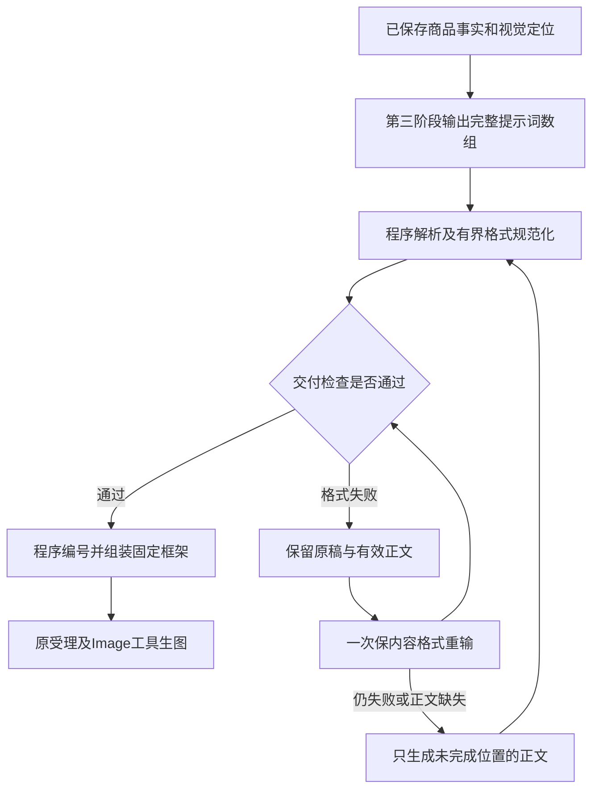

# 主图详情第三阶段简化交付与格式恢复方案

日期：2026-10-10。状态：按用户授权完成本地实现与验证，尚未提交部署。第1～8节保留诊断及决策依据；最终实现、验证与限制见第9节。未修改生产业务任务或账本。

任务工作树：`.worktrees/ecom-three-stage-agent`；调查基线为已部署 `d14613f9`。

## 1. 目标与已验证问题

模型按简单的程序交付格式返回逐张完整提示词；程序校验、编号、组装后调用既有Image工具。格式失败时保留有效设计，只处理格式或未完成部分，不重跑已经成功的前两阶段，不反复要求复杂patch路径。

生产项目 `2499c119-d8c8-4e35-9205-8d116a11e501` 为默认14张、Kimi K3。读取时7张主图已完成；详情计划 `12855607-ff81-449a-b8b7-4bce9400e8f0` 第一、二阶段已保存，第三阶段未通过。

原始第三阶段JSON可以解析，但205个字段名多出前导 `/`，包括 `/images` 和每张内部的 `/scene`。截至诊断取样，第三阶段有19条带attempt ID的调用记录：18次校验失败、1次发布重启打断。其中14次为 `PLANNER_REPAIR_SCOPE_CHANGED`，另有重复键、字符串未闭合和patch schema问题。不能将其统称为上游超时。

离线实验仅移除这些字段名多出的前导 `/`，检查不存在名称碰撞，全部叶子值逐项一致；经过原 `validate_designs()` 和 `assemble_designs()` 后得到ready及7份完整详情提示词。实验没有把结果写回生产，也没有恢复生图。

根因链：模型输出字段偏差 → 严格schema拦截 → 切入精确path patch协议 → patch不合规 → 同一草稿及同一修复策略跨窗口反复执行。需要简化交付协议，并改变恢复策略；仅放宽一处校验不能解决整个循环。

## 2. 推荐分工与交付协议

第一阶段商品事实和第二阶段视觉定位保留专业要求、来源证据及保存机制。原草案只调整第三阶段；后续第一、二阶段检查发现其格式接收和恢复也需要调整，补充检查见第8节，已按第9节实现。第三阶段新增页面专用交付版本 `ecom-prompts.v4`；此版本由程序冻结在plan，不要求模型输出版本号。

正常第三阶段只返回一个JSON对象：

```json
{
  "prompts": [
    "第1张的完整画面提示词正文",
    "第2张的完整画面提示词正文"
  ]
}
```

示例仅展示格式。实际数组长度严格等于当前调用要求的张数：默认模式为两个独立7张计划，单类支持现有最多15张。数组顺序即输出顺序；模型不再输出position、item_id、资源ID/URL、固定参数、schema_version和ready状态。

确实存在阻止执行的资料问题时使用互斥的短响应 `{"questions":["具体缺少什么"]}`，保留现有needs_input语义；不能混合prompts和questions，也不能把拒绝/未完成响应当作可执行提示词。可选规格缺失仍遵循原Skill，不因此强行停止。

| 内容 | 负责方及要求 |
| --- | --- |
| 平台、语言、模式、比例、清晰度、总张数 | 页面核验并冻结，程序直接用于实际工具参数及提示词框架 |
| 图片编号、ID、链接、版本与固定顺序 | 原图片系统；模型读取编号及内容，输出不重建绑定 |
| 输出position、item_id、默认展示名称 | 程序按数组顺序赋值，例如“主图1”“详情图1”；不从正文猜序号 |
| 每张主题、构图、场景、光效、准确文案、参考图使用方式、保真和特定负面约束 | 模型在每张完整正文中表达，保留当前第三阶段Skill的专业方法 |
| 详情整页阅读、内容覆盖、前后屏关系和边缘处理 | 模型先完成整套规划与自查，落实到各屏正文，不再重复提交page_plan/coverage/page_link机器表 |
| 固定框架、整套共同边界、通用保真/负面规则 | 复用程序拼接；避免模型重复生成技术外壳 |
| 最终request_text、hash、有序references及实际生图调用 | 原程序组装、来源门禁和Image工具 |

图片用途规则：移除`reference_usage`机器表不等于删除参考图语义。每条正文仍按原Skill说明实际使用的`image_N`、对应视图/内容、保留或参考范围及画面位置；例如“以image_1中的商品正面作为画面中下部主体，image_2仅用于搭扣细节窗口”。不得用“上面那张图”“第二张”混指输入参考与输出作品。程序在最终请求中加入同一套`image_N=第N张实际输入参考图`及已冻结角色清单，分析与生图使用同一顺序，不根据模型正文挑选或重排图片。正文中的规范编号检查是否存在，明确使用商品来源；未明确赋予用途的参考图不得据此增加商品、道具或信息。这里保留来源与用途的专业要求，不新增需要模型复制真实ID/URL的表格，也不对自然语言位置描述设置精确字面模板。

绑定校验只能证明编号、角色和实际传图对应，不能证明模型准确理解图片内容或生图模型必然按布局执行。真实模型验证要覆盖多张相似商品图、局部图、风格图和未使用素材，检查是否混淆视图、产品款式及输入/输出编号。

v4内部仍按旧页面DTO提供 `items[].item_id/position/name/purpose/references/aspect_ratio/positive_prompt/negative_prompt/scheme_markdown/request_text/request_text_sha256`。name和purpose使用明确的程序默认值，scheme_markdown展示最终提示词。`design_output`记录真实v4交付及版本，不伪造旧的逐字段设计或审核记录。

重要取舍：v4不再要求第三阶段输出fact_ids、reference_usage和review_records，因此无法继续使用v3的逐张事实集合、coverage与图内事实集合相等校验。第一阶段事实来源校验保留，第三阶段继承事实及声明边界、执行专业自查；程序只能校验可确定的协议/绑定/参数约束，不能证明正文所有语义正确。是否夸大卖点、风格好坏仍属于模型自查和人工内容核验。不得伪造逐张事实引用或把格式通过标记为独立内容审核通过。

## 3. 接收、校验与格式恢复



### 3.1 程序检查

1. 仅接受明确完整的单一JSON交付；重复键、名称碰撞、多个对象或含冲突结论不猜测选择。
2. prompts按固定请求数量交付为字符串数组，逐项非空；若额外返回超过N项，仅保留前N个已请求位置并审计额外数量，不删除或重排已请求位置；检查完全相同的重复正文。完整相同不直接删掉一项，只标记需重新设计的位置。
3. 继续检查固定画布/分辨率的明确冲突、原参考资源权限及版本、最终Image prompt长度/字节限制、图片size、积分和实际工具参数。程序拼接时完整保留参考图顺序及用户配置。
4. 不用“必须提交N条审核记录”“所有嵌套元数据齐全”作为v4执行门槛；不把字数阈值冒充设计质量。
5. 内容自查属于第三阶段原专业方法；机器格式校验不替代语义审核。

### 3.2 有界规范化

对协议已知的键，只在名称唯一、不发生碰撞、所有内容值和数组顺序逐项不变时处理确定的偏差，例如v4 `/prompts`→`prompts`。原回复、原hash、转换记录和规范化后hash保留。转换后仍执行完整适用校验。

v3兼容路径仅在当前schema对应对象层级识别已知字段的前导 `/`，不全局修改任意字典键、正文中的斜线、URL或引用，不接受含糊名称。未知结构继续明确失败，不能“尽量提取一段就生图”。

### 3.3 格式重输与失败部分补写

- 同一原稿、同一校验版本的格式整理最多一次，状态及原稿hash写入现有stage_drafts，跨Worker和恢复窗口不重置。
- 格式整理只传原稿、最小目标schema、数量及具体错误，不再上传图片，也不重新发送整套三阶段策划指令。返回完整最小对象，不要求模型编写patch/op/path。
- 原稿中能无歧义读取的正文按位置保存hash；格式整理后的对应正文必须保留原值。程序不以模型声称“未改动”为证据。无法证明完整性的截断文本不直接交付。
- 格式仍失败或确有空白/缺失内容时，转为只生成未完成位置。内部请求由程序携带目标位置及必要的前后屏上下文，模型仍只返回按该次目标顺序排列的prompts；程序合并，成功位置不允许被覆盖。
- 同一错误及同一草稿不再反复回到相同patch策略。继续用原每阶段/每窗口预算、绝对期限及延迟恢复，不新增无限前台循环；后续窗口沿用已保存的成功位置和已用过的格式整理状态，继续未完成部分。
- 网络未知先执行原回执核实；格式不合格、输出截断和供应商结果未知分开记录，不能混用。

这减少的是交付负担及无效重试。正常第三阶段仍是一组一次模型调用，不默认改为每张独立调用；只有局部恢复时才缩小到失败位置。

## 4. 保存、结算与旧任务兼容

新页面plan冻结 `stage_three_delivery_version=ecom-prompts.v4`、资源hash及组装版本；已有无新标记plan继续v3。新旧第三阶段分别路由，第一、二阶段成功记录不丢弃，不修改已冻结输入或已受理图片任务。

已有失败草稿先尝试本地可证明的结构修正，再决定是否调用模型。本次详情原稿适用，但已经以validation_failed结算的attempt是不可变回执，不能拿旧attempt_id再次finish成completed。

因此恢复已有草稿需要一个最小的受控本地完成入口，已使用迁移287：

- `complete_ecom_plan_local_draft`仅供可信后端Worker使用；runtime角色、用户/组织、当前project/run、当前stage=1/2/3、有效租约、当前草稿fingerprint及校验版本全部匹配；第一、二阶段不能直接进入ready。
- 锁定root/plan；拒绝当前窗口仍有started/uncertain调用或旧租约。只在原恢复机制取得执行权后完成，不与在途模型结果争抢。
- 保存规范化及组装结果、local_finalization幂等键/hash/audit，并在同一事务调用现有阶段保存和账本逻辑；不会伪造一次模型调用，也不会改写历史attempt。
- 不收取本地格式整理费用；按285同样规则结算尚未交付的有效前两阶段一次，已经记为平台承担的失败费用保持原分类。重复完成、重复扫描或断线重放不重复收费/不重复生图。
- 新v4在本次模型调用结束、尚未落定attempt前规范化成功时，继续使用原finish事务，无须经过本地历史完成入口。

stage_drafts继续用JSONB保存候选、逐位置可信正文、修复模式及hash，不新增第二套任务表或队列。主图7张已成功的任务不重做；详情恢复后复用原accept去重和图片来源约束。

## 5. 实施位置与顺序

| 顺序 | 文件/职责 | 交付 |
| --- | --- | --- |
| A | `prompt_resources.py`及新增v4第三阶段主图/详情提示词资源 | 专业方法保留，交付改为最小prompts对象；前两阶段专业内容保留并同步输出包装；v3正文和hash保留 |
| B | `delivery.py`、新v4交付类型/校验、`assembly.py` | 明确解析、已知键规范化、原文不变审计、v4正文与固定框架组装，旧v3读取兼容 |
| C | `service.py`第三阶段及stage_drafts恢复 | 普通生成/一次格式整理/失败位置补写分开；新旧版本路由，原预算和已完成阶段复用 |
| D | `detail_page_generation.py`、最小本地完成RPC迁移及受保护rollback | 新plan冻结v4；合法完成已验证旧草稿、一次结算、原accept和Worker调度复用 |
| E | `detail_page_recovery.py`及现有诊断投影（必要时） | 原恢复调度读取持久修复状态；若展示原因，区分格式整理与局部补写，不另造任务状态机 |
| F | 现有单测、隔离PG/Redis链路、页面DTO及下载回归、文档 | 主图/详情/15张、两个模型请求参数及安全边界验证 |

页面布局、任务栏、模型选择、AI帮写、上传、Image适配器、下载及前三阶段串行关系继续使用现有实现。既有聊天入口默认保留原协议，本次v4只给专用页面新plan使用。

## 6. 验证与发布回退

- 用本次真实失败原稿的脱敏等价夹具验证：已知键规范化后内容逐值不变、全校验/组装通过、不新增模型调用；同名碰撞、重复键、冲突尾话、未知字段和截断不错误放行。
- 新v4主图7、详情7、单类15：数量、顺序、空白/重复、固定参数冲突、输入参考1～9张及size保持；默认14张仍独立两组。
- 格式整理不带图片、最多一次、正文hash一致；错误跨窗口不重置整理次数。失败位置补写不覆盖成功位置，详情补写带邻屏上下文。
- 真实隔离PG验证本地完成RPC的权限、lease/fencing、draft变更、重复Worker、回执重放、积分不足事务回滚、平台失败成本不转嫁及前两阶段只结算一次。原Image受理去重、共享槽和聊天回归保持。
- 旧v3运行中、failed、ready任务都能按原version读取/恢复；v4不能误走v3 validator。前端继续展示最终request_text，单张详情和ZIP主图/详情目录不变。
- 实施后的真实Kimi/Gemini生成测试另行记录；当前离线规范化实验不等于新v4真实模型通过，也不承诺消除所有外部故障。
- 发布通过受控入口。回退先停止新建v4，保留双版本执行器完成已有任务；有活跃v4计划时不得直接部署只认识v3的旧版本。本地完成RPC回退仅移除入口、保留审计/历史和已完成结果，不回退账本或删除任务。

## 7. 待用户审阅的实质变化

推荐接受：第三阶段由复杂创意字段/审核表/精确patch交付，改为最小的有序完整提示词数组；程序承担确定的结构处理，专业自查保留，机器逐张事实引用覆盖校验不再作为v4门槛；格式重输失败后只继续未完成部分。

用户已确认并授权实施，最终实现及验证见第9节；尚未执行生产恢复或部署。

## 8. 第一、二阶段补充检查（2026-10-10，实施前诊断记录）

### 8.1 范围与证据

本轮复用同一任务的生产只读快照，检查当前部署基线的第一阶段Schema、两个阶段的完整专业提示词、`_stage`恢复、`_validate_visual`及第三阶段的共同边界提取。没有重新查询生产或调用付费模型，没有修改业务代码、任务或账本。

离线直接执行当前第一阶段校验；第二阶段校验及`_stage`从源文件提取原函数AST独立执行，隔离无关配置初始化。完成16项接收边界实验、两个阶段各3次模拟调用的恢复实验，以及真实第一阶段失败草稿规范化对比。它们验证当前代码行为，不是新方案已经实现的测试。

### 8.2 第一阶段：存在真实的格式阻塞，但来源关系不能删除

生产主图计划第一阶段首次输出耗时420.328秒，因`PLANNER_SCHEMA_EXTRA`失败；随后模型再调用71.917秒完成。失败草稿仍保存在`stage_drafts.1`，能够核对具体原因：

- 标准业务对象之外有990个字段，值全部为`null`，分布为gaps 176、facts 374、selling_points 440，例如`ok`、`end`、`tmp`、`emit`。这既是模型输出异常，也是当前接收端没有可证明本地整理路径的问题，不能只称为一个字段名不标准。
- 离线只去掉Schema不允许且值为null的字段，正式字段、数组顺序、事实及来源全部不改，经过原`validate_product`通过。
- 清理后的对象与该计划后来模型修复成功并保存的第一阶段对象完全相等：10条事实、5条卖点。该次付费格式修复可以由程序完成；不能据此声称首次420秒也能全部省掉。
- 原解析后对象序列化26,896字符，清理后5,587字符。此处为本地对象序列化长度；日志的原始回复长度34,442字符包含原回复格式，二者不能混为同一计量。

其他可复现问题：外层唯一JSON加代码围栏、已知`source_ref`误写为`/source_ref`、省略固定`schema_version`、省略可空`product.sale_scope`都会进入修复；多数Schema错误只返回通用错误码，不给具体字段路径。反而重复且冲突的JSON根键`status`会被`json.loads`静默取最后一个，造成信息丢失。

建议：

1. 先严格解析，拒绝重复键及非JSON常量；只对完整、唯一对象的明确包装做有界拆除。保留原回复、hash和转换审计。
2. 已知字段前导斜线等唯一映射可规范化，名称碰撞拒绝。对协议之外的null空字段采用明确的可审计清理策略，再跑原Schema及来源/引用校验；不能泛化为删除任意未知非空内容或覆盖状态。
3. 版本号由冻结的程序契约负责。旧任务出现明确冲突版本不能盲目覆盖；新模型交付可不要求回写版本。可空字段只有在新协议明确约定“省略即未知”后才能补null，不能自动补事实、来源、状态、问题或卖点。
4. 保留事实、卖点、疑问和缺口的业务结构，保留来源存在、图片角色、可用事实与卖点引用校验。`f1`、`fact_01`等ID名称当前本就没有固定拼写要求，主要约束是唯一性及引用存在；无需为改ID名称重做分析。
5. “这条卖点依据哪个事实、哪个图片或用户声明”仍需模型判断，程序不能根据顺序猜来源或替模型补造依据。第一阶段不建议简化成一整段不带证据的文本，也不复制第三阶段移除逐图审核表的取舍。

### 8.3 第二阶段：Markdown标题过严，同时存在漏检与下游耦合

当前用`find('## 1. 视觉定位')`等完整字符串查八个标题，没有解析Markdown章节。

离线保留全部正文，只把`## 1. 视觉定位`改为`## 1、视觉定位`或标题加粗，就触发`PLANNER_VISUAL_SECTIONS_INVALID`；第八节标点变化同样失败。相反，第八节只有标题、结尾没有换行时，空章节会通过；追加重复第八节也会通过。

第三阶段`assemble_designs`另用完全相同的第八节字符串做split，复制共同边界。因此只放宽第二阶段validator、仍让下游按旧字符串取正文，会把错误推到第三阶段。必须让两个位置共用同一个章节解析结果。

另外，专业Skill允许存在关键歧义时先问问题，但运行层只把第二阶段当Markdown，没有可用的补问分支。独立的合理补问会被识别为标题不完整，并进入格式重试。不能把真正需要用户确认的情况当成缺章节修复。

建议：

1. 保留八个专业主题及完整正文，不增加一套复杂JSON审核表。程序按已知标题解析章节，允许明确的编号标点、空格、加粗等表现差异；随后统一生成标准标题。
2. 不猜未知标题的含义；缺失、重复、真正空白或未完成章节必须准确定位。章节正文按明确标题对应保存；标题表现差异规范化。模型若调换已知主题顺序，程序按唯一主题恢复既定八节顺序并记录转换，不猜未知标题，也不把正文配到另一主题；节前说明保留。
3. 保存标准稿和解析结果；第三阶段按解析后的第八节提取共同边界，不独立做字符串split。显示稿、下游输入与拼接来源保持一致。
4. 在新交付协议中明确互斥的关键问题分支，进入既有needs_input/用户补充流程；不能靠搜索问号推断状态，也不把可选资料缺失扩大成阻塞。
5. 格式整理只改标题包装；真正缺少一节时只补该节，保留其他已确定主题、色彩、道具和照明正文。不得用一句“风格保持一致”替代专业结论。

本次快照中的两个第二阶段均一次调用完成，没有实际格式失败：主图105.431秒、详情366.131秒。详情首段正文等待278.368秒。标题误拦是已复现的代码风险，但本次第二阶段慢主要发生在正文返回之前，可能涉及模型推理、排队或上游响应；当前证据不能归因于JSON校验，也不能承诺格式调整消除这部分等待。

### 8.4 两阶段共同恢复问题与方案增量

`_stage`每个窗口最多3轮，失败后继续发送完整专业提示词、固定输入、全部图片及上一份完整草稿。模拟源函数执行确认两个阶段都如此。指令虽然写“保留有效内容”，程序没有逐字段/章节不变校验；错误通常没有路径，难以限定修正范围。三个失败后统一抛`PLANNER_JSON_VALIDATION_FAILED`，连第二阶段Markdown也使用该JSON错误码。

已有失败草稿会用于下一窗口，但`repair`从0重新计数，也没有原稿hash对应的已用格式整理状态。专用页面的持续恢复可让相同问题再次重复。此处没有第三阶段的严格patch-path协议，却有同类重复整稿恢复风险。

在原第三阶段方案上补充：

- 三阶段共用严格解析、有界规范化、字段/章节错误定位、原稿审计与持久格式恢复状态；不另造任务队列或计费。
- 能本地整理先本地整理；格式整理最多一次，只传原稿、最小协议及具体错误，不重新传图片和完整分析Skill。跨窗口不清零同一原稿的整理次数。
- 已确认有效字段或章节用原值/hash保护；格式仍失败或内容确有缺漏时，定向修正未完成部分，合并后重跑原业务校验。真正需要重新看图的事实疑问与纯格式修正区分。
- 保留已成功阶段，不因为后续失败重跑。未知回执继续沿用原核实流程，不能把截断当作可修正包装。
- 原第4节拟议的本地草稿完成入口只允许stage=3。若第一、二阶段也要从已结算失败草稿本地完成，需要将入口显式扩为当前stage=1/2/3：stage1按真实状态进入planning/needs_input/insufficient，stage2进入planning，只有stage3有效成稿才能ready；原租约、draft fingerprint、root/plan锁及attempt不可变要求不变。前两阶段有效费用按既有pending_delivery规则，不能提前按最终交付重复收费。
- 新plan冻结接收/规范化协议版本及对应资源hash。现有成功输出及已受理图片不可改写；旧计划兼容必须覆盖三阶段，不能只给第三阶段加新版本而改变旧前两阶段的含义。

建议实施顺序补为：先三阶段共享接收/错误定位 → 第一阶段可证明的格式清理 → 第二阶段章节解析和下游取边界 → 第三阶段最小prompts交付 → 三阶段持久恢复及本地完成 → 模型与隔离数据库验证。第一阶段事实模型与第二阶段专业设计方法保留，不合并两个阶段。

新增验证要求：以990个null额外字段的脱敏等价原稿证明本地结果与成功稿完全相等；未知非空字段、冲突/重复键、错误来源和丢失引用不得误放行。第二阶段覆盖编号标点/加粗的等价转换、空最后一节、重复节、真实缺节、补问、原第八节正文不变及下游拼接一致。恢复覆盖不传图、跨窗口次数、有效内容不变、只有失败部分重做及分阶段本地完成的一次结算。

本轮仅检查并补充建议。离线证据保存在本机会话临时文件，未提交用户原始草稿、未修改生产。


## 9. 最终实现与验证（2026-10-10，本地完成，未部署）

### 9.1 已实现内容与复用范围

- 新页面计划使用独立的v4资源包，冻结资源hash、`ecom-prompts.v4`、`ecom-format.v1`及`fixed-frame.v4`。旧v3提示词文件未修改，已有任务继续按冻结版本读取；聊天入口默认仍用原v3交付。
- 第一阶段保持商品、事实、卖点、SKU、证据、疑问及缺口结构；仅新协议由程序填写固定版本，明确可空的缺省字段才能补null。原来源角色、事实引用与usable边界校验保留。
- 第二阶段保留八个专业主题，程序统一解析、规范标题和提取第八节共同边界，完整保留章节正文及节前说明；缺失、重复、空章节准确定位。明确补问进入原needs_input流程。固定画布冲突定位到实际章节，仅修该节。
- 第三阶段专业方法及自查保留，改为有序完整prompts正文；程序生成名称、item_id、position、画布和有序真实参考绑定，拼入共用规则。正文按原值进入最终request_text，不由主AI摘要或二次复制。额外无用元数据可定位字段清理；混合questions与prompts不会通过删除问题来变成ready。
- `format_delivery.py`提供明确完整JSON解析、schema层级的已知键映射/空额外字段清理、标题解析、错误定位、内容保护和定向合并；`page_delivery.py`接入原策划执行器。未另造Agent、模型适配器、队列、账本或Image提交逻辑。
- 纯格式整理最多一次，不带图片和完整Skill；语法正确但正文放错根结构的情况也先做保内容格式整理。格式模型若只裁掉字符串首尾空白，程序恢复原始空白而非接受值变化；内部文字、数值及顺序改变仍拒绝。定向修复最多两轮，目标由程序定位，模型只返回正文数组或与目标顺序相同的values数组，不再编写patch/op/path。程序合并，不允许覆盖目标外的有效字段、章节或提示词。
- 原稿、原hash、当前稿、历次规范化审计、格式整理次数及局部修复次数保存在stage_drafts。先占用动作状态再调用；Worker重启后继续读取，不按窗口清零。预算拒绝或明确未执行的上游拒绝不会消耗未执行的恢复动作；结果未知不复位、不盲目重发。
- 已保存草稿先本地规范化；合格时由迁移287的`persist_ecom_plan_format_state`及`complete_ecom_plan_local_draft`完成。入口检查runtime身份、actor/org、当前project/run、租约、当前stage和草稿CAS，不改写sealed模型attempt，不新增虚构调用或费用；沿用原受理去重及费用事务。
- 格式/内容修复预算耗尽后保留有效资料并进入平台处理，避免相同草稿无限重试。供应商临时错误继续走原持续交付机制。此次调整不能消除上游永久故障或保证所有模型内容准确。

第三阶段不再提供逐张机器事实引用、coverage和review_records校验；这是已确认的简化取舍。第一阶段的来源校验及第三阶段专业自查保留，不将格式通过称为独立语义审核通过。

### 9.2 自动化与真实旧稿验证

最终336项定向测试通过，无跳过，覆盖：

- 新旧解析与协议、真实失败的脱敏等价夹具、冲突键/重复键/未知非空字段/截断、图片别名及角色、有效内容保持、单次格式整理及跨窗口恢复。
- 主图7/15张、详情7/15张的真实隔离PG链路，第三阶段只补缺失位置，最终提示词、参考顺序、ratio/resolution及size进入原Image受理结构。
- 真实PG/Redis上的CAS并发、lease/run/actor/未知回执门禁、旧草稿三阶段本地完成、第二阶段JSONB字符串保存、一次结算、积分不足事务回滚、旧attempt保持及迁移权限/回退重装。
- 原页面任务、持续恢复、旧设计协议与聊天策划回归。未修改前端布局、上传、AI帮写、下载、媒体预处理或模型价格。

另用本次真实生产只读快照执行最终本地接收器：第一阶段恰好清理990个额外null字段，所得对象与后来成功稿完全相等；详情第三阶段恰好规范205个已知键，全部叶子值和数组顺序不变，通过旧校验/组装得到7份完整提示词。没有把这些原稿写回生产，也没有对原用户任务重复生图。

### 9.3 真实模型验证及限制

使用既有Kimi K3/百炼与Gemini/KIE适配器，Gemini媒体上传使用生产现有海外代理路径。诊断运行在隔离进程，模型真实付费调用，但不写生产业务数据库、用户账本或Image任务。

| 模型与输入 | 第一阶段 | 第二阶段 | 第三阶段 | 结果 |
| --- | --- | --- | --- | --- |
| Gemini，存钱本主图7张 | 28.5秒 | 51.0秒 | 66.1秒 | 三阶段各一次，7份完整稿 |
| Gemini，存钱本详情7屏 | 26.5秒 | 53.3秒 | 68.8秒 | 三阶段各一次，7份完整稿 |
| Kimi，存钱本详情7屏 | 48.2秒 | 104.6秒 | 192.8秒 | 三阶段各一次，7份完整稿 |
| Kimi，存钱本主图7张 | 97.2秒 | 98.1秒 | 首次上游错误；续接363.9秒 | 前两阶段复用，第三阶段续接通过，7份完整稿 |

Kimi主图首次第三阶段诊断仅记录DashScopeAPIError类型，没有足够错误详情，不能归因于超时或参数。续接是本次诊断再次运行，不能把它写成首次全程一次成功。真实15张不是本轮测试范围；15张验证使用程序及数据库链路替身。

另补两张同商品不同视图加一张其他商品风格图的真实三阶段测试（每模型3张主图）：Gemini各阶段一次通过，共123.6秒；Kimi前两阶段133.9/134.0秒通过，第三阶段99.2秒返回语法有效但后两张正文误放在根对象键和值中。早期候选的两次局部修复未收敛，触发本轮进一步补齐结构格式恢复。之后一次44.3秒真实无图格式整理返回正确三项，只去掉第二项开头两个换行；最终代码将原换行恢复，使用这两份真实回复完整回放，保留三份原稿并通过，无新增付费调用。此处为最终接收代码回放成功，不记作Kimi多图首次在线全程成功。两模型正文均明确image_1/2商品视图和image_3仅光效范围，未把红本/貔貅作为目标商品。结果与完整提示词保存在会话产物“主图详情简化交付验证报告.md”，不以编号格式通过代替图片理解正确性。

实测成功稿保留了场景、布局、照明、文案、商品保真及详情逐屏关系；仍可能带入未确认的材质/工艺或功能措辞。此次按已确认范围保留现有卖点能力，没有擅自新增另一套内容审查或强化提示。尚未生成实际图片，不能据此证明最终图像保真、文字渲染或详情拼接视觉质量。

### 9.4 发布与回退

本批未提交、推送或部署，迁移287仅在隔离测试库运行。生产故障任务仍保持原状态，部署后应先观察它们在原恢复机制下的结果。

部署必须包含迁移287及双版本读取器。回退先停止新建v4，再排空/妥善保留活跃v4执行；不可直接部署仅认识v3的版本。回滚SQL仅移除新增入口，不删除stage_drafts审计、历史attempt、已交付结果、Image任务或账本。
