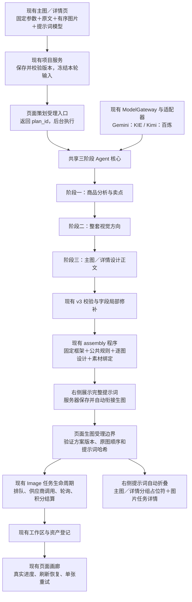

# 主图／详情页：Gemini、Kimi 提示词模型选择与现有链路复用方案

2026-10-10 分析可靠性补充（方案，待实施）：已只读核对生产正常API代理7890、海外上传代理7891；当前分析仍发送CDN链接，供应商拉图不继承后端代理，生图海外旁路没有接到分析。建议共享素材准备：Kimi直接发送合规原图字节，Gemini复用现有KIE底层上传经7891准备临时URL，保留原图绑定与最终Image请求；补齐图片限制、真实下载错误变体、流式／非流式参数统一及分阶段JSON模式。完整文件职责、验证与回退见[分析图片传输与适配缺口补充方案](TECH_AI帮写通用创作简报.md#2026-10-10分析图片传输与适配缺口补充方案待实施)。本段不宣称新增传输或JSON模式已部署。

日期：2026-10-09。状态：本地实现与定向验证已完成，未提交部署；真实付费调用待配置有效费率。

2026-10-09 交互修订：以用户最新两张截图为准，采用左侧输入、右侧进度／提示词／图片的连续工作区；开始生成后自动衔接生图，复用聊天现有图片占位符和“图片任务详情”。本次修订标注为【修改】或【新增】，替代此前要求单独确认规划的建议。

本次基于当前任务工作树代码、现有页面布局及本任务真实调用记录实施；本轮页面接入未新增真实供应商调用或生产写入。

## 1. 本次确定的目标与范围

1. 在现有主图／详情页增加“提示词模型”选择：Gemini、Kimi。
2. 同一轮任务的三个阶段使用用户选定的同一模型；主图和详情共用同一编排核心，第三阶段按模式使用现有对应提示词。
3. 保留 20261009 提示词包、当前卖点生成规则、v3 设计交付、程序组装和局部修补机制。按用户要求，本次不修改未确认卖点的处理，不新增事实评分器或第四阶段评审。
4. 页面固定参数、原始需求与图片顺序由程序冻结；模型输出创意内容；程序组装完整提示词并通过现有 Image 执行能力生图。
5. 【修改】接通截图页面中的真实分析、提示词浏览、自动衔接批量生图、失败恢复和结果展示，替换相应模拟逻辑。右侧连续显示执行过程，不要求另进入规划确认页。
6. 单类输出张数支持 1—15；【修改】默认组合模式显示 14 张，即 7 张主图＋7 张详情；上传参考素材继续沿用现有最多 9 张的限制。生成数量与输入素材数量分别管理。

不在本次范围内：重做上传系统、另建 Agent 框架、另建供应商 SDK、重做积分账本、重做工作区／资产中心、调整聊天的模型入口或替换聊天现有默认模型。详情交付沿用当前独立内容屏路径；本次不扩大为精确接缝或长图自动拼接功能。

## 2. 已查明的项目现状

| 模块 | 实际现状 | 本次处理 |
| --- | --- | --- |
| `DetailPage`、设置区、分析面板、方案卡、进度、结果画廊 | 代码有五步模拟流程，但与用户最新截图的连续工作区存在差异 | 【修改】以截图为布局依据，复用左侧输入能力；右侧连续显示进度、提示词与图片，不照搬五步切页 |
| `useDetailPageStore` | 上传、草稿读取／保存是真接口；分析和生图使用 MOCK 与定时器 | 保留真实部分，替换模拟部分 |
| `DetailProjectService`、`detail_projects`、`detail_project_images` | 已支持真实图片附加、分类、排序、乐观锁；项目已有 analyzing 等状态 | 扩展已有项目字段及读写接口 |
| 当前项目恢复 | `get_current()` 只找 draft；项目校验也依赖这个查询 | 增加按项目 ID 读取活动／已完成状态，刷新恢复不能只查询草稿 |
| 三阶段 v3 Agent | 已有输入快照、阶段保存、校验、第三阶段字段修补、最终组装 | 复用同一核心；拆开聊天入口约束和共享执行部分 |
| Agent 当前调用边界 | 要求聊天父任务、消息、工具调用、已激活入口 Skill | 页面增加自己的可信入口，不能伪造这些聊天对象 |
| 模型选择 | Agent 从全局配置读取模型，允许的模型仍主要是 KIE GPT 和 OpenRouter GPT | 增加服务端限定的两种页面模型配置，按任务冻结 |
| 模型注册 | 已注册旧版 Gemini／Kimi；此前测试的 Gemini 3.8 Flash、Kimi K3 未完成正式注册 | 在现有工厂与供应商配置中补齐实际测试版本 |
| Image 受理 | 有完整快照、幂等、预算、排队、积分、轮询和结果保存，但入口绑定聊天 | 扩展目的地为 detail_project，保留共享执行／结算核心 |
| Image 非聊天目的地 | 已有 skill_trial 接入同一图片生命周期的先例 | 沿用目的地扩展方式，不把页面冒充为试运行或聊天 |
| 聊天图片 UI | `MediaPlaceholder`、`FailedMediaPlaceholder`、`AiGeneratedImage`、`ChatImageControls` 已有占位、图片与实际提示词查看 | 【新增】页面图片块复用这些能力；只补页面任务来源适配和分组容器 |
| 旧 `EcomImageHandler` | 使用另一套旧 ImageAgent 规划过程 | 不作为新页面的策划入口；复用其下层通用图片能力即可 |
| 张数 | Agent 1—15；页面类型、校验、数据库约束仍为 1—9 | 同步输出数量约束；输入图数量不变 |
| 比例能力 | 页面有 4:5；当前默认 Sunburst 图生图配置没有 4:5 | 由已有图片能力源提供可选组合，不能静默替换用户比例 |
| 超时 | 持久化恢复窗口有 600 秒硬限制，代码也裁剪至 600 | 页面设置独立受控预算，并同步数据库、执行预算与租约 |

上述“可复用”不表示相应接口可以无修改直接调用。特别是聊天身份、SQL 权限和消息发布约束必须在页面边界完成适配。

## 3. 用户看到的操作流程

【修改】以最新截图的左右布局为准，用户在同一页面完成操作：

1. **左侧输入**：保留截图中的模式、平台、文字语言、比例、清晰度、张数、上传与需求区；【修改】在“生成数量”后紧接一行“提示词模型”选择，默认 Kimi，底部按钮为“开始生成”。
2. **右侧进度**：点击后右侧显示真实阶段“分析商品 → 确定整套视觉 → 生成提示词”，保持左侧位置稳定。页面退出不终止后台任务。
3. **右侧提示词**：完整提示词经现有校验、组装并保存后，在右侧按用途及张序显示，可浏览、展开和复制。未完成或未校验草稿不作为可执行提示词。
4. **自动进入生图**：服务器受理生图后自动收起该组提示词，保留可展开的摘要；下方显示每张图片占位符和上方“图片任务详情”入口，无须再次点击确认。
5. **原位替换结果**：结果替换对应占位符，不按完成时间重排；失败也保留原位置，并使用已有失败占位／重试能力。

【修改】用户已明确默认模式为主图 7 张＋详情 7 张，数量控件显示“14张”，“生成数量”标签右侧同一行显示“7张主图＋7张详情”，取消顶部模式说明小字。默认／主图／详情各模式的数量行、模型行、控件高度和间距保持一致；菜单使用浮层，不改变上传区和开始按钮位置。

【新增】右侧按真实任务类型分“主图”和“详情图”两组，每组各有进度、折叠提示词和图片区域。默认模式显示两组各 7 张；单类模式只显示相应组，不能混排或将其中一组错误折叠。类型与数量来自冻结任务配置，不由提示词文字推断。

【新增】排版沿用现有圆角、间距及设计令牌；右侧内容顶部对齐，提示词限制为可展开阅读区，图片按目标比例保留完整画面，主图采用自适应网格，详情按屏序排列。详情也可多列预览，但序号必须清楚；窄屏改为单列。生成时有等待／排队／生成／失败状态，不能仅靠同一个灰框让用户猜进度。

【新增】进入生图的判定以服务器实际受理为准。若受理失败，提示词仍保持可查看并显示错误；不能先将整组隐藏、渲染假任务。提示词显示时间可能短，保留随时展开及任务详情查看，不增加人为等待来模拟预览。

【修改】模型选择项名称为“提示词模型”，【最新修正】位于“生成数量”右侧，两者同排、等宽对齐；上传和文字合并输入框及底部工具栏复用原组件；选项显示品牌和具体版本。按用户明确要求，新草稿默认 Kimi（`kimi-k3`）；已保存项目恢复用户自己的选择。默认模型不可用时明确提示，不自动换用 Gemini 或 GPT；用户可主动选择可用的 Gemini。

模型选择在点击“开始生成”后冻结。运行途中、局部修补和续跑不得自动换模型。用户主动换模型需要发起新的策划轮次，已有结果与调用记录保留。

## 4. 目标调用链

三阶段内部串行；通过规划后的多张图片按既有并发额度执行。页面直接调用 Agent 的应用服务入口，不依赖聊天主 AI 再发现或激活 Skill。三个内部提示词资源继续封装在 Agent 内。

【新增】自动衔接由服务器保存的生成意图和幂等受理驱动，不依赖浏览器观察到 ready 后再发请求。刷新、多个标签页或 Worker 重启不能重复创建图片任务。策划未 ready 时不允许生图；needs_input／failed 时留在右侧反馈。

## 5. 模型接入与配置复用

2026-10-10可靠性修正（本地待发布）：页面Kimi新任务显式采用`high`，Gemini维持`medium`；修复Kimi旧`medium`被丢弃、供应商默认采用`max`的问题。复用既有调用预算和已完成阶段，明确的供应商临时拒绝自动限次重试，已输出或执行结果不确定的调用保留核验边界；不更改冻结旧任务、专业提示词或生图受理。详细证据与测试见[恢复修复与验证](TECH_AI帮写通用创作简报.md#2026-10-10上游拒绝恢复与kimi推理配置本地待发布)。

### 5.1 沿用此前实际测试的版本

| 页面选项 | 本轮方案对应模型 ID | 供应商路径 | 必要适配 |
| --- | --- | --- | --- |
| Gemini | `gemini-3.8-flash` | 现有 KIE ChatAdapter／Client | 在现有配置中补 endpoint、能力、输出限制和计费；不借用旧 Gemini ID |
| Kimi | `kimi-k3` | 现有 DashScope ChatAdapter | 补注册与计费，规范角色／多模态输入并启用该模型需要的思考模式 |

这些名称表示本任务此前测试的版本，不宣称它们是供应商当前最新型号。实现时核对账号可用性；版本变化不能只改显示名称或让旧 ID 指向新模型。

Kimi 的真实诊断曾将 `developer` 转换为 `system`，并将 `input_text/input_image` 转成该接口接受的 `text/image_url`。生产实现应在供应商适配边界完成转换并保留顺序；不能让业务代码依赖 OpenRouter 类来给百炼转换协议，也不应修改其他百炼模型的默认思考模式。

### 5.2 单一调用和配置来源

- 复用 `ModelGateway → create_chat_adapter → 供应商适配器`，不新增 HTTP 调用栈。
- 在 Agent 目录增加薄的页面模型策略：只定义允许选择的模型、执行参数、超时策略和可用条件；实际模型与供应商信息取现有注册表。
- 定价沿用各供应商现有配置来源并统一单位读取，不在前端或新项目表重复维护价目表；缺少有效费率时，该模型不可受理。
- 模型菜单由后端能力接口生成，是现有注册配置的投影，不建立第二个模型库，也不要求用户先去聊天模型商店订阅。
- 本任务沿用平台级凭据；KIE 使用用户已明确选择的平台默认密钥，百炼使用平台已有配置。用户和组织的资源权限及积分归属仍须保留。
- 选定模型、供应商、推理参数、费率版本与提示词资源版本写入本轮快照；恢复时核对兼容性。

当前计费分支使用全局 GPT 输入／输出费率计算非 OpenRouter 调用，不能直接复用于两种新模型。必须改为读取本轮对应模型的费率快照，并保留现有按真实 usage、调用回执和原子保存结算的方式。之前给出的 GPT 费率不能自动套给 Gemini／Kimi。

## 6. 数据、身份与异步执行

### 6.1 固定输入只绑定一次

开始分析前先等待上传、附加图片和草稿保存完成，以项目版本作乐观锁。后端从已保存项目取值，不信任客户端重新提供资源 URL 或模型生成的图片 ID。

冻结内容包含：

- 项目 ID／版本、主图或详情模式、平台、语言、比例、清晰度和张数；
- 用户完整需求原文，不由其他 AI 摘要后再转交；
- 图片的稳定 ID、角色、原始排序、工作区路径、文件身份、版本及内容摘要；
- 选定提示词模型和执行／计费配置版本。

模型只看到稳定的 `image_1`、`image_2` 等别名及对应图片内容；技术 ID 和链接由程序保存。生图前按相同顺序解析实际 URL。链接刷新或改为受控原图内联传输不能换文件、缩图、改顺序或创建新的资源身份。

前端 `main_image` 明确映射为 Agent 的 `main_images`；`quality` 转为大写 `1K/2K/4K`；`zh-CN` 转为简体中文，`none` 明确为不新增文案而非去掉商品原印刷；`auto` 平台明确使用通用电商规则，不依靠现有平台工具的未知值默认淘宝行为。

【修改】默认模式是页面层的组合运行，不增加另一套 Agent：冻结 `generation_targets=[{task_type:main_images,image_count:7},{task_type:detail_page,image_count:7}]`，共用本轮原文、素材绑定及选定模型，分别通过现有主图／详情规则产生各自子计划。页面总数为 14，不能把 14 当成某一类 Agent 的张数。子计划按本轮标识＋task_type 幂等关联，页面恢复、进度、自动生图及费用统计均覆盖两组。单类模式仍只有一个目标，不在本轮自行制定默认模式其他总数量的拆分规则。

### 6.2 复用已有数据表

**`detail_projects`：** 增加 `prompt_model`、当前方案／生成轮次引用等最小字段，复用现有状态、版本和输入字段；单类输出张数约束改为 1—15，模式类型补充默认组合模式及两组子计划的关联。【修改】新草稿默认 `kimi-k3`，历史未设置模型的未运行草稿使用该默认值；已保存选择和已运行任务快照不改写。

**`detail_project_images`：** 继续保存上传素材和顺序，不复制到另一张上传表。

**`ecom_image_plans`：** 继续承载三阶段结果、草稿、调用记录、模型配置、组装结果与恢复状态。增加来源类型和页面项目关联：聊天来源继续要求完整聊天定位；页面来源要求项目、项目版本和任务快照，聊天相关列允许在该来源下为空。使用数据库 CHECK 明确两种来源的合法组合，不能全面放松约束。按项目＋幂等请求键建立页面受理唯一索引。

**`tasks`：** 继续承载每张图片的真实 Image 任务。不可变请求中加入 `destination=detail_project`、项目、生成轮次、方案版本与 item_id；增加对应幂等唯一约束。复用 result_data、external_task_id、积分、状态和原图保存，不另建图片任务或结果表。已有 `ecom_image_plan_acceptances` 的聊天证明保留；页面通过任务快照与目的地唯一约束关联结果，无须为此重做该表的聊天主键。

生成轮次与方案版本必须绑定。页面返回上一轮、再次生成和单张重试时，可追溯每张图使用的提示词、原图和模型；前端 versions 来自真实任务关联，不能再使用模拟 URL。

### 6.3 页面策划后台运行

目前没有可直接接收页面三阶段任务的通用后台执行入口。新增的是一个**有限的页面策划领取／恢复执行模块**：复用现有后台 Worker 生命周期、数据库租约、ModelGateway 限流和 ecom_image_plans，按持久化记录领取页面任务并调用共享 Agent 核心。

- HTTP 受理完成后返回标识，不在 HTTP 请求中等待三阶段结束。
- Worker 有并发上限，组织／用户校验和原子领取；不新建队列基础设施、任务平台或第二套 Agent Runtime。
- 执行中续租并校验 fencing token；重启后仅对可确定安全恢复的阶段续跑。
- 已有 `started/uncertain` 调用不能因为租约到期就被另一个 Worker 直接重发；沿用既有执行确定性检查。
- 为页面来源补齐 Worker 的最小 RLS／RPC 权限。不能用无限制管理员数据库连接绕过当前作用域要求，也不能把页面伪造成交互式聊天。

## 7. 提示词浏览、组件复用与 Image 对接

### 7.1 【修改】提示词浏览与执行同源

本轮以用户指定的“浏览后自动生图”为准，不把独立标题／副标题编辑、删屏或规划确认作为必经步骤。右侧展示程序组装的完整 `request_text`，与保存稿、实际执行稿及 SHA256 一致；按张序呈现并支持复制，生成时自动折叠而非删除。

后续若需要编辑提示词，应独立设计版本保存与重新校验。本轮不恢复模拟方案卡的本地编辑逻辑，以免浏览稿与执行稿分叉。

### 7.2 【新增】直接复用图片占位符与任务详情

| 已有实现 | 页面接法 | 必要边界 |
| --- | --- | --- |
| `chat/media/MediaPlaceholder.tsx` | 每张图的生成占位符，沿用样式和目标比例 | 外围补真实排队／生成标签；尺寸随页面容器适配 |
| 同文件 `FailedMediaPlaceholder` | 失败原位展示及重试入口 | 回调接当前任务 ID，不重新策划整组 |
| `message/MessageImageBlocks.tsx` 中 `AiGeneratedImage` | 占位完成后原位展示、缩略图回退、预览与下载 | 将渲染 ID 和聊天消息来源解耦；不能为页面伪造 message_id 或聊天引用 |
| `chat/media/ChatImageControls.tsx` | 每张占位符／结果图上方显示“图片任务详情”，沿用现有弹窗 | 直接传真实 taskId；详情读取页面目的地的冻结请求 |
| `services/chatImage.ts` 和 `/tasks/{task_id}/image` | 继续读取实际执行 prompt、规格、原图、状态及费用 | 类型支持页面来源和无聊天消息的任务，后端保留项目／用户／组织验证 |

页面只增加主图／详情分组、标题和自适应列布局。现有 `AiImageGrid` 的单图格也是复用候选，但其整组按消息组织、且没有每个 task 独立详情入口，不能通过伪造消息批次硬套。优先共用其底层图片渲染能力，不再建立另一套占位符、预览、下载或详情弹窗。

`ChatImageControls` 已显示“服务器实际执行提示词”，因此生图后查看正文直接复用该内容；模型分析原文不替代实际 prompt。新任务尚未生成 taskId 时，可展示组装提示词和“准备提交”，任务详情入口仅在真实任务创建后出现。已入队任务可在尚未出图时打开详情。

### 7.3 复用现有图片执行核心

页面生图受理只接收方案 ID、版本、选定 item 与幂等请求键，服务端读取并核验已保存提示词和图片绑定。禁止由前端另传一份可与保存稿不一致的完整执行提示词。

需要扩展的目的地边界：

1. 页面项目／方案／item 的权限与版本证明；共用已有方案哈希、规格及有序参考图验证。
2. Image 原子受理和预算登记；共用已有冻结请求、去重与积分操作。
3. Worker 提交前的素材验证；共用 FileTargetResolver、原图身份和摘要校验，页面定位不能强依赖消息 ID。
4. 结果发布写回页面任务和项目聚合状态；共用下载、资产登记、积分结算与交付确认，页面目的地不创建聊天消息。
5. 失败单张重试／排队取消，扩展既有控制逻辑的页面权限边界；不另写一套供应商重试或退款算法。

目前部分 SQL 只接受聊天或 skill_trial，因此必须同步修改 claim、publish、replay 等目的地检查。只在 Python 加一个 if 不能完成接入。页面与聊天共享的受理／结算步骤提取为内部通用步骤，各入口保留自己的权限证明。

【修改】策划 ready 后的全组自动受理应在一个事务中登记本轮所有初始 item 及预算，避免按钮双击、网络重放或自动续接重放造成半组重复。供应商提交仍按单图和既有并发额度进行；失败重试使用新任务版本关联原 item，保留旧任务回执。

## 8. 接口与状态建议

在已有 `detail_project.py` 路由及现有方案读取接口扩展；实际契约以以下实施记录为准，表内原建议保留作为设计背景：

| 接口 | 职责 |
| --- | --- |
| `GET /detail-projects/capabilities` | 返回可用提示词模型、默认选择、1—15 张限制和现有 Image 支持的规格组合 |
| `PATCH /detail-projects/{id}` | 沿用草稿保存并增加 prompt_model；仍带 version |
| `GET /detail-projects/{id}` | 返回指定项目、活动方案、阶段、问题和当前图片任务摘要，用于刷新恢复 |
| `POST /detail-projects/{id}/analyze` | 【修改】作为“开始生成”的受理入口，携带项目版本与幂等键，冻结输入、目标分组及 auto_generate 意图；返回本轮标识与子计划标识，单类继续保留 plan_id 语义；各组 ready 后服务器幂等衔接图片受理 |
| `POST /detail-projects/{id}/plans/{plan_id}/resume` | 根据保存错误和阶段恢复；必要补充改变输入时创建可追溯的新修订，只复用未受影响结果 |
| 设计编辑接口 | 【修改】本轮不作为新页面必需接口；保留既有兼容读取，不新增未要求的编辑流程 |
| `POST /detail-projects/{id}/generate`／内部同名受理服务 | 【修改】核对 ready 方案及版本，供服务器自动续接复用同一受理步骤；正常 UI 不要求用户再次点击 |
| `POST /detail-projects/{id}/images/{task_id}/retry` | 调用扩展后的共享任务控制，保留同一 item 的新版本 |

已有 `GET /ecommerce-image-plans/{id}` 继续用作方案与完整提示词读取，权限拓展到对应页面来源；不另建重复的方案读取服务。

`/current` 继续兼容既有草稿语义；增加项目恢复标识并在 URL／本地状态保留 project_id。进入页面先恢复活动项目，再按需要创建新草稿。客户端取消订阅或组件卸载只清理本地观察，不取消后端任务。

进度可复用现有 WebSocket 传输和任务订阅；页面增加独立事件投影，避免套用必须有 conversation_id／message 的聊天消息结构。首版以项目状态读取与 1500ms 有界轮询提供刷新恢复，暂不新增 WebSocket 事件投影；不引入第二条连接或新消息总线。已有聊天 pending 任务恢复也应按目的地排除页面任务，避免页面结果混入聊天占位消息。

项目状态沿用 draft → analyzing → plan_ready → generating → completed／failed；plan_ready 是可自动继续的持久化节点，非必须等待人工确认的页面。详情问题和混合成功等细节取活动方案／图片任务，避免另造并行状态真源。若有部分成功，保留全部成功结果，返回实际成功／失败数量和可重试 item。折叠是 UI 状态，不改变方案 ready 与任务状态；主图、详情和每轮任务分别管理折叠。

## 9. 时间、错误与费用

### 9.1 时间预算

此前 Kimi 当前 v3 的 5 张样本：主图三个成功调用合计约 656 秒，详情约 581 秒，不包含所有失败重试和排队。证明 600 秒硬上限可能截断可完成的 Kimi 流程，不证明一定能在这些时间内返回。

建议页面策划先配置 **1200 秒本轮总预算**，首响应等待上限建议 300 秒，流式空闲上限和租约续租独立管理；仍保留每阶段最多三次调用的持久化限制。总预算包括重试与修补，不因重试重置。实现时同时改服务端预算、持久化窗口约束及运行租约；聊天现有 600 秒边界继续保留。

这是资源上限建议，不是 15 张完成时长承诺。上线前用当前 v3 对两个模型分别验证主图／详情的 5 张和 15 张，记录阶段耗时、首响应、修补次数、排队和总时间；不能依据旧交付版本的表现直接宣传稳定性。此前 Gemini 15 张旧协议记录同时有成功与超时，必须保留这个限制说明。

### 9.2 保留并正确接通现有恢复语义

| 情况 | 页面行为／程序行为 |
| --- | --- |
| 必要商品身份缺失 | 显示已保存的具体问题，补充后核对受影响阶段；不偷偷编写一套替代方案 |
| 第三阶段字段错误 | 继续使用已有限定路径修补，保留有效阶段和有效设计内容 |
| 明确未受理的临时错误 | 在原模型、调用次数和总预算内有限重试 |
| 401、额度不足、模型不可用 | 明确反馈具体配置／账户错误，不自动换模型或让其他 AI 接管 |
| 调用是否完成无法确定 | 保存 uncertain 和回执；不盲重发。需要新付费调用时给出清楚操作及费用含义 |
| 浏览器关闭或刷新 | 后台继续；重新进入读取持久化项目、方案与任务 |
| 单张供应商失败 | 保留其他已完成图片，终态后允许单张重试；无需重跑三个策划阶段 |
| 图片已生成但文件保存暂时失败 | 重试保存已有结果，不重新向供应商下单 |
| 输入图被删除或版本改变 | 报资源失效并停止本次执行，不偷偷用缩略图／其他图替代 |
| 方案被修改、请求使用旧版本 | 返回版本冲突，要求读取新版本；不能将两版提示词混用 |

积分沿用现有两条链：策划按实际调用 usage／回执结算，图片按任务生命周期锁定和结算。只显示已确认退款；有正常完成但格式失败的模型调用时，按现有计费语义记录，不额外承诺全部免费。提示词模型费率和生图估价分别展示，不能把两个模型当成相同费用。

## 10. 实施批次与具体位置

所有批次在当前任务工作树完成；本方案先审阅，实现时核对最新稳定基座的共享文件变化并保护现有未提交内容。数据库迁移用实施时下一个可用编号，不覆盖其他任务迁移。

| 批次 | 主要修改位置 | 完成标准 |
| --- | --- | --- |
| 1. 双模型与共享执行配置 | `adapters/factory.py`、`config/kie_models.py`、`adapters/dashscope/chat_adapter.py`、Agent 薄模型策略与 service.py | 正式注册两模型；角色、多模态顺序、思考、费率与选择快照正确；聊天原入口兼容 |
| 2. 项目受理与后台策划 | `schemas/detail_project.py`、`detail_project_service.py`、`routes/detail_project.py`、Agent service／inputs／recovery、现有 BackgroundTaskWorker 扩展、增量迁移 | 项目输入原子冻结；页面来源合法；后台执行及刷新恢复真实可用 |
| 3. 【修改】右侧连续工作区 | `types/detailPage.ts`、`services/detailProject.ts`、`services/ecommerceImagePlans.ts`、`useDetailPageStore.ts`、`DetailPage`、`GenerationSettings`、已有进度和提示词渲染能力 | 模型选择保存；真实进度与提示词浏览；按组折叠；主图／详情分区；展示、保存与执行稿同源 |
| 4. Image 页面目的地接通 | `handlers/image_handler.py`、`chat_image_request.py`、`chat_image_lifecycle.py`、`chat_image_controls.py`、相关 RPC／RLS、项目生成接口 | 复用同一任务／账本／存储；全组去重、逐张受理、轮询、发布及重试正确 |
| 5. 【修改】复用图片 UI 与整链验证 | `MediaPlaceholder`、`FailedMediaPlaceholder`、`AiGeneratedImage`、`ChatImageControls`、`chatImage.ts`、页面分组容器和定向测试 | 原位替换占位符；每张任务详情可读实际 prompt；自动续接、重进页面和失败恢复正确 |

新增应用服务模块只承担页面身份边界、薄模型策略和有限后台领取；共享三阶段核心、输入验证、组装、图片执行与计费仍只有一套。

## 11. 验证、发布与回滚

实施后按实际风险分层验证：

1. 适配器定向验证：两种模型的真实请求 ID、角色转换、图片顺序、思考参数、完整终止和 usage；避免零费率、None 费率和旧版本误标。
2. 项目与数据库验证：模型选择持久化、数量 1／5／15、9 张输入边界、双击受理幂等、版本冲突、RLS／组织隔离、Worker 租约及原子结算。
3. 三阶段验证：当前提示词包在主图／详情下运行，原文与参考图顺序一致；局部修补不整稿重写，已成功阶段不重新计费执行；超时及不确定调用不能盲重发。
4. 图片生命周期回归：原有聊天／skill_trial 不受影响；页面不创建聊天消息；单图失败、回调重放、提交后断网、文件保存重试均不重复下单或结算。
5. 【修改】前端与页面整链：默认模式数量显示 14 张且实际拆分 7＋7、数量标签右侧组成说明、取消顶部小字、各模式切换和浮层选择不改变左侧布局；选择模型、保存后立即点击、右侧阶段与提示词显示、自动续接且无重复受理、按组折叠、主图／详情不混排、每张任务详情 prompt 与预览哈希一致、按目标比例原位替换、刷新／退出恢复、单张重试及实际费用。保留聊天占位／详情组件原有回归。
6. 小范围真实供应商复验：两模型 × 主图／详情 × 5／15 张策划；代表性方案真实生图。次数与成本在实施阶段明确记录，不把无限重复跑模型作为“稳定性证明”。

发布采用新增字段与兼容读先行，页面真实链路由独立开关控制；用户授权提交部署时才执行项目受控发布入口。模型未配置有效费率或未完成 v3 复验前不能展示为可用。

回滚优先关闭页面新受理，保留已受理任务的 Worker、原图保存和结算直至终态；不能直接关掉恢复导致用户积分悬挂。然后按兼容顺序回退页面和服务代码。新增数据先保留，不在线删除已有任务、草稿或结果；若回退至不能读取页面目的地的旧 Worker，须先排空或保留兼容 Worker。

## 12. 实施前剩余配置事项

- Gemini 3.8 Flash 与 Kimi K3 的实际用户积分输入／输出费率：当前未正式注册完整配置，必须使用各自有效费率；本方案不代填价格。
- Gemini 用当前 v3 主图／详情规则的复验：旧协议成功样本不能替代当前规则验证。
- 页面总预算 1200 秒为本方案提出的具体落地建议；模型选项实际可用性以配置与验证结果为准。【修改】模型选择放在生成数量后、新草稿默认 Kimi，按用户最新明确要求执行。左右工作区、右侧提示词自动折叠、主图／详情分组和图片任务详情复用，按用户截图及明确要求执行。

其余架构依赖已经查到对应复用位置，不需要再建立一套上传、模型客户端、任务账本或结果存储。

## 13. 本轮实际实现与验证（2026-10-09，未部署）

- 页面保留原合并输入框、五列缩略图和底部上传／工作区／AI 帮写；数量与提示词模型同排。右侧两组使用聊天180px基准等宽自动排列，高度跟随实际比例，主图在上、详情在下并增加分隔线；共享媒体组件只为页面显式启用容器缩放，聊天原尺寸行为保持。默认14张、实际7张主图＋7张详情，单类1—15张；切换模式不增删字段行。
- `page_profile.py` 从现有模型注册表生成 Kimi K3／Gemini 3.8 Flash 选项；新草稿默认 Kimi。本轮固定选择，不自动切换；现有 DashScope／KIE 适配器统一转换角色和多模态消息，保持原文与图片顺序。
- `detail_page_generation.py` 冻结输入，复用共享 `EcommerceImagePlanner.execute`、现有后台 Worker、租约、阶段保存／结算和局部修补。每个子计划总预算默认1200秒、并发上限4；三阶段内部串行。
- `283_detail_page_generation.sql` 扩展现有项目、方案、任务来源与目的地证明；全组图片受理原子、幂等。不创建聊天消息，也不新增模型客户端、队列表、图片表或积分账本。
- 已受理的整组不因后续原图变化被扫描器再次验证或提交。供应商提交前仍走共享生命周期的原图验证。未知受理结果不能自动再下单；明确失败后重试保留幂等键。
- 实际接口：`GET /detail-projects/current` 恢复最近未归档项目；`GET /capabilities` 和 `GET /{id}` 返回配置与状态；`POST /{id}/analyze` 使用项目版本与请求UUID受理；`POST /{id}/resume` 携带 plan_id／request_id 续跑；`POST /{id}/archive` 开始下一任务。生图由后台内部受理，单张详情和重试复用已有 `/tasks/{task_id}/image` 控制接口。
- 右侧真实阶段、组装后完整提示词和受理后的图片占位分组展示；提示词在受理时折叠，仍可展开和复制；每张上方直接复用 ChatImageControls，结果／占位／失败／预览／下载复用已有组件。仅有真实 taskId 才显示图片任务详情。
- 批量下载复用现有工作区 ZIP 下载接口，兼容扩展可选 `archive_paths`／`archive_name`，后端校验安全相对路径和唯一映射。右侧一次下载当前已完成的最新原图，按 `主图/序号-名称.扩展名`／`详情页/序号-名称.扩展名` 分文件夹；打包期间防重复点击，失败可重试，不移动原文件，不新增压缩库、下载路由或结果存储。
- 本地证据：后端定向单元135项通过；隔离 PostgreSQL 页面链路5项通过，其中两模型的三阶段回复使用固定测试样本，分别覆盖主图7张＋详情7张、原文与顺序、精确执行正文。另有原有策划核心129项及相关隔离数据库回归通过。前端16个页面测试文件48项、聊天任务恢复19项通过；TypeScript／Vite构建和改动文件 ESLint 通过；浏览器核对1440×900、1280×720布局，数量与模型同排，各模式位置一致，无页面异常。
- 以上不是本轮真实供应商测试或生产验收，未据此宣称实际模型耗时、质量或稳定性。

### 必需配置与发布顺序

`DETAIL_PAGE_GENERATION_ENABLED` 默认 false。提示词模型按对应平台密钥及下列两项费率均已配置且大于0才标为可用：

- `DETAIL_KIMI_INPUT_CREDITS_PER_MILLION`／`DETAIL_KIMI_OUTPUT_CREDITS_PER_MILLION`
- `DETAIL_GEMINI_INPUT_CREDITS_PER_MILLION`／`DETAIL_GEMINI_OUTPUT_CREDITS_PER_MILLION`

两模型的供应商报价已由用户于2026-10-10提供，用户确认直接按下表成本折算扣费，不加价；不自动套用 GPT 费率。策划预算 `DETAIL_PAGE_PLANNING_SECONDS=1200`（600—1800），并发 `DETAIL_PAGE_PLANNING_CONCURRENCY=4`（1—16），图片数量／积分预算继续沿用已有 Image 限额。

### 2026-10-10 供应商报价与确认收费

报价来源为用户提供的供应商文字，未将其标为当前官网验证结果。单位均为每百万 token：

| 模型及提供商 | 供应商输入成本 | 供应商输出成本 | 按项目基准折算的平台积分（输入／输出） |
| --- | --- | --- | --- |
| Gemini 3.8 Flash／KIE | 45 KIE积分，约$0.225 | 225 KIE积分，约$1.125 | 45／225 |
| Kimi K3／百炼 | ¥20 | ¥100 | 571.43／2857.14 |

折算采用现有 `docs/API_REFERENCE.md` 的200积分/$1及固定7元/$1（1平台积分≈¥0.035），不是实时汇率；Kimi取小数点后两位。KIE所报45／225已含限时五折，不重复折半；该报价载明优惠截止2026-12-31 06:00 UTC，不把高档充值赠送当作所有账号固定折扣。

用户明确确认“直接扣上述成本”，以本表折算值作为用户费率，不沿用旧Gemini或OpenRouter的加价。生产配置仅更新四个 `DETAIL_*_CREDITS_PER_MILLION` 和 `DETAIL_PAGE_GENERATION_ENABLED=true`，沿用受控环境更新和发布重启，不写入或替换供应商密钥。发布前已核对共享图片异步受理开启、没有账号白名单、15张/300积分预算，故无需改动共享图片开关。实际扣费仍按每次已完成调用的真实输入/输出usage加总后向上取整、最低1积分，图片计费独立。配置与插入按钮修复一并发布，最终状态以受控发布结果和部署后可用性核验为准。

发布先按受控流程执行282、283兼容迁移并安装新 Worker／服务／页面，再配置有效费率、复验供应商并开启新受理。回滚先关闭新受理，保留 Worker 直到已受理策划及图片任务终态和结算完成；随后回退代码，保留新增持久化数据。旧 Worker 不识别页面目的地，不能在活动任务尚未排空时直接替换。

### 2026-10-10 发布前主干同步

首次发布入口已提交任务版本，但同步最新main时遇到9个页面/schema冲突，生产代码尚未变更。解决冲突时保留主干的360px紧凑输入、固定视口与独立结果滚动、上传后保存当前编辑及默认14张约束；结合本任务的真实Agent链路、数量/模型同排、单类15张、单份AI帮写和客户补充可直接采用。已取消旧模拟流程。

`283`在主干`279_detail_default_generation_mode.sql`之后保持默认14张，扩展单类1—15张；服务、请求和数据库边界同步。受影响前端32项、后端48项通过，临时PostgreSQL中迁移衔接与任务链路8项通过，构建与改动文件ESLint通过。生产部署结果以受控发布入口的最终结构化结果为准；两模型正式策划费率仍待确认，未自行套用GPT费率。
