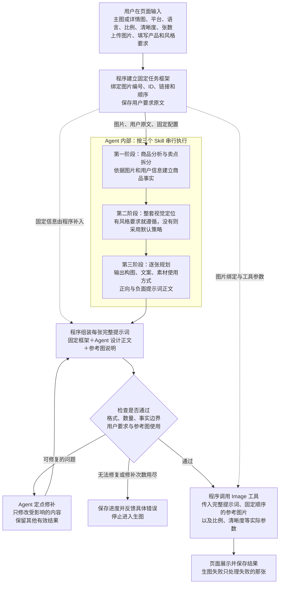

# 主图／详情页固定框架与 Agent 提示词编排方案

确认日期：2026-10-09。

状态：用户已确认架构；Agent内部固定输入、来源编号、主图／详情规则、唯一设计交付、程序组装和局部修补已本地实施。专用页面真实入口与生成调度尚未接入，未部署；不能据此认为页面已可生产使用。

具体 Skill 条款及校验调整见[三阶段 Skill 与校验修改对照方案](TECH_三阶段Skill与校验修改对照方案.md)，其中单独标注保留、修改、新增、迁移和删除项；已按用户最新20261009包实施，实际协议和验证见[固定框架v3实施记录](TECH_三阶段固定框架v3实施记录.md)。

任务工作树：`.worktrees/ecom-three-stage-agent`。

任务分支：`codex/task/20261007115552-ecom-three-stage-agent`。

## 1. 已确认的架构与范围

该 Agent 服务于专门的主图／详情图生成页面。页面提交任务，程序建立固定框架，Agent 按三个内部 Skill 串行生成设计内容，程序把内容填入框架、组装完整提示词并校验，再交给现有 Image 工具生成图片。

职责分工：**程序维护固定信息和图片绑定，Agent 生成设计内容，程序完成组装与生图调度。**

用户要求和风格文案按原文传递，不经过主 AI 摘要或改写。当前方案不把聊天主 AI 的自由策划纳入执行链；不注册三个内部 Skill 为独立平台入口，它们继续封装在 Agent 内部。

本文是该页面编排方向的最新确认记录。此前文档中“聊天主 AI 激活入口 Skill 后调用子 Agent”的入口设计，不作为本页面新流程的实施依据；既有聊天功能是否调整，另按明确授权处理。

## 2. 完整流程

图中的校验表示交付门禁；阶段一、二也应先校验并保存有效结果，再交给下游。任何阶段发生接口失败，都保留已有进度，按已有预算和执行确定性判断能否安全恢复；无法恢复时反馈错误，不继续生图。

## 3. 固定框架与设计内容的边界

| 内容 | 权威来源与处理方式 |
| --- | --- |
| 主图／详情图模式、目标平台、目标语言、比例、清晰度、生成张数 | 页面输入经程序校验后冻结；Agent 读取并遵循，程序直接用于组装和工具参数。 |
| 输入图片编号、资源 ID、来源定位、版本及顺序 | 复用平台既有图片系统；程序绑定并保存，不要求模型重新生成这些技术字段。 |
| 输入图片链接 | 程序依据绑定的资源解析可用链接；链接刷新不能改变图片身份、编号或顺序。 |
| 用户产品描述、风格和方向要求 | 原文完整传入 Agent，参与三个阶段；有要求则遵循，仅对未指定部分采用默认策略。 |
| 商品事实、卖点及可用宣传边界 | 第一阶段依据用户信息和图片分析；保留依据，不能把视觉推断升级为未经确认的材质、工艺或功能。 |
| 整套视觉主题、色彩、字体、场景和光影体系 | 第二阶段生成，第三阶段继承；程序可复用共同内容，避免模型逐张重复抄写。 |
| 每张图的展示任务、构图、文案、素材使用方式、正向和负面提示词正文 | 第三阶段按固定数量及模式生成，填入程序对应的输出位置。 |
| 完整提示词、参考图片列表、实际生图参数 | 程序组装并校验后交给既有 Image 工具；Agent 不自行提交生图。 |

“顺序固定”指上传参考图片的编号和传递顺序，不是成品画面内商品或文字的摆放位置。输入参考图编号与输出第几张图是两套不同的位置概念，不能混用；上传图片数量也不等于生成数量。

Agent 必须知道参考图编号及内容，才能正确写出“参考图 1 锁定外观、参考图 2 展示内页”等设计要求；不需要在输出中复制链接、资源 ID 或技术定位字段。素材用途已由用户指定时必须遵循，未指定时依据图片内容分析使用方式。

生图请求中的图片列表保持该任务约定的参考顺序。后续若需要逐张选择参考图子集，应另行定义映射协议，不能让模型临时改写绑定。

## 4. 三阶段的输入与交付

1. **商品分析与卖点拆分。** 接收原图、参考编号、用户原文及固定配置，建立商品事实、卖点和宣传边界。非关键规格缺失记录为限制，不因缺少可选信息阻断整个任务；确实影响商品身份或可执行性的缺口，保存问题并反馈页面补充。
2. **整套视觉定位。** 继承已通过校验的商品事实和完整用户要求，确定整套风格、色彩、字体、场景、装饰与光影规则；不能覆盖用户已指定的方向。
3. **逐张规划与正文交付。** 继承前两阶段，按页面固定的数量和主图／详情图模式，输出各张设计内容。每张内容应明确，避免把尚未决定的“方案 A 或方案 B”交给生图模型选择。

阶段一 → 阶段二 → 阶段三必须串行。三个阶段的模型调用继续走现有 ModelGateway 和供应商适配器，模型选择独立于聊天主 AI；本文不确定新的默认模型，也不新增供应商适配器。

第一、二阶段的共同结果可以由程序复用，第三阶段各张构图和文案会有所不同。减少的是固定字段复制和共同正文重复输出，不能把每张设计内容当作同一份文字直接复制。

已从20261009最新包接入独立详情规则：整页买家问题覆盖、阅读顺序、逐屏任务及全部相邻关系。默认独立逐屏生成，不能用风格一致或规划自检代替实际拼接效果验证。

## 5. 程序组装与交付门禁

组装关系：

**每张完整提示词 = 程序固定说明 + 可复用的整套视觉规则 + 本张 Agent 设计正文 + 程序参考图说明。**

**每张生图请求 = 完整提示词 + 按固定顺序解析的参考图片 + 比例／清晰度等实际工具参数。**

固定配置只有一个权威来源。程序补齐这些信息，不通过让模型重复输出再核对来建立第二份来源；设计正文与固定配置冲突时必须修复，不能只在提示词尾部补一句覆盖冲突。

校验至少覆盖：输出结构和目标张数；输出位置对应关系；用户语言、平台、比例与风格要求；参考图编号及使用方式；商品事实、未经证实的宣传承诺和前后矛盾。机械结构检查由程序完成，语义内容按需要评审，不能用一个总分代替明确的问题定位。

只有校验通过、完整提示词及绑定保存成功，才允许交给 Image 工具。比例和清晰度必须作为实际参数传入，不能仅出现在提示词中。明确的平台／工具限制冲突应反馈错误，不能默默改比例、减少张数或丢弃图片。

## 6. 失败、修补与恢复

- **格式或局部设计错误：** 返回明确的问题、相关原稿和受影响字段／图片位置；只接受限定范围的修补，保留其他有效内容。一个公共问题影响多张时一次收集受影响范围，避免逐张发现同一问题、反复调用。
- **上游事实错误：** 在事实所在阶段修复，重新检查依赖该事实的内容；保留不受影响的结果。保留阶段结果不等于忽略上下游依赖。
- **真正缺少必要信息：** 保存已完成结果和待补问题，页面补充后从受影响的位置继续。
- **供应商错误或超时：** 区分确定未执行、已完成但内容错误、执行不确定。沿用现有有界恢复规则；读取超时、部分响应或受理不确定时，不自动重复提交可能收费的调用。
- **修补次数或总预算用尽：** 保存进度、错误阶段和原因，返回失败，不重置额度来从头再跑，也不让其他 AI 自行接管策划。
- **单张生图失败：** 保留成功图片及对应方案，只恢复失败项；提交或受理状态不确定时先核对既有任务，避免重复生图和收费。

有效阶段结果、第三阶段草稿、修补记录与最终可执行方案需要明确区分。保存草稿不代表 `ready`；最终通过门禁才是可执行方案。恢复时核对输入快照、图片身份／版本、规则与模型配置，只有仍适用的结果才可复用。

## 7. 实施位置与顺序

沿用当前项目已有组件，不新建图片身份系统、模型 Gateway、供应商适配器或生图管线。

| 位置 | 本方案所需调整 |
| --- | --- |
| 主图／详情图页面及现有提交入口 | 将页面配置、用户原文和既有上传资源引用提交为同一个任务输入；展示阶段进度、结果和可恢复错误。 |
| `backend/services/agent/image/ecommerce_planner/arguments.py`、`service.py` | 冻结固定配置和输入绑定，保持串行执行，保存有效阶段与草稿，按依赖限定恢复范围。 |
| `ecommerce_planner/prompt_resources.py` 及三阶段专业资源 | 向模型说明如何使用固定输入；移除模型复制技术 ID、链接和绑定字段的输出责任；补齐详情图策划规则。 |
| `ecommerce_planner/contracts.py`、`delivery.py` | 区分 AI 设计内容与程序元数据，收集可定位的问题，由程序组装完整交付并设置执行门禁。 |
| `ecommerce_planner/recovery.py`、`workflow.py` | 对接现有预算、执行确定性、状态及恢复机制；不因页面调用而绕过原有约束。 |
| 现有 Image 工具、引用解析和生成任务管线 | 按保存方案读取完整提示词和固定顺序图片，传递实际生图参数，保留单张任务状态与成功结果。 |

实施顺序：固定任务输入与绑定 → 调整三阶段交付及程序组装 → 定点修补与进度恢复 → 补齐详情图规则并接入页面 → 整链验证。

旧方案的读取和已受理生图任务保持兼容。新旧交付需要明确版本；不能将历史模型输出直接当作新协议，不能为迁移重复提交已受理任务。回退时恢复旧调用路径，保留历史方案、图片、计费和受理事实。

## 8. 验证与完成条件

- 按 1、5、15 张验证数量、输出位置和每张完整交付；参考图数量与生成张数不同仍能正确处理。
- 多参考图从页面到三个阶段再到 Image 请求，编号、身份和顺序一致；刷新链接不改变资源绑定。
- 用户原文完整传递；指定风格得到遵循，未指定风格采用默认策略；目标语言、比例及清晰度与实际请求一致。
- 模型未输出技术 ID、链接和固定参数字段，也能由程序正确组装并交付；不存在正文与工具参数冲突。
- 商品事实无依据时不生成“烫金、耐用、可替换内芯”等确定卖点；语义错误能够定位并局部修补。
- 同一公共错误影响多张时集中修补，单张错误不改其他图片；上游变更只重新检查受影响内容。
- 阶段超时、供应商错误、取消或预算耗尽时准确反馈并保存进度，未通过方案不能进入生图。
- 单张生图失败不重做整个方案；成功图片保留，不确定受理状态不会重复提交。
- 主图与详情图分别验证对应策划规则和页面到结果的整链；不以一份主图样例代替详情图验收。

本次完成项仅为保存用户确认的架构和方案。后续速度优化应记录各阶段耗时、输出量、修补次数及总时长；目前不承诺固定的生成时间或单一模型稳定性。
