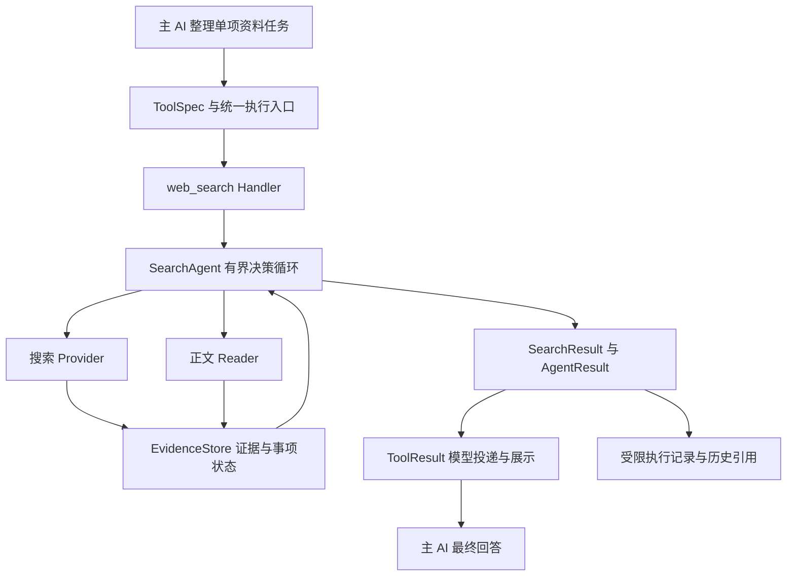

# 搜索工具开发与质量验证方案

日期：2026年10月1日，2026年10月2日补充生产权限诊断。状态：P1 首版已部署；真实模型调用通过，联网搜索被未开通的独立搜索服务拒绝；与旧版对照和内容质量指标尚未实测。

本方案覆盖 EVERYDAYAIONE 的公开网页搜索工具：怎样确定质量目标、验证当前差距、设计内部机制、逐步实施并验收。推荐保留一个对外的 `web_search` 工具，内部建立受限的搜索决策、证据处理和结果传输流程，底层通过可替换的搜索 API 获取资料。

采用成熟团队的工程和评测方法，可以建立可靠的产品基础；不能仅凭架构或测试数量承诺达到豆包在所有场景中的效果。对标结论必须说明问题范围、测试时间、模型与搜索版本、质量、耗时和费用。

## 实施记录

用户已授权在 `codex/task/20261001171800-search-tool-design` 开发。当前实现保持唯一公开工具 `web_search`，接入方舟 Responses API 的豆包搜索来源；服务端 `.env` 设置 `WEB_SEARCH_PROVIDER=auto`、`WEB_SEARCH_ARK_API_KEY=<方舟 API Key>`、`WEB_SEARCH_ARK_MODEL=doubao-seed-2-1-pro-260628` 后会选豆包 provider，`WEB_SEARCH_ARK_BASE_URL` 默认指向方舟北京 Responses API。这里需要方舟 API Key 并开通对应搜索能力，不是豆包搜索专用 MCP Key。没有搜索 key 时继续走已有 Gemini/千问路径。豆包 provider 单次请求内由方舟负责改写与联网搜索，代码读取回答中的 URL 引用标注、搜索词与用量；引用可映射到回答片段时标 `success`，有回答但缺少可验证映射时标 `partial`，确认执行搜索但没有资料时标 `empty`，凭证、限流或网络故障标 `error`/`timeout`。豆包请求失败不会自动启动第二个收费 provider。

首版复用 `AgentResult` 和现有 `ToolResult` 两种模型投影；来源、摘录与回答一起进入主模型可见文本，provider 响应、问题、来源条数与摘录均有界，结果不缓存。父任务预算用于限制排队和请求等待时间，单个服务进程内最多并行 3 个搜索请求，provider 回传的联网搜索次数写入元数据。跨进程总额度依赖服务端账号限额；豆包 API 内部查询轮数不能由本地硬限制。首版工程验证使用固定响应；后续生产真实诊断见下节，内容评测、最终回答偏好与完整来源冲突处理仍待后续阶段。

### 2026-10-02：模型已开通但联网搜索被拒绝

使用生产当前密钥和同一 `doubao-seed-2-1-pro-260628` 模型只做普通 Responses 请求返回 200，
加入 `tools=[{"type":"web_search","sources":["doubao"]}]` 后返回 403、错误码 `AccessDenied`，
官方响应明确要求核对 web search activation。已登录控制台的“开通管理 → 应用组件库 → 豆包搜索”
也显示“豆包搜索 Custom 版”未开通。生产后端进程加载的搜索密钥与环境文件一致；未发现空格或重复 Bearer 前缀。

当前根因是独立搜索服务尚未开通，不能因模型服务已开通就视为搜索可用；401/403 统一成“凭证无效”又误导排查。
提示修复分别报告 401 鉴权失败和 403 搜索开通/账号权限问题，并附 HTTP 状态与受限字符的官方错误码；
不回传官方原始错误正文，不盲目重试或自动启用第二个收费 provider。
开通框要求接受豆包搜索专用条款和服务等级协议，已提交用户当次确认；开通及实际搜索复验仍待完成。
4 个新增回归在旧实现上均失败；修改后 provider、工具执行入口和结果投影共 118 项通过。
官方[产品计费](https://docs.volcengine.com/docs/87772/2272951)和[工具调用说明](https://docs.volcengine.com/docs/ark/responses-api-tool-calling?lang=zh)
分别说明 Custom 搜索按量费用与其作为 Responses 内置工具的用法。诊断未输出或修改密钥、数据库、Skill 和其他生产配置。

## 1 目标与能力范围

第一版优先完成中文公开资料的事实查询、产品与服务比较、官方规则和技术资料查找，以及需要多轮补充证据的小型调研。用户明确的对象、版本、地区、日期和限制必须保留。

工具负责完成一项连贯的资料任务。主 AI 继续负责与用户沟通、跨工具编排和最终交付。例如“查竞品规则，再结合库存分析”由主 AI 协调搜索与 ERP；搜索内部可以分别查价格、规格和售后，因为这些共同服务同一项比较任务。

第一版不建设全网爬虫和索引，不训练专用模型，不纳入需要登录的社交平台采集，也不默认提供精确行情或实时天气数据源的保证。遇到这些任务时保留现有职责边界，并明确公开网页资料的局限。

### 1.1 可验证的行为要求

| 编号 | 要求 | 完成证据 |
|---|---|---|
| R1 | 主 AI 正确传递任务和上下文，型号、时间、地区不被改写丢失 | 路由与参数测试，多轮问题评测 |
| R2 | 查找与任务相关的资料，按信息缺口继续查询 | 任务事项与证据对应记录，完整性评分 |
| R3 | 关键结论对应实际取得的原文片段和链接 | 证据存在检查、引用支持率、人工复核 |
| R4 | 区分过期资料、转载、冲突、仅摘要和未读取正文 | 时间、去重、冲突与正文失败样例 |
| R5 | 资料不足时返回部分结果或明确缺口 | 有界搜索测试，缺口在最终回答中保留 |
| R6 | 调用、并发、等待、模型输出和取消受程序约束 | 预算竞争、故障注入、取消测试及用量记录 |
| R7 | 证据经过模型投递、持久化、历史恢复和展示后仍可追溯 | 完整调用链与新旧载荷恢复测试 |
| R8 | 请求及缓存按组织和会话隔离，网页内容不获得执行权限 | 隔离、网址访问、提示注入测试 |
| R9 | 修改后可测量质量变化，问题可以定位到具体阶段 | 固定回归集、执行记录和版本报告 |

## 2 当前项目事实与设计依据

本次隔离工作树来自最新 `origin/main`，基座提交为 `260ed1bffb92896653542e41ffe4701ecc755c6e`。以下结论来自该提交的代码阅读，未通过生产运行验证。

| 位置 | 代码事实 | 对方案的影响 |
|---|---|---|
| `backend/services/tools/definitions/general.py` | `web_search` 的 schema 与 ToolSpec 在此定义；输入为 query；声明并行、缓存和多执行模式 | 在此更新唯一工具定义，不能另建注册表 |
| `backend/config/common_tools.py` | 工厂从 Spec catalog 投影工具 schema | 保留兼容入口，不在这里重复维护定义 |
| `backend/services/agent/tool_executor.py` | `_web_search` 调用搜索服务，来源放在 AgentResult.metadata | 已改为调用内部 `web_search` service，并把完整来源投影进摘要 |
| `backend/services/agent/web_search/` | 搜索响应合同、方舟豆包 provider、provider 选择和有界展示 | 首版新增；豆包内部改写/补搜由 Responses API 托管 |
| `backend/services/agent/web_search_engine.py` | Gemini Google Search Grounding，失败降级千问；失败与无结果混为 None | 作为无豆包凭证时的兼容路径；None 现在报告 provider 错误，不再报告 empty |
| `backend/services/agent/agent_result.py` | chat 输出不自动展示 metadata；TEXT 的 tool_loop 输出主要为 summary | 证据必须进入明确的模型投影，不能只保存在 metadata |
| `backend/services/tools/result.py` | ToolResult 统一事实、状态、审计与 chat/tool_loop 输出；支持模型投影覆盖 | 复用此结果外壳，避免独立展示、计费和审计流程 |
| `backend/services/tools/result_payload.py` | v1 持久化有类型、大小和深度限制，并保留旧格式外壳 | 搜索结果必须有界并兼容当前读写版本，不能全量正文塞进 metadata |
| `backend/services/agent/execution_budget.py` | 已有轮次与时间预算，支持子预算 | 已使用父剩余墙钟时间限制请求；豆包内部搜索计数通过 usage 回传，本地暂不控制 API 内部的查询轮数 |
| `backend/services/prompt_builder/templates/tool_strategy.md` | 主 AI 编排和数字来源约束在当前模板中维护 | 有针对性补充搜索结果使用规则，不修改已废弃的旧提示词常量 |
| `frontend/src/components/chat/message/MarkdownRenderer.tsx` | 已支持 Markdown 链接与 Mermaid | 第一版使用普通来源链接，暂不新增引用卡片协议 |
| `backend/tests/test_tool_executor.py` | 有搜索入口状态与 metadata 来源测试 | 继续复用，新增证据实际进入模型及最终答案的验证 |

旧文档中关于工具系统的描述与最新 ToolSpec/ToolResult 可能不一致。实施以当前代码为准，每批修改只更新受影响的文档。

### 2.1 尚未验证的事项

尚无新工具内容质量数据、当前工具完整基线、豆包同题对比、真实调用量和目标并发数据。
账号的模型调用、凭证与独立搜索开通状态已经上述生产诊断核实，开通后仍需实际搜索和用量复验。
前几轮提出的准确率与工期均不能视为验证结果。

外部依据限于公开实践：Anthropic 建议先做原型和真实任务评测，再反复改进工具；Research 团队从小规模代表性问题开始，人工检查自动评价遗漏；Google 搜索结合人工评价、并排比较与真实流量实验。这里借鉴开发方法，不复制它们全部架构，也不声称知道豆包内部流程。来源见第 11 节。

## 3 开发前建立问题集与当前基线

### 3.1 起步问题集

附录 [搜索工具评测场景](./TEST_搜索工具评测场景.md) 给出 24 个内容与编排场景，以及 16 个工程故障场景。它们是本次拟定的种子场景，不是已收集的用户日志，也不是已跑通的测试。先用项目真实问题替换或补充，再冻结评价规则。

每个内容场景记录：用户输入、必要上文、固定请求时间、必须查清的事项、允许的来源类型、关键错误、是否可答、评分规则和参考证据。时效问题在运行当日建立参考材料，不硬编码今天的答案长期复用。

预计起步用 20 至 30 个问题定位大问题；首轮上线前扩充到 80 至 120 个适合目标场景的问题，其中至少 20 个保留为未参与调优的测试集。数字为建议工作规模，不是统计显著性保证。每道内容题至少运行 3 次，并记录每次结果；问题内的多次运行不能当作独立新用户样本。

### 3.2 两种评测环境

固定资料回放用于隔离算法差异：保留搜索结果、正文、日期、失败响应及其来源，比较查询策略、证据处理、返回和生成。真实联网评测用于检查当时的内容覆盖、资料变化、限流和耗时。两类结果分开报告，避免把网页变化误判为代码回归。

测试集与调优集分别存放；看过并据此修复的保留题转入回归集，另补保留题。新增失败样例在去除业务敏感信息后进入回归集。

### 3.3 对照组与评分

先测现有 Gemini/千问路径；再分别测成熟搜索 API 的直接检索版本与完整新流程。供应商比较尽可能固定主模型、问题与时间窗口；与豆包 App 比较属于端到端产品比较，不能把差异都归因于搜索 API。

| 指标 | 定义与注意事项 |
|---|---|
| 事实准确性 | 按问题评分规则检查关键事实，不用“写得像报告”替代事实核验 |
| 完整性 | 用户明确要求的可回答事项中，得到有效处理的比例；正确报告不可查清事项单独记录 |
| 引用支持率 | 有效引用真正支持的关键事实条数 / 被检查的关键事实条数；无引用也计入缺失 |
| 问题完成率 | 满足该题所有必需条件的试验比例；事实错误和假装完成为失败 |
| 比较偏好 | 隐藏新旧标识后人工并排比较，分别记录胜、平、负及原因 |
| 稳定性 | 同题多次运行的成功分布，以及哪类问题波动较大 |
| 效率 | 首个真实进度、资料任务总耗时、最终答案总耗时、搜索次数、读取次数、模型用量；报告中位数与高分位 |
| 成本 | 按供应商实际调用与模型用量计费估算；列出免费额度影响，不把免费试验解释为生产成本为零 |

确定性代码检查证据 ID、链接、限制和协议；模型评分辅助判断事实支持与完整性；人工校准评分规则并复核冲突、高影响和模型分歧样例。开发者自评不单独作为质量改善证明。

### 3.4 建议验收目标

以下是待基线校准的建议目标，不是行业统一标准，也不表示已达标：目标场景问题完成率至少 90%，关键事实引用支持率至少 95%；新旧并排比较中，在非平局样例上新版本偏好率至少 60%。同时公开各类别结果、样本数和波动，不能只用总分放行明显退步的类别。

工程固定场景应全部通过，已发现的证据丢失、越权访问、越过硬预算、取消后继续安排调用和凭空完成等阻断问题应为零。这个“零”只描述已测场景，不保证现实世界永不发生。

响应时间和月费用目标在基线后确定。先测再选择运行配置；达不到目标时回到具体瓶颈，不能通过删减必要证据或假装完整换取成绩。

## 4 架构与职责



### 4.1 主 AI 与工具边界

主 AI 传递用户目标、已明确的条件和必要背景；搜索工具决定查询、来源、正文读取和局部补搜。主 AI 保留跨 ERP、文件、图表和网页的总任务编排职责。任务缺少必要对象时返回可理解的缺口，由主 AI 向用户澄清，搜索内部不另开用户对话。

工具对外继续叫 `web_search`，不把内部搜索、阅读、校验分别暴露为多个顶层工具。内部使用一个搜索决策模型和确定性模块，不为每个模块再建立独立 Agent。

### 4.2 搜索控制方式

完整目标是搜索专用的有界状态循环：准备任务 → 获取或读取资料 → 更新证据与缺口 → 收尾。首版让方舟 Responses API 的豆包搜索管理 provider 内部改写与查询，并通过 `usage.tool_usage.web_search` 回传搜索用量；本地只发一次 Responses 请求。应用复用父执行预算、公共执行与审计，不修改通用 ERP 工具循环。该 API 没有提供应用方控制豆包内部查询轮数的入口，因此首版不能声称对单次请求内搜索次数作了硬限制。

决策模型只能提出三类动作：搜索、读取已发现资料、结束。程序验证动作和预算再执行；模型不能调用 ERP、代码、文件写入、任意网站登录或变更运行限制。正文读取通过内部证据 ID 定位链接，不能让模型直接指定服务器任意网络目标。

这不是固定“搜三次再总结”：下一动作依据任务事项和当前证据决定。简单问题可以一次搜索完成；复杂问题在预算内继续。实际状态修改、去重、计数、访问限制和取消由代码负责。

### 4.3 模块与文件职责

| 建议位置 | 职责 |
|---|---|
| `backend/services/agent/search/contracts.py` | 任务、动作、证据、结论和结果类型；校验外部与模型输出 |
| `backend/services/agent/search/agent.py` | 搜索状态循环与动作调度，管理事项覆盖 |
| `backend/services/agent/search/providers/` | 搜索供应商接口及结果、错误的规范化；主要供应商实测后确定 |
| `backend/services/agent/search/reader.py` | 有界公开网页读取，提取相关正文，区分失败原因 |
| `backend/services/agent/search/evidence.py` | 证据 ID、片段、日期、去重、来源关系和覆盖记录 |
| `backend/services/agent/search/policy.py` | 调用次数、并发、时间、重试、缓存与停止条件 |
| `backend/services/agent/search/presentation.py` | 从已校验结果生成有界模型证据包及来源链接 |
| `backend/services/agent/search/trace.py` | 结构化事件、用量和版本记录，敏感信息最小化 |
| `backend/tests/` 与专用评测目录 | 协议、工程故障、回放与真实任务评测 |

文件按职责形成，在内容很少时允许合并，不为数量拆分。沿用已有 httpx 和模型适配器。正文解析依赖是否缺失，在原型阶段确认；若需新增依赖，实施方案另列用途、精确版本与维护依据，不在设计中猜版本。

## 5 输入输出与证据契约

### 5.1 输入与兼容

目标接口可以使用 `task` 和可选 `conversation_context`；当前代码继续保留已经发布的 `query` 字段，主 AI 应把完整问题和必要条件传入 query。当前版本不传整段聊天或 ERP 数据；缺失、非字符串、空白或超过4000字符的 query 会返回参数错误。

```json
{
  "task": "比较三款指定产品当前价格、规格和保修条件",
  "conversation_context": "中国大陆购买，预算2000元，三款型号已由用户明确"
}
```

请求时间、时区、org_id、会话与调用身份、模型路由、凭证和预算由运行环境注入。用户背景只提取公开检索必要内容，不发送整段聊天、客户身份或 ERP 经营数字。

### 5.2 目标事实类型与首版结果

| 类型 | 必要内容 |
|---|---|
| SearchTask | 原始任务、明确约束、可回答事项、当前请求时间 |
| SearchAction | 动作类型、对应事项、查询或证据 ID；不含可修改权限和预算 |
| Evidence | 唯一 ID、链接、标题、原文片段、来源、获取时间、可选发布时间、正文状态、内容指纹 |
| Claim | 结论文本、对应事项、证据 ID、支持或冲突状态；推断另行标记 |
| SearchResult | 已查清事项、结论、精简证据、缺口、冲突、终态、停止原因、用量与版本 |

资料中未提供发布时间时保留 unknown；获取时间不能冒充发布时间。事件发生时间、文章时间和规则生效时间分别记录有依据的内容。全文未取得时标记 snippet_only，不能给出“已经阅读全文”的结论。

供应商结果统一成事实类型。若某服务只有模型总结而无原文片段，标记为摘要线索，不能升级成经过原文核对的证据。排序分数只在同一服务和查询中解释，不直接跨供应商比较大小。

### 5.3 模型输出与持久化

对外 handler 返回 AgentResult，由现有 ToolResult 包装。首版 metadata 保存 provider、实际搜索 query 与次数、用量、来源 URL/标题/网页摘要、可用时的引用文字区间、结果限制原因；presentation 将 provider 回答、匹配的〔S1〕引用、来源及摘要一起放进 summary。引用位置由接口标注映射，不等同于本地语义蕴含验证。SearchTask/Evidence/Claim 状态仓库、逐项完成缺口及全文读取仍未实现，属于 P2。

首版选择 summary 本身包含引用和关键来源，使当前 chat 与 tool_loop 都能读取同一份内容，避免只把来源放在模型看不到的 metadata。结果继续走现有 ToolResult 与载荷写入路径；专门的历史恢复回归和 v1 新旧载荷往返尚待验证，不能据此宣称完整历史可追溯。

首版限制回答最多8000字符、最多8个来源及摘要长度，最终模型文本最多24000字符；provider 响应在抽取时截短。本地没有完整正文证据仓库，因此来源摘要只是线索，不表示已读取全文。增加来源数之前应复测边界并确保引用不会被截断。

不得把 JSON 文本伪装成现有 FileRef 指向的 Parquet。需要全文导出时单独走已支持的产物通道，并验证类型与读取方法。

验证 ToolResult v1、旧载荷外壳、模型投影和历史消息的恢复；不能擅自把全局写入版本切到 v1。SearchResult 不携带 DB、HTTP 客户端、锁、令牌或执行权限对象。

### 5.4 状态与主 AI 使用方式

| 状态 | 含义 | 主 AI 应如何处理 |
|---|---|---|
| success | 任务必需事项在指定范围内有足够证据 | 用证据回答，不添加未支持的关键事实 |
| partial | 已取得有效结果，但存在缺口、冲突或局部服务失败 | 保留已查清结论和缺口，必要时重新组织后续任务 |
| empty | 搜索成功执行，但没有符合条件的有效资料 | 报告未找到；不推断对象或事实不存在 |
| error | 无可交付结果，参数、凭证、额度或服务错误 | 返回明确原因和是否可恢复 |
| timeout | 未形成可交付结果即超时 | 说明超时；有可交付资料时改为 partial 并记录超时原因 |

用户取消沿用现有取消异常传播，不发明成功或普通错误来吞掉取消。公共框架的“执行成功”与搜索任务“全部查清”不同；partial 即使不是 is_failure，也必须在模型可见内容和显示中保留。

主 AI 回答使用工具实际返回的链接；证据 ID 与链接由程序映射。首版使用普通 URL 与〔S1〕编号，无需引用卡片；API 给出文字区间时将编号放在对应文字后，并同时附来源及摘要。无映射时会返回 partial 提示，避免把来源列表误当作逐句证据验证。

## 6 搜索决策与证据处理细节

### 6.1 查询与读取

模型先提取明确条件和必须查清的事项，不扩张用户任务。查询改写保留型号、版本、时间和地区；对比任务可以并行查各个对象。原始输入始终保留，便于检查意图漂移。

优先使用 API 已提供的相关片段或正文。关键细节缺失、片段过短、结果冲突或需要核对条款时再读全文，避免每条资料都重复下载。

排序优先看是否直接回答当前事项，再看新旧、直接出处、内容质量与来源多样性。规格和正式规则优先官方原文；体验和争议允许论坛与个人文章，标记其性质。不可把统一的“只取官方”应用到全部任务。

### 6.2 去重与冲突

URL 规范化保留有语义的查询参数，去除明确的追踪参数；重定向地址受同样访问校验。相同内容按指纹识别，近似转载保留原始出处线索；同一篇文章的多次转载不能计为多个独立支持来源。

结论不强制要求两份来源：直接明确的官方规格可以单源支持；来源冲突或关键资料只有转述时需进一步核对。处理冲突先确认对象、地区、版本和时间是否一致，再找直接出处；无法解决则返回冲突，不做简单多数投票。

### 6.3 停止条件

程序在动作开始前检查硬预算、取消状态和动作有效性。终止条件包括必需事项已覆盖、连续获取结果没有补充有效证据、没有可执行的下一动作或达到限制。模型可以建议结束，但不能宣称从未获得支持的事项已解决。

“证据足够”检查组合两种方法：程序校验证据存在、引用映射和条件保留；模型判断语义相关性与支持程度。模型判断会有误差，需评测与人工校准，不能把自报置信度当作准确概率。

### 6.4 最终回答也要验收

搜索内部合成的结论必须指向证据。主 AI 最终回答再次检查是否增加了新数字、把条件性说法改成绝对说法、漏掉冲突或引用错配。

第一版在回归评测和试用审查中核验最终回答，提示词明确保留证据边界，链接使用代码映射。根据基线决定是否对高影响回答增加在线语义核验。在线核验会增加延迟与成本，在证明有必要前不默认给所有回答追加一个评审模型。链接有效性检查不能替代语义核验。

## 7 运行预算与失败恢复

以下为完整方案的建议上限，待基线调整；由后台配置，模型不能修改。目标普通资料任务最多搜索6次、读取正文4次、搜索决策4轮、单任务并行外部请求3个、整体60秒。首版本地只发出一次 Responses API 请求，最多2500个回答 token、provider结果至多8来源；单进程通过共享信号量最多并发3个请求，并把等待和API耗时合并限制在父剩余时间与45秒以内。豆包内部搜索请求次数由API管理并在usage中回报，本地不能硬设其上限。当前没有独立搜索决策轮、正文读取或跨进程总额账本。

父任务剩余时间更短时服从父限制。完整版本的子任务可独立计搜索数，但不能重置父截止时间；每次付费尝试应预留额度并记录。首版不自动重试豆包请求，也不在豆包失败时自动启动第二个付费 provider；由响应 usage 记录实际搜索次数和模型 token，不能把请求数或免费额度当作精确费用上限。原有 Gemini/千问兼容路径保留其历史 provider 降级行为。

| 情况 | 处理方式 |
|---|---|
| 豆包 API 返回401/403或凭证错误 | 不自动重试或切到第二个付费 provider；隐藏凭证，报告配置/开通问题 |
| 豆包 API 返回429、额度耗尽或临时网络故障 | 不自动重试，报告可恢复错误；后续重试必须由新的显式工具调用触发 |
| 超时或不完整响应 | 没有可用资料时标timeout/error；API已返回部分结论时保留为partial |
| 成功搜索但无资料 | 只有API返回已完成的搜索调用且无答案/引用时才标empty；失败调用不能冒充无结果 |
| provider只提供回答与页面摘要 | 结果最多标注为接口引用映射；首版不声称本地读取全文或完成引用蕴含核验 |
| 用户取消 | 取消并等待并行任务收口；停止新调度；不承诺已发给服务商的请求不计费 |
| 持久化超过边界 | 在写入前精简证据包；协议错误单独报告，不重新付费执行整个搜索来修复 |

公共 ToolSpec 当前为 `parallelizable=True`、`cacheable=False`：允许独立问题并行，但每个服务进程最多三个并发搜索请求；暂不缓存搜索结论。内部缓存底层检索与正文属于后续方案，尚未实现。

工具 read 策略继续沿用现有权限和执行模式；审计明确外网请求、可能的服务费用与资料暂存，不以 effects=none 描述全部行为。具体 effects 标签遵循当前工具协议允许的约定并通过策略回归，不能为了接入更改其他工具权限。定时任务沿用同一查询服务并传入新的请求时间，不使用上次运行时间。

阅读模块校验每次重定向及解析后的网络地址，禁止内网、回环和云元数据地址，限制协议、大小、类型和超时；实施中优先受控网络出口，必要时绑定验证后的地址，防止校验与访问之间出现 DNS 变化。未知或需要登录的页面返回不支持，不自动获取 Cookie。

上下文和缓存默认按请求或组织隔离；外网查询不得包含凭证、客户个人信息或无关 ERP 数字。网页只作为不可信资料，不能改变系统提示、工具权限或诱导上传文件。查询和正文日志使用最小必要字段，记录 URL、内容指纹和选中片段；业务敏感原文不默认进入通用日志。

## 8 实施阶段与阶段证据

阶段按依赖推进，不要求用户逐批批准普通实施细节；用户已授权实现当前版本。是否开通服务、增加账号预算、跨进程计费闸门或扩大产品范围仍依据证据和用户账号条件处理。

| 阶段 | 实际工作 | 必须交付的证据 | 当前状态 |
|---|---|---|---|
| P0 基线与契约 | 冻结第一批问题，测现有路径，定义错误、证据和旧参数兼容 | 基线报告、代表性执行记录、协议样例 | 已完成方案与固定场景种子；真实基线未测 |
| P1 完整原型 | 接一个候选 API，保存证据，返回完整引用，打通主 AI 与历史展示 | 同题结果、模型实际输入、协议与来源传输测试 | 首版代码已接好并通过固定响应测试；豆包真实 API 尚未验通 |
| P2 搜索决策 | 加事项覆盖、相关正文读取、缺口补搜、冲突与去重 | 固定资料对照、完整性与引用报告 | 待实施；首版把查询计划托管给方舟 API |
| P3 可靠性 | 预算、并发、取消、缓存、失败恢复与版本审计 | 工程故障矩阵、用量与时间报告 | 首版已具备父超时、单进程并发上限3、结果限长、不缓存和明确错误；跨进程总额度、费用配额和恢复矩阵待补 |
| P4 质量与试用 | 扩充保留问题，重复试验、人工复核，少量用户试用 | 分类别质量报告、保留集结果、反馈和回退演练 | 待执行真实联网对照与人工评分 |
| P5 持续改进 | 真实失败进入回归；定期复测内容漂移和供应商差异 | 版本比较与问题关闭证据 | 持续维护阶段 |

所有实现先在本任务工作树进行，不覆盖主工作区。提交部署和验收关闭沿用受控脚本，不因阶段完成自动发布或合并。

### 8.1 工作量与依赖

在已有公共工具和模型适配器可复用、公开网页为范围的前提下，一名熟悉项目的开发者借助 AI，P0 至 P1 初估 3 至 5 个工作日，完成 P2 累计 8 至 15 个工作日，完成 P3 至 P4 累计 20 至 30 个工作日。估算包含定向测试与评测，不保证实际日历工期或豆包同等质量。

这是基于最新工具架构和完整验收范围修订的估算。凭证、原始片段与正文质量、模型结构化动作支持、网络环境和真实问题质量都影响工期。P0 后应据实重估；P5 是持续维护。真实评测会消耗现有模型与搜索服务费用，需要根据选定模型和试验数量预算。

## 9 需求到实施和测试的对应

| 要求 | 主要实现位置 | 验证场景 |
|---|---|---|
| R1 任务保真 | general ToolSpec、输入 contracts、现有参数校验、主 AI 模板 | Q03、Q09、Q10、Q17、Q18、E01 |
| R2 有效补搜 | search agent、事项覆盖、provider | Q04、Q06、Q13、Q21 |
| R3 证据与引用 | evidence、presentation、主 AI 结果使用 | Q01、Q04、Q11、Q24、E07、E14 |
| R4 日期转载冲突 | evidence、reader、policy | Q05、Q07、Q08、Q11、Q12、Q23 |
| R5 如实部分完成 | agent、contracts、presentation | Q12、Q13、Q14、Q15、E02 至 E06 |
| R6 运行约束 | policy、父预算、取消传播 | E02 至 E06、E08、E09、E15 |
| R7 结果完整传输 | AgentResult、ToolResult 投影、result_payload、模型投递、Markdown | E07、E10、E11、E16；恢复后的 Q17 |
| R8 隔离和访问边界 | reader、缓存与 trace、现有请求上下文 | Q20、Q22、E12、E13 |
| R9 可评测可诊断 | trace、固定回放、问题集与评价脚本 | 全部场景及版本比较报告 |

需修改的现有位置还包括 `_web_search`、当前 ToolSpec schema 和缓存声明、配置中的服务选择与开关，以及搜索相关测试。公共结果层只修改确有必要的搜索兼容点，其他工具结果必须保留回归验证。

## 10 上线试用与回退

首版用 `WEB_SEARCH_PROVIDER=auto|doubao|legacy` 选择 provider；`auto` 只在配置方舟 key 时切换到豆包。豆包请求错误不会自动进入 legacy，避免重复收费并保留真实故障状态。切换 provider 不新增数据库迁移或前端字段；精简证据随既有消息和结果载荷保存。上线前仍需验证旧消息恢复及小范围试用，当前未发布。

先人工试用与评测，再在得到发布授权后生产小范围验证。流量少时用邀请用户和人工对照，不把小样本满意反馈当成统计显著改善。额外影子调用会增加费用，不能默认对每个用户问题双倍联网。

回退时停止新任务进入 v2；已有执行正常取消或收口。历史消息里的普通链接仍能展示，既有证据包保留；不删除证据、不回滚用户数据，不通过关闭开关重新执行已完成工具。回退演练至少包含旧调用、新历史、取消中任务与其他工具不受影响。

每个版本记录提交、provider、模型、提示词、协议与评分规则版本。失败记录包含查询目的、结果数量、选择证据、状态变化、停止原因、费用及耗时；可以定位到检索、阅读、证据、传输或最终回答。

## 11 公开依据与需要后续确定的事项

以下资料支持本方案中的开发与验证方法，不证明豆包使用了本架构。

1. [Anthropic 工具开发实践](https://www.anthropic.com/engineering/writing-tools-for-agents)：原型、真实任务评测、工具描述与结果优化，发布于2025年9月11日。
2. [Anthropic Research 开发实践](https://www.anthropic.com/engineering/multi-agent-research-system)：早期小规模评测、过程观察与人工检查，发布于2025年6月13日。
3. [Anthropic Agent 评测实践](https://www.anthropic.com/engineering/demystifying-evals-for-ai-agents)：多次运行、最终结果与执行过程、模型评分的人工校准，发布于2026年1月9日。
4. [Google 搜索验证流程](https://www.google.com/search/howsearchworks/how-search-works/rigorous-testing/)：人工评价、并排比较与真实流量实验。
5. [豆包搜索能力说明](https://docs.volcengine.com/docs/ark/agent-plan-enterprise-search?lang=zh)：独立搜索服务提供结构化网页字段、query 改写、来源与时间过滤；使用该服务需要开通产品与专属凭证。
6. [方舟 Responses API 联网搜索指南](https://docs.volcengine.com/docs/ark/online-content-plugin-guide?lang=zh)与[响应字段说明](https://docs.volcengine.com/docs/ark/list-model-responses-api?lang=en)：首版使用 `tools: [{"type":"web_search","sources":["doubao"]}]`，提取回答、`url_citation`、实际搜索 query 与搜索用量。
7. [官方搜索计费说明](https://docs.volcengine.com/docs/87772/2272951)：截至2026年10月1日，豆包搜索主账号每月共享500次免费搜索额度；额度耗尽后搜索按量计费，Responses 所用模型的 token 费用另计。上线前需在账号控制台核对实际套餐和限额。

仍需验证或决定：豆包凭证是否开通及真实调用格式；这批问题是否代表用户用途；豆包与现有路径的质量、延迟及真实费用；是否需要独立页面读取；总支出与并发限额；基线校准后的质量目标。首版使用可选 provider 配置，无凭证时兼容旧路径，不会因开发测试消耗外部额度。

## 12 审阅时需要关注的内容

本方案推荐的产品边界是“公开网页搜索工具”，内部自主完成一项资料任务，对外保持现有工具名和主 AI 编排方式。审阅重点是：优先使用场景是否符合软件用途、开发和质量验证是否都在交付范围内、上线前需要哪些证据。

当前交付包括本地代码首版、固定响应测试与方案文档；尚无真实联网准确率或与豆包 App 的端到端对照。后续报告应沿阶段说明实际完成内容、验证结果、失败样例与遗留事项，不用“大厂水准”替代具体质量结论。
