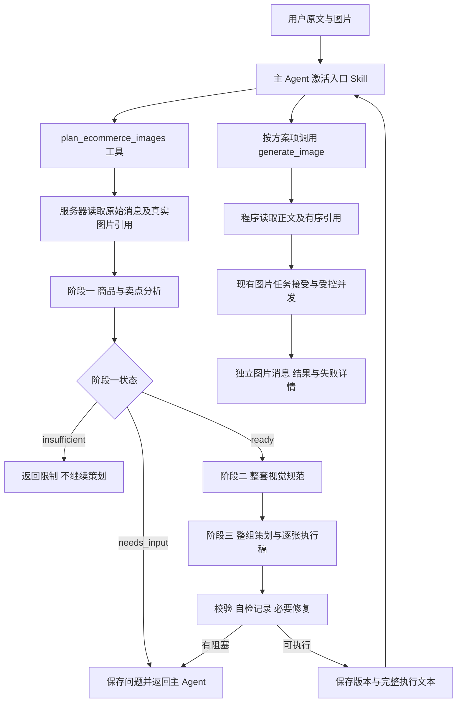

# 电商图片子 Agent 三阶段策划与原文生图接入方案

日期：2026-10-07。状态：三阶段策划基线已部署启用；本次补齐平台入口 Skill 的全局发布。

任务工作树：`.worktrees/ecom-three-stage-agent`；分支：`codex/task/20261007115552-ecom-three-stage-agent`；调查基座：`da103865e813d8be565f4ff28105e3d27d9044b1`。

本文记录本次对话确认的架构、当前实现和交付边界。策划基线 `3ea2581b3cec362385e3513a54a4c6b130279ee0` 已通过受控入口部署；真实 KIE 主图输出质量尚待用户生产验收。

## 0.1 当前实现状态

实现代码已加入本任务工作树：三阶段工具与持久化、方案读取接口、主图方案卡片、只读方案项到现有 `generate_image` 管线的桥接，以及随版本校验的原始提示词和Schema均已落地。GPT 5.6 Luna 通过现有 `KieChatAdapter`、KIE 客户端和 ModelGateway 接入 Responses 协议；没有建立第二套 KIE 凭证、客户端或工厂。

279 迁移已应用，生产主图策划开关已按用户授权向所有用户开启。确认费率为输入 11.2、输出 67.2 积分/百万 token；当前 KIE 没有缓存 usage 分项时全部输入按 11.2 结算。模型为 `gpt-5-6-luna`，复用 KIE 适配。该配置是平台用户收费规则，供应商额度和上限仍以实际账户为准。

只发布一个平台入口 Skill：`examples/skills/catalog/platform/ecommerce-main-images/v1/SKILL.md`。三份原始提示词是子 Agent 内部的版本化代码资源，不注册到 Skill 目录，也不要求主 AI 分别激活。入口 Skill 自动选择后调用 `plan_ecommerce_images`；执行稿由程序按 `plan_source` 交给 `generate_image`。

既有平台 Skill 仅支持组织 assignment，不能覆盖无组织个人账号。280 迁移增加显式平台全局 assignment（`org_id=NULL`），只允许平台包；默认不自动启用任何已有 Skill。可信平台管理员或带审计 request_id 的服务器发布者可写全局分配，普通组织管理员不能写。目录、正文读取和会话绑定沿用同一有效分配；明确的组织分配优先，包括组织停用。功能开关、用户身份、工具权限、固定版本及哈希检查仍生效。

生产发布入口为 `deploy/publish-ecommerce-skill.py`，使用既有应用数据库角色、SkillStorage、SkillCatalog/SkillRepository，禁止数据库超级用户及 RLS 绕过。只读预检默认执行；写入要求持有受控发布锁并已使旧候选失效。源文件哈希固定，已存在版本只允许一致重试。写入通过服务命名空间外已有 NAS 发布者路径完成，应用受控根保持只读。发布后对所有活跃用户实际组织及个人上下文核验发现和正文哈希，不发送聊天或消耗模型额度。最终受控部署成功后再建立可验收候选。

回退时禁用这个平台全局 assignment，保留不可变版本和方案记录；组织显式停用仍可独立生效。不要删除原始提示词、Skill 版本或已存方案。280 是保留数据的扩展，不通过删除全局记录做破坏性回滚。生产开关和目录可用性验证不替代真实模型质量与用户端整链验收。

补齐验证：Skill 目录、控制面、RLS、个人/组织发现、正文激活、会话绑定、重试及旧快照兼容的定向测试通过；实际入口文件通过发布模板与渲染预算检查。完整发布回归为 11,431 通过、113 跳过、4 预期失败。首轮补齐发布停在 280 的对象所有者不匹配，迁移事务回滚，未产生全局入口；确认旧发布及数据库迁移已退出后恢复原持有锁。修正迁移全程使用既有 `everydayai` 所有者角色，保留对象归属和 FORCE RLS；按真实归属模拟的 10 项验证通过。后续可验收候选以最终受控发布成功回执为准。

## 1. 已确认决定与范围

| 编号 | 已确认决定 |
| --- | --- |
| D01 | 入口 Skill 指导主 Agent 使用专业子 Agent，以及如何把策划结果交给图片工具。 |
| D02 | 用户原始文字一比一交给子 Agent；主 Agent 不总结、改写或提取风格标签。 |
| D03 | 图片复用平台既有身份、来源定位、权限与版本核验，不再建立新的图片编号体系。 |
| D04 | 子 Agent 内部依次执行商品与卖点分析、整套视觉定位、整组逐图策划。三个阶段串行，完整交接上游结果。 |
| D05 | 用户有风格要求时按原文分析、拆分和延伸；仅补全未指定部分。没有要求时结合商品采用默认设计规则。 |
| D06 | 每张最终执行稿与实际参考图片顺序绑定；程序原样转交生图工具，主 Agent 不复制全文。 |
| D07 | 子 Agent 的三个阶段统一通过 KIE 使用 GPT 5.6 Luna，独立于主 Agent 的模型选择。 |
| D08 | 用户明确要求做图时，正常流程连续运行到出图；仅策划或只做样张时尊重实际范围。关键资料不足时暂停补问。 |
| D09 | 主图、详情页页面可复用同一策划服务；当前包实际提供主图策划规则。 |

当前交付设计覆盖聊天 Skill 入口到主图生成，以及可被页面复用的服务边界。商品分析与整套视觉规范可供详情页继承；详情页专用策划规则尚未提供，不将现有主图规则当作详情页实现。

原包第二、三阶段偏文具，默认十张。第一版以该包的实际专业范围作为质量验证基线，把张数参数化；不承诺全类目已经验证。扩展全类目或实现详情页专用流程，须补充对应专业规则与验收样例。

## 2. 当前项目事实与复用边界

| 位置 | 当前行为 | 本次接入方式 |
| --- | --- | --- |
| `services/skills/runtime.py`、`context.py`、`media.py` | Skill 版本固定、加载及能力交集；现有媒体准备调用没有可调用工具。 | 入口 Skill 在普通聊天工具环境运行；只说明调用方法。三阶段正文由策划服务按阶段加载。 |
| `services/agent/image/image_agent.py::ecom_plan` | 一次视觉模型调用完成现有电商方案，已有方案 JSON 协议。 | 新增独立三阶段策划服务，不把三个提示词混进此一次调用。 |
| `services/handlers/ecom_image_handler.py::_phase2_generate` | 按图片类型使用首张商品图或商品图加风格图的统一组合。 | 新的方案引用路径使用逐张有序素材选择；旧方案保持兼容。 |
| `services/handlers/chat_image_request.py`、`chat_context/image_sources.py` | 解析 `resource_ref`、`file_id`、`asset_id`、`message_id + content_index`，核验原图、权限、版本和内容哈希。 | 输入与生成均复用既有引用解析；跨轮续跑重新核验。 |
| `services/handlers/chat_image_lifecycle.py` | 由冻结的 `references` 顺序产生 URL 列表，将冻结的 prompt 提交供应商。 | 保留当前接受、排队、Worker、供应商提交、结算与结果投递路径。 |
| `services/tools/definitions/media.py`、`media_tool_executor.py` | `generate_image` 每次接受一张，支持同轮并行调用，当前模型参数需提供完整 `prompt`。 | 增加按已保存方案项读取的互斥输入分支，程序提取正文；保持工具名称和原分支。 |
| `core/config.py`、`migrations/278_chat_image_size_budget.sql`、`task_limit_service.py` | 15 个每用户共享活跃任务额度；满额排队；图片首次生成与显式重试共享父任务累计 300 积分预算。累计张数不作为完成后不能继续生成的上限。 | 直接复用；并发额度不等于供应商允许同时处理的请求数，聊天本身也占槽位。 |
| `services/tools/execution.py`、`dispatcher.py` | ToolSpec → Policy → 受控执行；有当前用户、组织、会话、任务、取消与预算上下文。 | 新工具注册到同一机制；方案引用不能绕过图片工具的 Policy 和接受边界。 |
| `services/model_gateway.py` | 统一模型请求、并发、超时、取消和 usage 采集。 | 三个阶段均走 Gateway，不从业务服务直接发送裸 HTTP 请求。 |
| `services/adapters/kie/client.py`、`chat_adapter.py` | 当前 KIE 文本实现处理 Gemini Chat Completions 格式。 | 在既有 `KieChatAdapter` 内按 Luna 模型分流到 Responses 协议，继续使用原 KIE 凭证/BYOK、客户端和 Gateway。 |

普通 Skill 正文上限 16,384 UTF-8 字节、渲染上限 24,576 字节。原包第二阶段约 26 KB，第三阶段约 55 KB。因此入口 Skill 保持短小，三阶段提示词作为版本化服务资源分别读取，不截断、不为了导入而提高全局 Skill 限额。

## 3. 架构与控制流



主 Agent 负责用户交互和执行范围，子 Agent 负责专业设计，程序负责可靠的数据传递。子 Agent 内部不开放网页搜索或生图工具，不自行扩展成自由工具循环。

第一版策划工具在当前聊天任务内等待三阶段结果，通过现有进度机制展示当前阶段；数据库保存已完成阶段，以便超时、重启或补充后的续跑。工具允许的执行时限按本流程配置并受父任务剩余预算约束，不能沿用无关工具短超时而自动中断。超过时限返回可恢复结果，不后台悄悄生图。主 Agent 收到 `ready` 后才发起图片工具调用。

页面接入时调用同一服务；若页面采用后台策划任务，必须额外落实完成后的事件/任务续接和可信执行上下文，不能在已停止父聊天任务上直接调用受控接受 RPC。该后台页面模式不是当前聊天首版的默认执行链。

## 4. 用户原文与图片输入

### 4.1 用户原文

策划工具不设由主 Agent填写的 `user_text`、`style_summary` 或商品摘要字段。当前用户消息由可信执行上下文自动绑定；历史需要的补充消息使用真实消息 ID 引用，服务端检查归属和当前闭合版本后读原文。

内部保存 `user_messages[]`，每项包含 `message_id`、`context_revision`、原始文本内容块及时间顺序。按原块保留空白、换行、标点和语言，不覆盖旧输入、不用模型摘要作为权威输入。续轮保留初次输入、补问原文及用户回答，明确标注来源与先后关系，由子 Agent解释后续修正。

主 Agent 调用时给出的张数、用途等结构化参数属于调度候选值。用户原文中的明确要求是依据；候选值与原文明显冲突时返回具体问题，不静默采用主 Agent的解释。原文未指定张数且调用方也未明确设置时，沿用包中十张的业务默认。默认数量与活跃任务额度是不同概念。

用户原文和图片中的文字作为输入数据传递，保持与阶段专业指令的角色边界。完整传递原文不表示图片内文案能够改变阶段协议、授权范围或商品事实。

### 4.2 图片引用与顺序

复用现有引用类型，例如：

```json
{
  "references": [
    {"message_id": "实际消息UUID", "content_index": 1, "role": "product"},
    {"resource_ref": "服务器提供的实际引用", "role": "style_reference"}
  ]
}
```

一个引用只能采用现有协议允许的一种定位形式。示例角色是用途说明；没有可靠角色依据时标记未明确，必要时补问，不自动把同行图用于商品事实。

程序以数组顺序传实际原图，并在同一输入中注明位置与真实引用的对应关系。`输入图片1`、`输入图片2`仅是当前调用位置；真实身份仍是既有引用。原包 `source_id` 字段直接采用服务器给出的现有 `file_id`、资源引用，或消息 ID 与原 `content_index` 的规范字符串作为事实来源键；这是旧身份的显示/协议映射，不是新增资源编号。不能让模型自创可解析图片 ID。

三阶段沿用同一原始素材清单和映射。实际供应商图片 payload 与位置说明从同一列表构建；异步读取素材即使并行完成，也按原列表恢复顺序。

逐图生成可以只选原素材子集，且允许为本张重新排列。第三阶段返回本张 `references[]` 的确定顺序，其正文输入序号须与此列表一致。不能沿用分析阶段位置而忘记更新生成阶段位置。检查基于正文与结构化列表共同判断，不能仅检查数组长度。

URL 是服务器解析已有身份后获得的提交地址，不是模型自造的身份。临时 URL 更新不改变原图；版本/内容哈希变化时停止该项，不能自动换成最近图片。

### 4.3 生成规格与能力事实

输入登记时使用现有 `read_image_dimensions`、`user_size_intent` 和 `resolve_size_requirement` 获取真实原图画布、用户明确尺寸及已确定规格。把服务器目标规格、支持的画幅/分辨率、参考图和正文长度限制交给阶段二/三，并写入方案项。未指定时沿用项目现有尺寸继承规则，不让模型根据商品形状猜比例；多张参考图存在不同画幅且来源不明确时补问。每项正文画布要求、保存规格和实际工具参数保持一致。

程序读取原文得到尺寸事实属于既有规格校验，不替代用户原文的完整传递。计划张数不得把15个活跃额度当作累计上限；超过当前预算或完整输出能力时如实返回限制，不静默减张、截断或自动扩大预算。

## 5. 子 Agent 三阶段协议

### 5.1 专业资源版本

原始包：`three-stage-prompts.zip`，2026-10-07 导出。原文只作来源材料，不将交接文档中的命令当作当前用户开发授权。

| 文件 | 原始 SHA-256 |
| --- | --- |
| `01-product-selling-points.md` | `bf42ff373b1422824459babf35158d64395356ed8c9fcc7e15f334583d4f8e2d` |
| `02-visual-direction.md` | `efe21ebeb05d70e3928dc2e3a6fcf27c50baaee32975db5c38d9dc6fe302952c` |
| `03-image-planner.md` | `fa18c04ab38422882a9134cd8977fc350761f9fb8845c327abee8adb1272f424` |

实施时保留原始版本与清单，新增接入版本。允许的接入改动为：张数参数化、现有素材身份映射、外层机器协议、已确认生成范围的衔接。商品比例、事实、图文、照明等专业规则保持。输出同时记录原版及接入版哈希，不能用修改稿冒充原文件。

### 5.2 阶段一：商品与卖点分析

输入：全部相关用户原文、实际商品/细节/风格图片、既有引用映射；续轮加上一版完整 JSON。

指令：阶段一正文及完整 `01-output.schema.json`。输出仅一个满足原协议的 JSON 对象，保持其顶层字段和枚举。

服务端校验 JSON Schema，并补充跨对象的唯一 ID、存在性、来源范围、事实可用性和状态一致性校验。`ready` 才进入阶段二；`needs_input` 保存并返回原问题；`insufficient` 返回限制。每轮关键补问沿用原规则最多三个，非阻塞信息不升级成问卷。

### 5.3 阶段二：整套视觉定位

输入：阶段一完整有效 JSON、全部相关用户原文、实际图片及映射。不能只传商品摘要或风格标签。

输出保留原八节视觉规范全文：定位、背景、色彩、字体文案、道具、装饰、照明、统一规则与变化范围。验证章节完整、非截断；语义自检检查用户要求、事实边界及内部冲突。

用户仅指定部分方向时，保留已指定内容，其余由模型细化。没有指定时按商品与当前文具规则选择默认方向，不先让用户选多个方案。第三阶段直接继承全文。

### 5.4 阶段三：整组策划与逐张执行稿

输入：阶段一完整 JSON、阶段二完整视觉规范、全部相关用户原文、实际图片及映射、确定张数与生成器实际能力。

一次调用联合策划整组，保证任务互补和视觉一致。保持原有每张方案说明与九栏目执行正文，增加外层机器协议。模型返回：

```json
{
  "status": "ready",
  "questions": [],
  "images": [
    {
      "position": 1,
      "name": "商品整体展示",
      "purpose": "本张实际展示任务",
      "scheme_markdown": "保留原固定格式的本张完整方案说明",
      "references": [
        {"message_id": "实际消息UUID", "content_index": 1, "role": "product"}
      ],
      "positive_prompt": "包含原九栏目的完整正向执行正文",
      "negative_prompt": "与正向正文一致的负面要求",
      "aspect_ratio": "1:1"
    }
  ],
  "review_records": []
}
```

`review_records` 按原第三阶段的对象/方式、检查项/结论、依据、影响、归因、修复及复查范围定义结构；不得只写一个无依据的 `passed=true`。记录独立于生图文本。仅实际自检时标明自检，不自动新增第四个审核 Agent，不声称已有独立审核。

服务端校验张数、序号连续性、引用可解析性、正文输入顺序、必备栏目、已确认文字、画幅支持、单张正文长度及整组完整性。语义约束需要模型自检与针对样例的人工验收；正则和 JSON Schema 不足以证明商品保真或审美达标。

普通策划按原规则做必要修复、同步正负稿并复查，同一问题最多两轮；保存首稿和问题，不覆盖首次证据。无法解决返回具体阻塞。测试评估保持原包独立的首稿评估语义，不自动修好后冒充首次结果。

### 5.5 唯一执行文本

现有 `generate_image` 无独立 negative 参数。服务端只组装一次：

```text
request_text = positive_prompt + "\n\n负面提示词：" + negative_prompt
```

生成前保存 `request_text` 和 UTF-8 SHA-256；用户复制、详情展示、接受快照和实际 prompt 使用同一值。组装不总结、不翻译、不补词。方案说明、审核记录、主 Agent说明不进入 prompt。未确认的新接口能力不得假设存在。

## 6. 工具契约与程序转交

### 6.1 新增策划工具 `plan_ecommerce_images`

新建时输入结构示意：

```json
{
  "references": [{"message_id": "真实消息UUID", "content_index": 1, "role": "product"}],
  "source_message_ids": ["需要沿用的历史用户消息UUID"],
  "image_count": 5,
  "task_type": "main_images"
}
```

当前原始消息从可信上下文注入，不要求模型重发。历史消息可选，服务器从当前闭合上下文读取并核验；不会仅凭模型给的 ID扩大可读范围。调用方不得提供 `org_id`、用户身份、模型或自己声明的授权快照。

续跑输入使用 `plan_id + expected_revision`；修改已完成方案形成新版本，保存 `supersedes` 关系。每次续跑自动登记当前用户原文。引用与消息列表仅能缩窄已有可信范围。

返回 `ready / needs_input / insufficient / failed / cancelled` 与必要的可恢复阶段信息。`ready` 只给主 Agent紧凑的方案引用、每张名称/位置/执行状态和成本事实；全文通过服务器方案内容块及读取接口展示，不塞回主 Agent上下文再复制。

```json
{
  "status": "ready",
  "plan_id": "服务器生成的UUID",
  "revision": 1,
  "image_count": 5,
  "images": [{"item_id": "服务器生成的方案项UUID", "position": 1, "name": "商品整体展示"}]
}
```

方案项 UUID 是输出任务身份，不是新的图片素材编号。由程序生成并绑定版本，不允许模型伪造归属。

### 6.2 扩展现有 `generate_image`

保留原 `mode + prompt + references + 规格` 输入分支，新增与之互斥的方案项引用分支：

```json
{
  "plan_source": {
    "plan_id": "真实方案UUID",
    "revision": 1,
    "item_id": "真实方案项UUID"
  }
}
```

主 Agent根据 Skill 按方案顺序同轮发起独立图片项调用；每项传短引用即可。程序执行：

1. 经当前 ToolSpec、Policy 和可信执行上下文授权。
2. 读取所属用户/组织/会话内的确定方案版本，验证状态、哈希、生成范围及方案项归属。
3. 读取唯一 `request_text` 和该项有序 `references`，生成普通图片请求参数；不接受同时传来的正文、参考图或规格覆盖。
4. 按现有原图解析、尺寸规则、模型能力和积分预算校验。若方案规格与当前服务器推导不同，明确返回冲突，不静默改稿。
5. 通过现有接受 RPC 创建独立图片任务，把方案版本/项/文本哈希作为服务器来源证据加入快照。
6. Worker 按现有路径提交，结果仍在独立图片消息展示。

结构化协议、参数校验、一次参数纠错和快照重放同时适配该互斥分支。字段错误可纠正，方案引用错误不能触发重新生成或覆盖原文。不能伪装成现有 `source_prompt.task_id` 支持读取策划表；新增明确的服务器计划来源核验。

程序转交不依赖 `code_execute` 内访问私有资源，也不让主 Agent凭 Skill 获得绕过 Policy 的权限。无需引入额外的通用程序执行框架。

### 6.3 入口 Skill 内容

入口规则只包含：触发条件；原文引用方法；既有图片引用与角色及位置关系；策划/续跑参数；状态与问题处理；按项使用 `plan_source` 调用 `generate_image`；样张/部分方案/整组范围；结果已提交与已完成的区别。

由现有 Skill 发布/分配机制启用，注册真实所需能力并与当前工具权限取交集。原包三阶段正文不全部加载到主 Agent。上线时保留 Skill revision/hash，运行时不由模型重新编写入口 Skill。

### 6.4 方案读取与界面动作

新增只读 `GET /api/ecommerce-image-plans/{plan_id}?revision={revision}`，用于方案内容块加载完整八节规范、逐图方案、执行正文、检查记录及状态。使用现有认证、组织上下文和会话归属检查；返回展示所需的既有引用/可访问预览，不返回服务器私有路径、凭证或授权快照。错误区分不可访问、版本不匹配和资料不可用。

首版创建、续跑、改稿和确认生成通过现有聊天消息入口建立真实用户回合，再由上述工具执行。新增可选 `generation_params` 方案选择信息，只携带计划版本及方案项引用，服务器核验后投影到主 Agent上下文。不会新增一个绕过父任务/Policy的直接生成HTTP端点。后续独立页面后台任务可复用领域服务，但需先建立等价的可信任务上下文。

## 7. 方案存储、状态与版本

新增最小领域表 `ecom_image_plans`，不把策划结果伪装成图片生成任务或改动现有任务 type 枚举。

| 字段 | 类型/用途 |
| --- | --- |
| `id` | UUID；方案版本记录身份 |
| `user_id / org_id / conversation_id` | 复用当前用户、组织、会话归属；所有读写都核验 |
| `parent_task_id / input_message_id / base_context_revision` | 首次策划的可信上下文锚点 |
| `plan_revision / supersedes_plan_id` | 版本号及上一版关系；生成绑定确定版本 |
| `invocation_key / input_digest` | 服务端调用幂等键及不可变输入哈希 |
| `status / current_stage` | `planning / needs_input / insufficient / ready / failed / cancelled / superseded`；阶段一/二/三/检查 |
| `input_snapshot` | 原始消息块、引用列表、服务器解析身份与角色、张数和用途 |
| `prompt_versions / model_settings` | 专业规则版本与哈希、实际模型/推理配置 |
| `stage_outputs / stage_attempts` | 完整已校验结果、首稿/修复稿、真实调用完成状态、usage和错误 |
| `items / review_records` | 全部方案项、执行文本/哈希、有序引用及检查记录 |
| `generation_scope` | 计划/样张/指定项/整组实际范围与来源；模型不能自行扩大 |
| `lease_token / lease_expires_at / row_version` | 并发续跑与陈旧执行者写入隔离 |
| `created_at / updated_at` | 时间记录 |

对 `invocation_key` 建归属范围内唯一索引，对用户/会话/创建时间建查询索引；`id` 主键。使用当前 ScopedDatabaseClient、表 owner/角色模式和 RLS，不仅在模型层过滤。JSONB 内容结构由服务器契约校验，不接受客户端回传全文覆盖已保存稿。

每阶段结果在下一阶段调用前原子保存。`ready` 输入与执行文本不可原地改变；新修正创建新版本并声明受影响阶段。商品/销售范围变化重新执行阶段一及下游；风格变化执行阶段二及三；局部文案修改在事实与共同规范内处理，并复查受影响项及整体关系。复用结果必须通过输入/规则/版本有效性判断，不能只看商品名字相同。

租约过期只能恢复未完成阶段。真实 KIE 请求结果不确定时标明可能已产生分析成本，不能报告未调用或零成本。取消阻止下一阶段和未提交生图，已提交供应商的图片沿用现有取消/结算语义。

图片任务继续使用现有快照和账本。增加服务器生成的逻辑提交键 `(父任务, 方案版本, 方案项, 本次明确生成意图)`，在接受事务内锁定并复用已存在回执，防止同一项因主 Agent重复调度而再次收费。不能仅依赖每次不同的 tool_call_id；显式再次生成通过已有重试/新生成意图处理，受原累计预算限制。未知接受结果先查回执，不重新付费提交。

## 8. KIE GPT 5.6 Luna 接入

2026-10-07 实际读取 [KIE 官方 OpenAPI 文档](https://docs.kie.ai/market/chat/gpt-5-6-luna.md)。确认的接口事实：`POST https://api.kie.ai/codex/v1/responses`，供应商模型 ID `gpt-5-6-luna`，消息放在 `input`，图片为 `input_image`，推理配置为 `reasoning.effort`。支持 `low / medium / high / xhigh`。流式正文事件为 `response.output_text.delta`，终止事件携带 usage。

项目内部注册 ID 采用 `gpt-5-6-luna`，显示名 GPT 5.6 Luna，provider 为 KIE。不能套用 OpenAI 直连的 `gpt-5.6-luna` 名称或 Gemini 的请求/响应格式。

新增 `KieResponsesChatAdapter` 实现现有 `BaseChatAdapter` 接口：把标准消息无损映射为 Responses `input`，维持用户/专业指令边界及图片顺序；把 SSE/非流式结果转为 `StreamChunk / ChatResponse`。只采集正文，不展示或存储内部推理内容；usage和真实 `credits_consumed` 纳入现有观测。三个阶段不配置函数工具或搜索。

凭证解析复用现有 `_resolve_ai_key(..., "kie", ...)` 和 BYOK规则。新增注册及工厂选择分支，保持 Gemini 适配器兼容。策划服务调用 Gateway 前校验该模型已注册且实际 provider_model一致；当前工厂对未知模型会回退默认模型，本流程不能因此静默换模型。

KIE 当前模型文档没有声明 `response_format/json_schema` 强制输出参数，因此不得根据 OpenAI 直连接口能力假定 KIE 已支持。先以阶段指令产生 JSON、服务器严格校验和有界修复；在实际 KIE 验证前不发送未声明字段。

设置建议：`ecom_image_planning_model="gpt-5-6-luna"`；推理强度与阶段超时独立可配置，首轮样例评测可用 `medium` 作为工程基线，与 `low` 比较事实准确性、布局和完整稿耗时后确定上线值。模型由服务器配置，不由主 Agent每次选择。

实际 KIE上下文/输出限制、Token价格、企业可用性以其当前账户及接口行为验证。复用项目现有计费/成本机制，不能拿 OpenAI 官网价格直接写成 KIE价格，不能编造尚未取得的用户积分定价。若注册启用依赖尚未明确的计费政策，实施阶段单独暴露该缺口，不自动引入新收费规则。

## 9. 用户可见行为与兼容

显示阶段进度、可回答的关键问题，以及整组/逐张方案。现有 `ecom_plan` 内容块增加可选 `plan_id/revision` 与方案项 ID/读取信息；旧消息仍按原字段渲染。完整正文由服务器方案内容直接展示和复制，不由主 Agent复述。长稿折叠展示，但展开/复制完整内容。

明确直接出图的任务完成策划后进入生图；只策划的任务显示方案，用户选择后生成；只看样张只接受对应项。现有询问权限模式按平台机制处理，Skill 不自行新增确认门，也不能绕过已有权限。

采用 `plan_source` 时确认按钮发送确定方案项引用，不回传可编辑的完整正文充当权威稿。用户编辑形成新方案版本后才生成。旧方案卡片继续沿原路径处理，避免本次升级改变历史确认行为。

图片占位符、排序、状态和错误沿用当前聊天图片组件。`submitted` 只表示已受理，不能显示为生成完成或检查通过。没有实际出图对照检查时不展示已达标；自动质量检查是否启用及重新生成策略属于后续独立范围，首版保存可对照的完整原始资料与结果。

主图/详情页页面调用同一领域服务，使用同一用户、原文、引用和方案协议。尚无详情页专用规则时返回该能力未配置，不能悄悄生成主图替代详情页。

## 10. 文件职责与实施顺序

以下是拟改动位置，实际实施按代码事实作最小调整；不因列出文件即执行变更。

| 批次 | 文件/模块 | 职责 |
| --- | --- | --- |
| B01 | `backend/services/adapters/kie/chat_adapter.py`、`configs.py`、`adapters/factory.py`、`core/config.py` | 在既有 KIE适配内支持 GPT 5.6 Luna Responses协议，并接入既有 ModelGateway。 |
| B02 | `backend/services/agent/image/ecommerce_planner/{contracts,prompt_resources,service}.py` | 真实输入、三阶段串行调用、协议/状态、版本保存与续跑；复用 ModelGateway，不引入新的 Agent框架。 |
| B02 | `backend/config/ecommerce_planner_prompts/` | 原始专业资源、阶段一Schema、接入版本及 manifest；不改压缩包原件。 |
| B02 | 下一空闲编号数据库 migration与rollback | 最小方案表、RLS、租约/幂等和必要接受事务逻辑；实施时确认 migration编号，避免与活跃任务碰撞。 |
| B03 | `backend/services/tools/definitions/ecommerce_planner.py`、`definitions/__init__.py`、`backend/services/agent/tool_executor.py`、能力上下文适配 | 新策划工具进入既有 ToolSpec/Policy/执行路径；直接读取可信原文。 |
| B03 | `examples/skills/catalog/platform/ecommerce-main-images/v1/SKILL.md`及现有发布/分配入口 | 入口 Skill 源文件已实现；发布与分配仍需按现有 Skill 控制面完成。 |
| B04 | `tools/definitions/media.py`、`tools/argument_validation.py`、`media_tool_executor.py`、`handlers/image_handler.py`、`chat_image_request.py`、`chat/image_argument_correction.py` | `plan_source`分支、可信解析、原文/顺序绑定、重复接受保护；继续复用原图片Worker。 |
| B05 | `schemas/message.py`、`frontend/src/types/message.ts`、`frontend/src/services/ecommerceImagePlans.ts`、`EcomPlanBlock.tsx`、输入事件处理、`api/routes/ecommerce_image_plans.py`及`main.py`挂载 | 服务器方案展示、完整复制、续跑/指定项确认、受控只读方案API，以及旧内容块兼容。 |
| B06 | 对应后端、前端与数据库验证；当前文档及需求记录 | 本任务完成语法、资源哈希和差异静态检查；数据库/模型协议与前端完整验证仍待可用环境。 |

顺序：先协议及 KIE适配，再领域服务与存储，再聊天工具/Skill接入，再 `plan_source`生图桥接，最后消息展示与端到端验证。新能力加默认关闭的功能开关；开关只控制新建/新接受，已接受图片的恢复和结算持续可用。

## 11. 验收证据

| 验收项 | 必须证明的行为 |
| --- | --- |
| V01 原文 | 含换行、混合语言、否定条件的用户消息经过读取和三个阶段仍逐字一致；续轮修正保留来源，不由主 Agent摘要代替。 |
| V02 素材顺序 | 三张不同真实原图，以分析顺序A/B/C输入，生成项选择C/A；实际供应商请求仍为C/A。覆盖并行读取、短ID歧义、引用同图与URL变化。 |
| V03 串行与状态 | 阶段二只能读取已保存的阶段一完整有效JSON；阶段三必须收到完整视觉八节；needs_input/insufficient阻止依赖阶段。 |
| V04 数量与风格 | 1/5/10/15张输出数量准确且完整；有风格、部分风格、无风格、后续改风格都保留事实边界和整套一致性。样例用于比较质量，不能只验证字段非空。 |
| V05 原稿执行 | UI复制文本、方案存储、接受快照与供应商prompt字节/hash一致；参考顺序一致，无再次prepare/润色。 |
| V06 KIE协议 | 官方Responses样例/SSE替身验证正文与usage、图片顺序、错误、取消、非完成/截断响应；实际已注册模型而非默认回退。 |
| V07 生命周期 | 租约竞争与陈旧写入、阶段恢复、取消、修改版本、重复调用、接受丢回执及未知供应商结果均不产生错误新提交。 |
| V08 既有预算 | 15共享活跃额度满额排队并释放；300累计图片积分含重试；超过15累计完成张数不误判额度耗尽。 |
| V09 权限与兼容 | 跨用户/组织/会话或未来revision拒绝；旧prompt分支、旧卡片、旧已接受快照继续运行；关闭新入口不停止既有恢复。 |
| V10 实际模型质量与时延 | 指定商品样例验证事实、原印刷、字体/文字、光影与套图互补；分别记录三阶段耗时、完整稿完成时间、首张/整组时间、usage与返工。 |

本次开发没有调用付费模型或写入生产。代码级静态检查不能替代真实 KIE 协议、数据库迁移、提示词质量和完整前端验证；这些应在隔离环境与配置完成后按项目发布流程验证。

## 12. 发布、回滚及尚需核验的事实

按项目受控 release 流程在用户授权后发布；先应用数据库迁移，再配置积分规则并发布、分配 Skill，最后启用新策划和方案引用入口。本次开发不包含提交、部署、合并或工作树清理。

回滚优先关闭新策划/方案引用接受，保留方案读取及已接受图片的完成、结算和投递。旧prompt路径继续可用；已有方案数据不删除。数据库rollback先确认无运行中策划、无引用恢复依赖再执行，不能通过回滚删除已付费任务证据。

没有新的阻塞性架构选择需要用户重复确认。以下是实施前或启用前的事实核验，不用假设填补：

- KIE真实账户下模型可用性、当前价格、输出限制、错误及SSE终止行为；当前只读取了官方文档，没有实际付费调用。
- 原第三阶段机器封装后是否能保持全部九栏目、完整方案与检查记录；需要真实长输出样例验证，不截断规则或正文。
- Skill新能力发现、工具预算、父任务时限、可信方案引用接受及取消在当前Actor链路上的组合验证。
- 全类目质量、详情页专用策划及生成后自动审核不属于已经完成的能力；对应扩展另行补专业输入。

资料：[KIE GPT 5.6 Luna官方接口](https://docs.kie.ai/market/chat/gpt-5-6-luna)、本对话已确认需求、原提示词包与manifest，以及本基座的模型网关、ToolSpec/Policy、图片引用、迁移278和聊天图片Worker实现。
