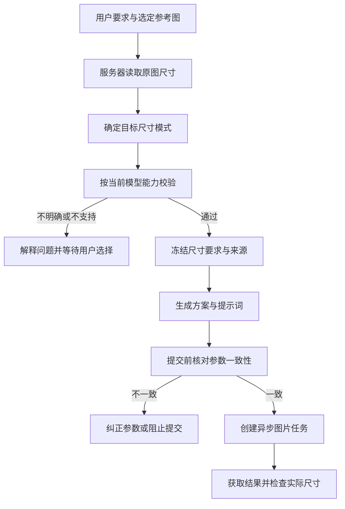

# 聊天图片尺寸与并发预算方案

保存日期：2026-10-05。状态：已在本对话任务工作树实现并验证，尚未提交部署；生产配置未修改。

尺寸作为独立的生成要求：模型理解用户意图，服务器读取图片真实尺寸、校验要求并生成执行参数。既能保持原图比例，也允许用户通过聊天主动修改尺寸。

## 1. 分清三个概念

| 概念 | 示例 | 由谁确定 |
| --- | --- | --- |
| 原图画布尺寸 | 1080 × 1080，比例 1:1 | 服务器读取原始文件 |
| 画面中产品的形状 | 竖向笔记本、长条包装盒 | 模型分析视觉内容 |
| 目标输出规格 | 3:4、2K | 用户要求与任务规则共同确定 |

笔记本即使是竖向的，也可能放在正方形照片里。**产品形状不能用于推导整张图片的宽高比。**

比例与分辨率分别处理：`1:1、2K` 表示正方形的 2K 输出，不等于必须保留原图的 1080 × 1080。

## 2. 尺寸选择规则

采用三种明确模式：

| 模式 | 触发条件 | 行为 |
| --- | --- | --- |
| 用户指定 | “改成3:4”“统一1:1、2K” | 使用用户指定规格 |
| 沿用参考图 | “保持原图尺寸比例”，或参考图任务明确要求保持比例 | 根据指定参考图的真实尺寸计算比例 |
| 自动选择 | 用户允许自动决定，且任务没有固定尺寸要求 | 按模型能力自动选择，并记录实际结果 |

优先级：**当前用户明确要求 → 当前任务已确定的规格 → 自动选择**。

用户只修改比例时，保留已有分辨率；只修改分辨率时，保留已有比例。不会因为说了“改成2K”，就把原来的竖图变成方图。

多张参考图比例不同时，只有“沿用参考图”模式需要确定哪张负责输出画布；风格参考图不能自动成为尺寸来源。

## 3. 用户操作示例

| 用户说法 | 系统处理 |
| --- | --- |
| “参考这张图，生成六套方案和图片” | 本参考图任务要求保持比例，读取原图尺寸并沿用 |
| “这六张改成3:4、2K” | 更新六张尚未提交图片的目标规格，校验通过后生成 |
| “保持比例，提高到4K” | 保留比例，仅调整分辨率 |
| “生成1920×1080” | 按精确像素要求检查接口能力，不偷偷转成16:9、2K |
| “做1080尺寸” | 含义不明确，询问是1080×1080，还是长边1080 |
| “比例你决定” | 使用自动模式；若与此前固定要求冲突，先明确本次是否替换该要求 |

已提交的任务使用冻结参数继续运行。用户修改规格后，需要生成新版本，不修改在途任务。

## 4. 非法或不支持的尺寸

在创建图片任务和扣图片积分之前处理：

- **表达不明确**：只询问缺少的信息。
- **明确但模型不支持**：说明限制，给出可用替代规格，等待用户选择。
- **参数互相冲突**：例如同时要求1920×1080和1:1，先解释冲突。
- **原图尺寸读取失败**：不能用目测结果冒充“沿用原图”；提示重新选择图片，或让用户指定比例。

例如：

> 当前生成接口支持比例与1K/2K/4K，不能保证精确输出1920×1080。可以生成16:9、2K；是否使用这个规格？

这里不创建图片任务，也不扣图片积分。已经接受的其他图片继续运行。普通聊天模型调用的计费仍按现有规则处理。

## 5. 完整执行链路

关键是让**方案、提示词和生图参数使用同一份目标规格**。不能方案说1:1，工具却传3:4。

如果用户要求沿用原图，模型提出3:4，而服务器测得原图为1:1，这属于系统内部错误，系统应修正一致性，不再让用户重复确认已经明确的要求。

## 6. 本次问题如何被修复

针对这张1080 × 1080图片：

1. 服务器读取并提供“画布1080 × 1080、比例1:1”。
2. 参考图分析明确区分画布与笔记本形状。
3. 六套方案统一绑定目标比例1:1。
4. 生图请求提交前再次核对目标规格。
5. 若用户随后说“改成3:4”，目标规格才变为3:4。

因此不会把所有图生图强制设成1:1，也不会禁止用户主动改变比例。

## 7. 实施位置与兼容方式

| 位置 | 修改职责 |
| --- | --- |
| 图片元数据与参考图解析 | 从实际文件读取尺寸，处理EXIF方向；复用现有宽高字段 |
| 当前附件、历史图片上下文 | 持续提供尺寸事实，并与具体图片身份关联 |
| 参考图提示词规则 | 禁止依据产品形状估计画布；方案使用已确定规格 |
| 图片工具与请求校验 | 增加尺寸模式、来源和能力校验，生成一致的执行参数 |
| 异步任务结果处理 | 保存目标规格与实际尺寸，核验结果 |

旧图片没有尺寸字段时，按需读取原始文件补齐，不批量改写历史消息。已接受任务保留原有冻结参数，不重新提交、不重新扣费。

## 8. 结果不符合尺寸要求时

请求正确但供应商返回比例不符，是另一类问题。系统应记录并明确提示“生成结果未满足尺寸要求”，不拉伸、不擅自裁切，也不自动付费重试。

这类情况已经发生供应商调用，不能与“提交前拒绝、未扣图片积分”混为一谈。退款或平台承担费用的规则需要单独确定，本方案不自行改变现有结算规则。

## 9. 验证与上线边界

验证覆盖：本次方图误判、横竖图、EXIF旋转、历史引用、多参考图、用户改变比例、非法尺寸、参数冲突，以及供应商返回错误比例。

已确认的 **15个共享并发额度、每次聊天300图片积分预算**单独实施。尺寸校验先于任务接受；额度满时进入现有排队机制，结束后释放，并发额度不会随完成张数累计耗尽。

本文保留已确认设计。按用户后续指令，实际开发由本对话在原任务工作树完成，未交由其他对话。生产上线需要应用迁移、更新环境覆盖值并发布Skill新版本。

原方案末尾曾要求重新打开任务工作树并连接 AOCI；该要求已被当前个人共同协作规则撤销。后续遵循最新规则，不接入或恢复 AOCI。

## 开发与发布补充

- 迁移：`278_chat_image_size_budget.sql`；回滚：`rollback/278_chat_image_size_budget_rollback.sql`。采用现有父任务行锁及幂等回执，不改写历史任务快照。累计请求数用于审计，不能作为已完成张数上限；首次生成与显式重试共享父任务累计积分上限。
- 现有生产环境曾覆盖为2个请求、24图片积分、单对话5个任务。发布时必须将配置改为 `RATE_LIMIT_GLOBAL_TASKS=15`、`RATE_LIMIT_CONVERSATION_TASKS=15`、`CHAT_IMAGE_MAX_REQUESTS=15`、`CHAT_IMAGE_MAX_CREDITS=300`；仅改变代码默认值不会覆盖生产旧值。此处记录发布步骤，不执行生产写入。
- 参考图提示词提供不可变新版本 `examples/skills/catalog/platform/reference-image-prompts/v2/SKILL.md`。通过现有Skill发布和assignment流程切换；不覆盖已发布v1文件或哈希。上下文通用画布事实规则同时生效。
- 供应商输出违反尺寸合同时沿用已有输出合同失败结算：任务失败、退还用户积分并记录平台成本；不引入新的结算政策、不自动付费重试。旧快照不追加尺寸检查。
- 回滚前停止新图片接受并等待新快照任务完成结算，再回滚迁移、应用和环境配置。不要修改在途快照或重复派发任务。

## 验证证据

- 真实隔离PostgreSQL验证52项：单次受理与回执幂等、并发累计300积分、超过15张后继续排队受理、首次生成与重试共享预算、迁移回滚再前进、真实1080×1080原图覆盖模型3:4猜测、明确用户3:4覆盖、非法精确像素零任务零图片扣费、未来消息隔离、供应商错误比例及重复回调不重派发。
- 独立Redis验证3项：聊天和图片在两个对话中竞争同一15槽位、单个对话可使用全部15槽位、完成释放后连续多批生成不耗尽累计次数、重复释放幂等、Redis故障不放行未记录任务。
- 尺寸与自然语言边界35项、Skill示例8项通过；图像请求、来源、历史引用、参数纠错、缓存、上下文快照和提示词用户层的定向回归通过。工具全量契约与聊天上下文回归通过；聊天上下文中3项旧V1编排测试按仓库既有标记跳过。
- 前端图片详情5项通过；`tsc -p tsconfig.app.json` 类型检查及任务范围 `git diff --check` 通过。
- 供应商HTTP为MockTransport，存储为本地真实图片，PostgreSQL和Redis为独立测试实例；未进行真实付费生图、生产迁移、生产配置写入或部署。

## 2026-10-05 生产复测纠正

- 复测当前消息8ed47f6c-259c-45c0-847c-31224975eab8沿用既有引用附件机制，记录了旧对话原消息6b2ead9f-32f0-4b36-85e5-d77d31ea5ced。生图引用校验错误要求来源属于当前对话，提前拒绝且使画布事实不可用，尚未进入尺寸解析。
- 修复只沿用现有附件定位、对话所有者和工作区资源权限：当前消息仍是工具选定引用；跨对话的来源只验证同用户、同组织的个人对话，再核对图片路径和原生成任务。模型不能直接用其他对话消息ID扩大引用范围。不增加新引用持久化格式、权限表或授权流程。
- 当前与历史图片上下文共用这项来源校验，缓存投影升级为canvas-v5，避免继续显示旧的不可用来源。产品比例只描述主体造型，工具输出比例使用服务器目标规格；已发布Skill v2原文件保持不可变。
- 回归覆盖跨对话合法引用、原图1080×1080而产品3:4、用户显式输出3:4、跨用户/组织/频道拒绝、原图路径变更、直接选取外部对话消息拒绝，以及跨对话生成图片的原任务匹配。

验证记录：来源/历史连续性/尺寸/缓存88项通过；聊天上下文、UserLayer、Skill回归117项通过，3项旧V1编排测试按既有标记跳过。对真实失败消息和父任务使用生产现有RLS及原图文件进行独立只读诊断，旧实现稳定返回IMAGE_QUOTED_SOURCE_DENIED，拟议修复恢复引用并将模型3:4校正为1:1；供应商调用、图片任务创建和积分写入均为零。本次纠正尚未提交部署。
