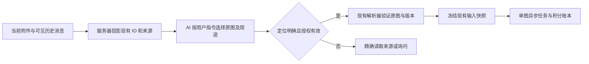

# 聊天图片来源与文件 ID 复用优化

日期：2026-10-05。状态：用户已批准并完成本地实施，尚未提交或部署。沿用 `codex/task/20261004141838-chat-skill-image-async` 独立工作树；生产仍为 `95a18e18`。本轮使用隔离本机数据库、真实临时原图和离线供应商替身验证，不调用付费供应商、不写生产控制面。

研究依据：[多轮图片引用与可靠定位](INDUSTRY_多轮图片引用与可靠定位.md)。问题证据及已完成的本地修复见 [实施记录](TECH_聊天Skill图片异步生成_实施记录.md)。本文以现代码为准，不把旧文件 ID 文档的阶段状态当作当前行为。

## 1. 已有机制和实际缺口

用户记忆正确：平台已有文件身份和资源解析机制，图片不需要再建编号体系。

| 机制 | 当前代码事实 | 本次复用方式 |
| --- | --- | --- |
| `file_id / fid_…` | `agent/file_id.py::compute_fid` 对组织与路径生成 8 位十六进制短哈希；不是文件表主键，也不是权限凭证。格式校验不证明存在，短哈希可能碰撞。 | 保持算法及旧协议；向模型提供服务器计算的短 ID，复制即可。歧义必须使用更精确的已有定位。 |
| `resource_ref / fref1_…` | `file_resources.py::FileReferenceCodec` 签名绑定组织、工作区拥有者、上下文作用域、相对路径、文件版本。`FileTargetResolver` 每次仍执行资源权限和路径守卫。 | 复用为精确资源定位与版本核验，不把签名当授权。避免要求模型拼路径、URL 或签名。 |
| `asset_id` 与来源登记 | `user_assets` / `user_asset_refs` 由 `AssetRegistryService` 登记 canonical 资产和上传/生成来源。上传登记为 best effort，旧图可能没有资产记录。 | 有真实登记则关联；无登记但原消息与原文件可核验时，使用已有消息/文件定位，不能判定文件不存在。 |
| `message_id + content_index` | `generate_image` 已支持原消息图片块定位，`ChatImageInputResolver` 核验会话、组织、版本、原图和字节。 | 用于说明图片在对话中的来源，以及同名图/短 ID 歧义时的准确选择；不是新增资源 ID。 |
| `ResourceManifest` | 冻结当前任务附件，Web 回退值中的 `asset_id` 有时是消息位置占位值，不能当 `user_assets.id`。 | 保持当前附件清单语义，不把整个聊天历史塞进它或扩大文件权限。 |
| 图片任务快照 | `_media_request_v1` 已冻结 prompt、参考定位、文件版本、内容哈希、用途与顺序，并绑定预算及独立任务。 | 继续使用现有接受、Worker、积分账本、恢复链路。 |

完整调用链调查发现：

- 当前附件经 `attachments.py::format_current_attachment_refs` 和 `UserLayer.render` 提供短文件 ID；这一机制已存在。
- 历史消息经 `history_loader.py` 转换和截断视觉图片。生产版本没有本任务后来增加的消息位置投影；assistant 图片常保留为交付事实，视觉位置与原消息块位置不能混用。
- 原《TECH_文件ID协议化》明确跳过历史翻译，并曾把 AI 生成图视为没有工作区路径。现在普通生成图和聊天异步图可持久化原图到工作区，该假设已过时。
- `get_conversation_context` 的图片精确读取和 `ChatImageInputResolver._message` 都使用父任务固定版本；旧 `context_revision=NULL` 消息会被排除或拒绝。
- 前端 `ImageContextMenu`、`attachmentSubmission`、`messageSender` 已传递原图路径、资产 ID、来源消息、原始图片块位置和来源任务。这些客户端字段必须由后端核验，不能直接相信。
- 当前故障审计中的原图均存在。主要问题是模型侧来源发现不完整和旧历史边界兼容，而不是文件系统缺少 ID。

## 2. 推荐行为

**服务器给出真实图片及其来源，AI 按本次指令选择，工具将选择解析为可信原图后接受任务。**

不把“图片出现在上下文中”视为“被用户选作参考图”。不建立自动沿用最新图片的默认状态。用户显式引用保留在现有消息块；自然语言选图继续由 AI 结合完整来源判断，有影响结果的歧义才询问。

### D01：统一图片来源投影

新增一个小型图片来源投影模块，供当前附件、历史投影及精确历史工具共用；它只整理元数据，不搜索全工作区，不授予权限，不创建任务。

投影每个真实图片块的现有字段：短 `file_id`、`name`、`message_id`、原始 `content_index`、上传/生成/引用来源、已有 `task_id`/真实 `asset_id`、可用性和视觉对应位置。客户端的来源字段经核验后才能进入可信投影。无路径或失败图片也应说明不可引用原因，不输出伪造 ID。

模型调用 `generate_image.references` 时可复制现有 `file_id`。图片来源本身带有消息位置，工具可在本轮可信候选中找到精确路径；有同名图、ID 碰撞或不同版本时，要求复制现有消息定位或精确 `resource_ref`。同一物理文件在多条消息出现时保留来源位置，不能仅凭显示名称合并。

提供可直接复制的引用对象，仍只包含工具合同已有的一个定位方式；`role` 由模型根据用户用途填写。不要把 `file_id`、`asset_id`、`message_id` 混填进同一个引用对象。

图片视觉预算截断时，仍保留来源元数据，并明确哪些图本轮实际可见。元数据不能冒充看过图。需要看图或远端历史时调用已有精确读取能力。

### D02：安全兼容旧图片历史

正常版本化历史继续执行 `context_revision <= base_context_revision`。不能把过滤改成无条件包含所有 NULL 版本消息。

推荐在聊天上下文锚点建立时，额外冻结当时可引用的旧图片来源清单，复用父任务 `request_params` 的服务器私有 JSON 元数据。清单使用现有消息 ID、图片块位置和原始来源字段，不新增表或图片编号。

- 仅当前组织、当前个人会话且归属可核验的终态旧消息。无 Turn 的真正旧消息，以及有 Turn 且关联终态非 Actor 原生任务的旧生成消息可纳入；待执行/运行中的 Actor 输入和任务结果、工具内部消息、失败消息不纳入。图片块自身失败时只展示不可用原因，不进入可生成候选。
- 清单需在实际聊天 claim 建立上下文边界的同一事务内生成；它是一次确定的来源读取集合，不能在重启后重新查询并扩大。输入消息及明确引用仍通过已有输入锚点处理。
- 清单冻结原始图片块的定位字段，读取和接受时核对消息位置及来源一致性；如果消息被修改，则拒绝该旧定位。图片内容在受理前仍需实际校验并计算哈希。
- 复用现有 tasks JSON；迁移 `277_chat_image_sources.sql` 扩展串行/分支 claim 并增加私有目录保护触发器。首次 claim 覆盖客户端伪造目录，之后目录不可修改；已有检查点而没有目录的旧任务冻结空目录，不能恢复后扩大边界。不全库回填版本号，不改变 claim 的租约、排队、执行权或父聊天流式状态。
- 长历史来源最多冻结 100 条消息 / 120000 JSON 字节；超限冻结空目录及 `IMAGE_SOURCE_CATALOG_TOO_LARGE_SELECT_EXPLICIT_IMAGES`，继续正常聊天 claim，不让队首请求反复报错。模型展示最多最后 20 个图片来源并注明其余可精确读取；权威目录不截断。超限时使用已有图片引用入口明确选定原图，不能猜历史 ID。
- 历史加载、精确读取、受理解析、Worker 复核及快照重试必须使用同一兼容边界。新快照保存所选旧来源的兼容证据，Worker 不依赖最新用户消息或恢复时重新生成的候选集。

ReplayCheckpoint 继续保存实际模型消息及上下文锚点，来源清单保存在同一父 task 的不可变私有元数据；重领使用原基线，恢复读取原 checkpoint，不重新混入新历史。该部分已完成独立数据库/恢复审查及真实隔离 PostgreSQL 并发验证；不代表生产完整 schema/RLS 已验收。

### D03：通过已有文件解析器绑定选择

在 `ChatImageInputResolver` 中连接本轮服务器来源清单和已授权工具实际发现的资源：

- 已展示的 `file_id` 优先匹配对应可信来源，再通过 `FileTargetResolver` 的路径守卫、版本及资源权限验证。不要为每张已知来源图重复扫描整个工作区。
- 精确消息、资产、签名引用继续支持，不破坏已接受任务的四种旧定位。无本轮来源的裸短 ID 不能仅因全工作区恰好存在就当作用户此次选择；可通过获准的 `file_search` 或精确历史读取恢复来源。
- 搜索候选与用户选择分开。多个不同原图命中时询问，不把最近图、首个文件或相似文件名自动替代。
- 文生图不传参考图，图生图按模型明确给出的用途及顺序解析。原图 URL 由服务器生成；预览/缩略图不能成为生图输入。

这层只能核验资源身份与已知选择约束，不能证明任何自然语言选图都语义正确。对于“上面那张”这类含糊指代，仍依赖 AI 识别歧义及用户确认；方案不承诺 AI 永不选错。

### D04：精确读取和未受理错误

完善 `get_conversation_context` 返回的图片来源，使其与普通上下文一致；保留完整提示词原文和来源哈希。`file_search` 已提供 `resource_ref`，继续复用，不新增生图搜索工具。

区分格式错误、来源不存在、来源歧义、原文件变化、权限拒绝与受理不确定。缺来源提示读取真实来源；缺输入提示用户补充。当前本地修复已把资源错误与字段纠正分开，先保留保守停止行为，**本方案不增加自动重新提交付费请求的循环**。模型应尽量在首次调用生图工具前完成只读定位。

如果已调用受理 RPC 但响应丢失，继续沿现有调用账本查询；不能把这种情况当作“来源没找到”再创建任务。合法同提示词变体和两张输出仍受现有单图调用、预算、幂等约束。

### D05：冻结与可核验详情

保持现有接受前验证、预算限制及受理时冻结。快照增加可选的来源证据，但旧 `_media_request_v1` 快照仍能读取和完成。复制旧来源兼容证据必须发生在服务器接受边界，不能由模型传父任务、权限或恢复元数据。

详情展示真实执行的原图缩略图、来源消息、用途、顺序及提示词，数据来自冻结快照。复制配方只包含公共输入，优先保留精确消息位置，不复制模型选择或服务器私有来源证据。用户替换/追加图片仅影响下一次接受。重试使用原快照；成功结果再生成创建新版本。积分预扣、账本、供应商提交和结算算法不在本方案中调整。

### D06：客户端来源与特殊旧图

先复用已存在的引用链路；核对当前附件投影是否丢失 `source_message_id/source_content_index`，后端验证客户端引用与原消息、资产、原图路径相符。前端仅在来源详情或歧义澄清确有需要时补展示，不要求手动固定 Skill，也不强制用户每轮重新选图。

另有已确认边界：图片上传的旧 base64/工作区禁用路径可能仅保存 OSS URL，当前图片解析器要求可读工作区原图。本次故障的原文件均存在，不能把 URL-only 问题混为此次 ID 故障。仅 URL 的图先通过现有资产/存储身份查询寻找可核验原图；找不到则明确提示引用不可用或重新上传。本轮方案不新增任意 URL 下载兜底，也不把展示 URL 当作授权。若后续需要自动恢复 OSS-only 原图，应另做存储恢复设计与验证。

## 3. 修改位置与兼容

| 位置 | 实际职责 |
| --- | --- |
| 新 `handlers/chat_context/image_sources.py` | 当前与历史图片来源共同投影；复用 `compute_fid`，不实现新 ID/授权协议。 |
| `handlers/base.py`、`chat_context_mixin.py`、`prompt_builder/layers/user_layer.py`、`chat_context/history_loader.py` | 复用已有附件格式器；当前图片保留客户端来源后核验，历史按原始块索引投影；三处历史调用均传实际 org。 |
| `handlers/context_snapshot.py`、`handlers/chat/executor.py` | claim 私有目录接入锚点，在共享缓存之外投影；既有 stream_setup/execution_engine 的 ReplayCheckpoint 不另建恢复机制。 |
| `277_chat_image_sources.sql` 及 rollback，扩展现有 claim RPC | 同一上下文事务冻结旧来源；保留函数 owner/ACL；不新建任务/资源表，不回填历史、不改账单。 |
| `agent/conversation_tool_mixin.py` | 精确读取统一来源和原文，使用同一旧历史边界。 |
| `handlers/chat_image_request.py`、`handlers/image_handler.py` | 接受端从父目录绑定已知 file_id；所选来源证明进入快照，现有 lifecycle/controls 调用同一解析器复核，旧快照继续兼容。 |
| `tools/resource_access.py`、`tools/runtime.py` | 仅记录实际获准 file_search 返回的签名引用，支持原 checkpoint 恢复；不授予浏览或读取权限。 |
| `tools/definitions/media.py`、`media_tool_executor.py` | 说明复制真实 ID、来源恢复与明确错误；维持单图/default model 合同。 |
| 已有前端引用、详情及附件测试 | 校验来源字段与原图传递，按需要补快照详情。 |

`agent/file_id.py` 的生成算法和 `file_resources.py` 的签名协议保持。`ResourceManifest` 的当前附件边界、ERP/MCP/文件操作/计划任务权限不因本次来源清单扩大。现有原生生图、电商、视频和文字 Skill 路径保持其各自准备与执行行为。

Skill 正文继续定义创作流程。实际工具说明和能力展示可同步修正；无需用 Skill 正文维护图片 ID 或资源权限。不启用新的动态枚举 Schema、不切换聊天供应商作为本次前置条件；供应商 strict 能力另行验证后才使用，不能代替服务端校验。

## 4. 实施顺序、验证与回滚

已在本任务工作树按依赖完成 D01 → D02 → D03/D04 → D05/D06、离线故障注入和独立审查。真实模型自动选图/Skill 激活及生产付费生成仍待发布后复验，不能把脚本化双任务测试称为模型行为验收。

| 验证 | 必须观察的证据 |
| --- | --- |
| V01 上传 A 分析、上传 B 生成 | 实际参考字节哈希为 B，A 不自动加入参考。 |
| V02 打磨提示词后仅回复“确认”，生成两张 | 两次单图调用、两个独立任务；原提示词、原图及预算正确。 |
| V03 历史上传图、旧原生生成图、刚生成结果继续编辑 | 三种来源均有可复制身份，实际文件和版本相符。 |
| V04 同名、多图、同图多次引用、短 ID 碰撞 | 原始消息块位置及顺序准确；歧义拒绝或明确选择，不能误用首个匹配。 |
| V05 刷新、压缩、断线、Actor 重启及 Worker 重启 | 来源清单和已接受快照一致，不引入晚完成或新上传图片。 |
| V06 NULL 版本兼容并发/RLS | 真实隔离 PostgreSQL 事务验证，跨组织/会话、伪造私有字段、并发新增/完成图片被正确排除；旧清单不可扩展。 |
| V07 无效/删除/损坏/变化来源及权限撤销 | 受理前错误无图片预扣；受理后按已有结算/恢复，不重生成或换图。 |
| V08 前端引用与缩略图 | 请求、消息、冻结快照都使用原图；客户端伪造来源被后端拒绝。 |
| V09 接受丢响应、部分成功、关闭新接受 | 不重复创建付费任务；已接受子任务仍完成、结算和恢复。 |
| V10 受影响入口回归 | 原生文/图生图、电商、Skill 自动激活及图片试运行、文字试运行、文件和计划任务的定向回归；前端有改动时做类型检查/构建。 |

验证不依赖新供应商。本轮后端定向 **654 passed / 3 skipped**，真实隔离 PostgreSQL/Redis **58 passed / 0 skipped**；前端与构建的最终结果见实施记录。额外 scheduled Skill HTTP 测试的 7 项因本机缺少已有 `supabase` 包而阻塞，未安装依赖或用伪模块宣称通过。此前 774 passed / 3 skipped 仅属于上一批修复证据。实际模型和生产付费测试仍须沿既有授权范围、预算及受控发布执行。

发布先加性数据库能力，再部署兼容读端、恢复和 Worker，最后启用新来源接受。升级缓存前缀以避免复用缺来源的旧投影，保留 TTL 自然失效，不清空用户文件缓存或批量删除历史。

回滚先停止采用新来源接受；保持支持新快照/旧历史证据的 Worker、读端与恢复，直到已接受任务完成。旧后端不能处理新旧历史证据时，不直接降级整个后台。私有来源元数据可留存，数据库回滚不得删除仍被任务引用的证据。

## 5. 当前状态与未验证项

此前本地消息定位、缓存及错误分类修复已纳入本批，缓存前缀升级为 `conv:msgs:outcomes-v3`。本批补齐文件 ID 复用和旧历史安全边界，复用现有消息记录承载显式引用，不新增“AI 推测的当前参考图”全局状态。生产未改，任务工作树保留。

剩余为受控发布前完整数据库 schema/owner/ACL 核对，以及真实模型上传 A 分析、B 生成两张、历史原生结果继续编辑、自动 Skill 激活和刷新恢复验收。仅 URL 且找不到登记原图的资源仍提示重新引用/上传；自动恢复 OSS-only 原图不在本批范围。没有新增供应商、依赖或生产 Skill 发布。
